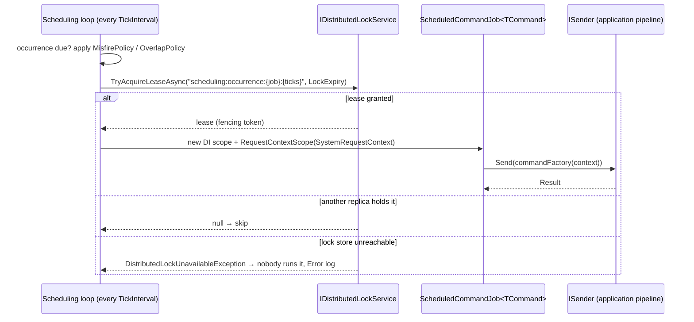

# SharedKernel.Scheduling

[](https://dotnet.microsoft.com/)
[](https://github.com/Gresta-Vertex-Labs/platform-shared-kernel/blob/main/LICENSE)


> **Cron and one-shot jobs that send a kernel command through `ISender` — once per occurrence across every replica
> of the service, with explicit misfire and overlap policies and no job database.**

| You get | So that |
| --- | --- |
| `AddRecurring<TCommand>(name, cron, factory, …)` / `AddDeferred<TCommand>(name, fireAtUtc, factory, …)` | A job is one registration line that sends an ordinary command |
| A per-occurrence lease from `IDistributedLockService` | Ten replicas run a 02:00 job once, not ten times |
| Mandatory `MisfirePolicy` and `OverlapPolicy` | The team decides what happens after downtime or a slow run — nothing is guessed |
| Each run in a `SystemRequestContext` scope with a new correlation id | Persistence, idempotency and outbound calls see a tenant and a traceable caller |
| The full application pipeline per run | Validation, transactions and auditing apply exactly as for an HTTP request |
| `scheduler` readiness probe, `SharedKernel.Scheduling` traces and metrics | The loop is observable and gated like any other dependency |

## Contents

- [Install](#install)
- [Quick start](#quick-start)
- [How it works](#how-it-works)
- [Recipes](#recipes)
- [Configuration](#configuration)
- [Reference](#reference)
- [Testing](#testing)
- [Pitfalls](#pitfalls)
- [Design decisions](#design-decisions)

## Install

```xml
<PackageReference Include="SharedKernel.Scheduling" />
```

The version comes from your central `SharedKernelVersion` property — every SharedKernel package ships at the same
version. See [Using the packages](https://github.com/Gresta-Vertex-Labs/platform-shared-kernel#using-the-packages).

| Requirement | Value |
| --- | --- |
| Target framework | `net10.0` |
| Tier | Adapter — reference it from your **Infrastructure** project (or the Worker that hosts the jobs) |
| Depends on | `SharedKernel.Application` (`ISender`, `ICommand`), `SharedKernel.Caching.Abstractions` (`IDistributedLockService`), `SharedKernel.Execution`, `SharedKernel.Primitives`, `SharedKernel.Configuration`, Quartz (`CronExpression` parser only) |
| Namespaces | `SharedKernel.Scheduling.Extensions`, `.Registry`, `.Policies`, `.Jobs`, `.Options`, `.Probes` |
| Needs in the host | A mediator adapter (`app.UseMediatR()`), an `IClock`, and for more than one replica an `IDistributedLockService` |

## Quick start

```csharp
using SharedKernel.Caching.Redis.Core.Extensions;
using SharedKernel.Caching.Redis.DistributedLocking.Extensions;
using SharedKernel.Scheduling.Extensions;
using SharedKernel.Scheduling.Policies;

builder.Services.AddRedisConnection(builder.Configuration);   // SharedKernel:Caching:Redis
builder.Services.AddRedisDistributedLocking();                // cross-replica single execution

builder.Services.AddSharedKernelScheduling()                  // SharedKernel:Scheduling
    .AddRecurring<RunNightlyReconciliation>(
        jobName: "nightly-reconciliation",
        cronExpression: "0 0 2 * * ?",                        // every day at 02:00 UTC (Quartz syntax, seconds first)
        commandFactory: ctx => new RunNightlyReconciliation(ctx.ScheduledFireTimeUtc),
        configure: o =>
        {
            o.MisfirePolicy = MisfirePolicy.FireOnce;
            o.OverlapPolicy = OverlapPolicy.Skip;
        });

builder.Services.AddHealthChecks().AddSharedKernelReadiness();  // exposes the "scheduler" probe
```

```json
{
  "SharedKernel": {
    "Scheduling": { "TickInterval": "00:00:01", "DefaultLockExpiry": "00:05:00" }
  }
}
```

The command is ordinary application code:

```csharp
public sealed record RunNightlyReconciliation(DateTimeOffset BusinessDate) : ICommand;

internal sealed class RunNightlyReconciliationHandler(ILedger ledger) : ICommandHandler<RunNightlyReconciliation>
{
    public Task<Result> Handle(RunNightlyReconciliation command, CancellationToken ct) =>
        ledger.ReconcileAsync(command.BusinessDate, ct);
}
```

## How it works



- **Cron** is parsed by Quartz's `CronExpression`, always evaluated in UTC; Quartz's scheduler and job store are never
  used. Time comes from `IClock`.
- **Cross-replica claim.** Each occurrence is claimed with a self-expiring lease keyed by job name **and** scheduled
  fire time. It is never released or extended, so a slightly late replica cannot run the same occurrence again. The
  fencing token reaches the command factory as `ScheduledJobExecutionContext.FencingToken`.
- **An outage is not contention.** A `null` lease means another replica owns the occurrence. An unreachable lock
  store means no replica can prove ownership, so none runs it (EventId 19016).
- **No lock service, no silence.** Without an `IDistributedLockService` the package still starts, logs a Warning
  (EventId 19002), and every replica fires every occurrence.
- **Who the job runs as.** Each run opens `RequestContextScope.Begin(new SystemRequestContext([], jobName,
  tenantId, CorrelationIds.New()))` — `ActorKind.System`, the job name, the job's tenant (none for
  `TenantScope.Global`), a new correlation id and **no permissions** — then a fresh DI scope.
- **Outermost command.** The fresh scope means a fresh `ICommandScope`: `TransactionBehavior` commits once and
  `OnCompleted` callbacks run before the fire is reported. A failed `Result` (validation, authorization) is logged as
  a failed fire, never thrown.
- **State is in memory.** Next-fire and misfire detection live in the process; nothing is persisted.

### Misfire and overlap policies

| `MisfirePolicy` | After downtime covering N missed occurrences |
| --- | --- |
| `Skip` | Zero catch-up runs; continue with the next occurrence after now |
| `FireOnce` | Exactly one catch-up run, then the next occurrence after now |
| `RunImmediatelyThenReschedule` | Replays every missed occurrence, one per tick, keeping the cron grid |

| `OverlapPolicy` | When the previous run is still going |
| --- | --- |
| `Skip` | Discard this tick |
| `Queue` | Run it after the current one finishes |
| `Allow` | Run concurrently |

## Recipes

### 1. Run a job for one tenant

```csharp
scheduling.AddRecurring<RebuildTenantIndex>("acme-index-rebuild", "0 30 3 * * ?",
    ctx => new RebuildTenantIndex(),
    o =>
    {
        o.MisfirePolicy = MisfirePolicy.Skip;
        o.OverlapPolicy = OverlapPolicy.Skip;
        o.TenantScope = TenantScope.For(acmeTenantId);        // becomes IRequestContext.TenantId
    });
```

A job for **every** tenant is one global registration whose handler iterates the tenant directory; the scheduler
never fans out per tenant.

### 2. Send a command that needs a permission

The job's context carries no permissions, and `[RequirePermission]` is always enforced. Open a scope with exactly the
permission the command needs, from a small unpermissioned wrapper command's handler:

```csharp
using (RequestContextScope.Begin(new SystemRequestContext(["reports.generate"], "nightly-reports", tenantId)))
{
    return await sender.Send(new GenerateReports(), ct);
}
```

### 3. Fire once, later

```csharp
scheduling.AddDeferred<PurgeImportStaging>("purge-import-staging", clock.UtcNow.AddHours(1),
    _ => new PurgeImportStaging(),
    o => { o.MisfirePolicy = MisfirePolicy.FireOnce; o.OverlapPolicy = OverlapPolicy.Skip; });
```

Deferred jobs are registered at composition time and are not persisted: a restart forgets one unless the
composition root registers it again. For a durable delay use `17.Workflows`, or `IMessageScheduler` for a delayed
message.

### 4. Start a workflow on a schedule

The job's command handler dispatches the workflow through `IWorkflowDispatcher`; `SharedKernel.Workflows.Temporal`
owns everything after the start.

## Configuration

Section `SharedKernel:Scheduling`, validated when the host starts. The `configure` delegate of
`AddSharedKernelScheduling` runs after binding.

| Key | Type | Default | Meaning |
| --- | --- | --- | --- |
| `SharedKernel:Scheduling:TickInterval` | `TimeSpan` | `00:00:01` | How often the loop checks for due occurrences (100 ms – 10 min) |
| `SharedKernel:Scheduling:DefaultLockExpiry` | `TimeSpan` | `00:05:00` | Lease length for an occurrence when the job sets no `LockExpiry` (1 s – 1 day) |

Per job (`ScheduledJobOptions`, set in the registration's `configure` delegate):

| Option | Type | Default | Meaning |
| --- | --- | --- | --- |
| `MisfirePolicy` | `MisfirePolicy?` | — (required) | See the misfire table |
| `OverlapPolicy` | `OverlapPolicy?` | — (required) | See the overlap table |
| `TenantScope` | `TenantScope` | `TenantScope.Global` | The tenant the job runs for |
| `LockExpiry` | `TimeSpan?` | `DefaultLockExpiry` | Lease length; keep it above the worst claim-to-start skew between replicas |

## Reference

### Registration

| Method | Registers / does |
| --- | --- |
| `AddSharedKernelScheduling(Action<SchedulingOptions>? configure = null)` | `IScheduledJobRegistry` (singleton), the hosted scheduling loop, the `scheduler` readiness probe; returns `ISchedulingBuilder` (`IScheduledJobRegistry` + `Services`) |
| `AddRecurring<TCommand>(jobName, cronExpression, commandFactory, configure)` | A cron job; `TCommand : class, ICommand` |
| `AddDeferred<TCommand>(jobName, fireAtUtc, commandFactory, configure)` | A one-shot job |

Both throw `ArgumentException` for a duplicate job name, an invalid cron expression, or an unset `MisfirePolicy` or
`OverlapPolicy`. `commandFactory` is `Func<ScheduledJobExecutionContext, TCommand>`; the context carries `JobName`,
`ScheduledFireTimeUtc`, `ActualFireTimeUtc`, `TenantScope` and `FencingToken` (`null` without a lock service).

### Health

Registers the `scheduler` readiness probe (`SchedulerReadiness.ProbeName`); `AddSharedKernelReadiness()` exposes it on
`/health/ready`. It reads in-process state only and reports `IsRunning`, `RegisteredJobCount` and `LastTickUtc`.

### Telemetry

`ActivitySource` and `Meter` named `SharedKernel.Scheduling` (activity `Scheduling.Job.Fire`); subscribe with
ServiceDefaults' `builder.WithSchedulingTelemetry()`. Counters: `scheduling.job.fired`, `.succeeded`, `.failed`,
`.overlap_skipped`, `.overlap_queued`, `.misfired`, `scheduling.lock.acquisition_failed`,
`scheduling.lock.store_unavailable`.

### Logging

| Event id | Level | Event |
| --- | --- | --- |
| 19000 | Information | Scheduling hosted service started with `{RegisteredJobCount}` job(s) |
| 19001 | Information | Scheduling hosted service stopping |
| 19002 | Warning | No `IDistributedLockService` registered — every replica fires every occurrence |
| 19003 | Debug | Job firing (scheduled / actual time) |
| 19004 | Information | Job succeeded |
| 19005 | Warning | Job failed with `{ErrorCode}` |
| 19006 | Error | Job threw an unhandled exception |
| 19007 | Information | Tick skipped — previous execution still running (`OverlapPolicy.Skip`) |
| 19008 | Debug | Tick queued behind the running execution (`OverlapPolicy.Queue`) |
| 19009 | Warning | Job misfired |
| 19010 | Information | Missed occurrence discarded (`MisfirePolicy.Skip`) |
| 19011 | Debug | Occurrence claim not acquired — another replica holds it |
| 19012 | Debug | Occurrence claim acquired (fencing token) |
| 19013 | Critical | Scheduling loop faulted and is stopping |
| 19014 | Information | Job execution observed shutdown cancellation |
| 19015 | Warning | Shutdown drain timed out with executions in flight |
| 19016 | Error | Occurrence skipped — the lock store could not be reached |

## Testing

Reference [`SharedKernel.Scheduling.Testing`](https://github.com/Gresta-Vertex-Labs/platform-shared-kernel/blob/main/src/Testing/SharedKernel.Scheduling.Testing/README.md).
`InMemoryScheduledJobRegistry(ISender)` records your registrations; register the jobs against it with the same code
the host uses, then fire one explicitly:

```csharp
var registry = new InMemoryScheduledJobRegistry(sender);
RegisterJobs(registry);                                             // your composition code, taking IScheduledJobRegistry

await registry.TriggerAsync("nightly-reconciliation", simulatedNowUtc: clock.UtcNow);
registry.ShouldHaveFired("nightly-reconciliation");
```

`TriggerAsync` also takes `fencingToken` and `simulatedMisfire`; `BeginInFlight(jobName)` holds a run open to assert
overlap behaviour (`ShouldHaveSkipped`, `ShouldHaveMisfired`). No clock, hosted loop or lock store is involved.
Multi-replica claims need a real Redis.

## Pitfalls

| Don't | Do | Why |
| --- | --- | --- |
| Scale out without an `IDistributedLockService` | Register one (e.g. `AddRedisDistributedLocking()`) | Every replica fires every occurrence |
| Write a five-field Unix cron | Use Quartz syntax, seconds first (`0 0 2 * * ?`) | The parser is Quartz's `CronExpression` |
| Expect local time | Write cron in UTC | Evaluation is always UTC; there is no per-job time zone |
| Send a `[RequirePermission]` command directly | Open a scope with exactly the permission it needs (recipe 2) | The job context has no permissions; the command fails with `Forbidden` |
| Build a multi-step, resumable process from jobs | Start a workflow from the job | Crash-resumable steps are `17.Workflows` |
| Rely on a deferred job surviving a restart | Re-register it at start, or use a workflow | Nothing is persisted |
| Set `LockExpiry` below the replicas' clock and tick skew | Keep it comfortably above | An expired lease no longer excludes a lagging replica |
| Read `DateTime.UtcNow` in the factory | Use `ctx.ScheduledFireTimeUtc` or `IClock` | Keeps runs deterministic and testable |

## Design decisions

**Why a per-occurrence lease instead of a lock held for the run?** A lock released after the run lets a slightly
later replica claim the same occurrence again. A lease keyed by the fire time and left to expire closes that window —
the same approach Quartz clustering and Hangfire take — without a job database.

**Why are the policies mandatory?** Whether a missed nightly run catches up once, every time or never is a business
decision; a default would make it silently.

**Why is `TenantScope` optional here when it is mandatory elsewhere?** A scheduled job is registered once, at
startup, as a system actor — not per request. Per-tenant work belongs in the handler.

**Why a command factory?** A fired job has no caller to hand it a command; the factory builds one per occurrence
from the execution context.

---

Part of [Platform.SharedKernel](https://github.com/Gresta-Vertex-Labs/platform-shared-kernel) ·
[Scheduling domain](https://github.com/Gresta-Vertex-Labs/platform-shared-kernel/blob/main/src/Infrastructure/Scheduling/README.md) ·
[MIT license](https://github.com/Gresta-Vertex-Labs/platform-shared-kernel/blob/main/LICENSE)
