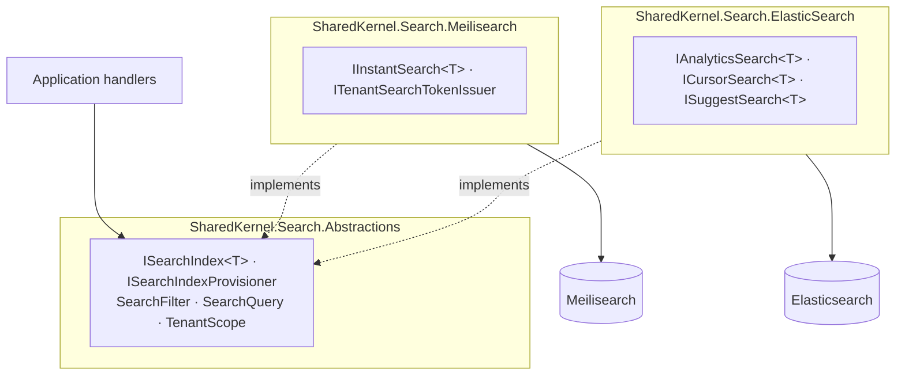

<div align="center">

# SharedKernel Search

**Full-text search for multi-tenant .NET services — Meilisearch and Elasticsearch behind one contract, a tenant scope
on every read, and no engine allowed to answer approximately while claiming to be exact.**

[](https://dotnet.microsoft.com/)
[](../../../LICENSE)


[](https://github.com/meilisearch/meilisearch-dotnet)
[](https://github.com/elastic/elasticsearch-net)

[What you get](#what-you-get) · [Packages](#packages) · [How it fits together](#how-it-fits-together) · [Get started](#get-started) · [See it run](#see-it-run) · [Guarantees](#guarantees)

<sub>📂 <code>src/Infrastructure/Search</code> · <a href="../../../docs/packages.md">all packages by tier</a> · <a href="../../../README.md">Platform.SharedKernel</a></sub>

</div>

---

## What you get

- **One search contract for two engines.** Application code depends on `ISearchIndex<TDocument>`,
  `ISearchIndexProvisioner` and the `SearchQuery.New()` builder — never on `MeilisearchClient` or `ElasticsearchClient`.
- **Tenant isolation by construction.** `TenantScope` is a separate, mandatory parameter on every read; a tenanted
  index called with `TenantScope.Global` fails with `search.tenant_scope_missing` before any I/O.
- **Engine-only features without a leaky abstraction.** Instant search and tenant tokens (Meilisearch), aggregations,
  point-in-time cursors and completion suggestions (Elasticsearch) live in their provider package, so a provider swap
  is a build error listing every non-portable call.
- **Failures as values.** Outages, timeouts and bad credentials come back as `search.unreachable`, `search.timeout`
  and `search.unauthorized` on both engines; bulk writes report per-item failures in a `SearchBulkReceipt`.
- **Safe rebuilds.** Idempotent provisioning from every replica, staging → live `CutoverAsync`, and
  `VerifyRegisteredIndexesAsync` to catch a live schema that no longer matches the code.

## Packages

| Package | Tier | Reference it from | Use it for |
| --- | --- | --- | --- |
| [SharedKernel.Search.Abstractions](SharedKernel.Search.Abstractions/README.md) | Abstractions | Application | `ISearchIndex<T>`, `ISearchIndexProvisioner`, `SearchFilter`, `SearchQuery`, `SearchErrors`. No third-party dependency |
| [SharedKernel.Search.Meilisearch](SharedKernel.Search.Meilisearch/README.md) | Adapter | Infrastructure | User-facing, typo-tolerant search; `IInstantSearch<T>`, `ITenantSearchTokenIssuer`, ranking rules |
| [SharedKernel.Search.ElasticSearch](SharedKernel.Search.ElasticSearch/README.md) | Adapter | Infrastructure | Analytics and large corpora (ES 9.x/10.x); `IAnalyticsSearch<T>`, `ICursorSearch<T>`, `ISuggestSearch<T>` |
| [SharedKernel.Search.Testing](SharedKernel.Search.Testing/README.md) | Testing | test projects | An in-memory `ISearchIndex<T>` that evaluates the full `SearchFilter` tree, with provisioner and descriptor fakes |

Start with Abstractions in the Application project and one provider in Infrastructure; pick Meilisearch for a
storefront, Elasticsearch for analytics, or register both for different indexes. `SharedKernel.ServiceDefaults` maps
the probes (`AddSharedKernelReadiness()`) and exports telemetry (`WithSearchTelemetry()`).

## How it fits together



- **The seam rule:** Abstractions contains nothing both engines cannot implement completely and correctly. A
  capability one engine lacks is a typed contract in the other engine's package — never a capability flag, never
  silently degraded. The two providers never reference each other.
- **The tenant is never part of the request.** Providers add the tenant predicate as the outermost `AND` after
  translating your filter, and `GetAsync` never returns another tenant's document by id.
- **Totals carry their accuracy.** `SearchCount` says `Exact` or `LowerBound`; `ToPagedList()` refuses a total that is
  not exact, so a capped Meilisearch count cannot leak into a page header as a real one.

| | Meilisearch | Elasticsearch |
| --- | --- | --- |
| Best at | User-facing search | Analytics, large corpora |
| Type-ahead | `IInstantSearch<T>` — returns documents | `ISuggestSearch<T>` — completion suggester |
| Aggregations | Facet counts, numeric min/max | `IAnalyticsSearch<T>` — terms, cardinality, stats, histograms, ranges |
| Deep pagination | Capped by `MaxTotalHits`; walk with `EnumerateAsync` | `ICursorSearch<T>` — point-in-time + `search_after` |
| Client-side search | `ITenantSearchTokenIssuer` — engine-enforced tenant filter | Not available |

## Get started

```xml
<PackageReference Include="SharedKernel.Search.Abstractions" />   <!-- Application -->
<PackageReference Include="SharedKernel.Search.Meilisearch" />    <!-- Infrastructure -->
```

```csharp
builder.Services.AddSingleton<IClock, SystemClock>();

builder.Services
    .AddSharedKernelMeilisearchSearch(builder.Configuration)    // section Search:Meilisearch (Url, ApiKey)
    .AddIndex<ProductDocument>("products", index => index
        .PrimaryKey(ProductFields.DocumentId)
        .TenantField(ProductFields.TenantId)
        .Field(ProductFields.TenantId, SearchFieldKind.Keyword, filterable: true)
        .Field(ProductFields.Name, SearchFieldKind.Text, searchable: true)
        .Field(ProductFields.Category, SearchFieldKind.Keyword, filterable: true, facetable: true))
    .Build();

builder.Services.AddHealthChecks().AddSharedKernelReadiness();   // search-meilisearch-products

// In a handler: provision once (deploy step or startup task), then search with the caller's tenant
var request = SearchQuery.New()
    .Matching("wireless")
    .Where(SearchFilter.Eq(ProductFields.Category, "electronics"))
    .Page(1, 20)
    .Build();

Result<SearchResults<ProductDocument>> results =
    await index.SearchAsync(request.Value, TenantScope.For(tenantId), ct);
```

Switching to Elasticsearch changes the registration only (`AddSharedKernelElasticSearchSearch(...)` with a read and a
write alias). The document type, field constants and every option are in the
[SharedKernel.Search.Meilisearch Quick start](SharedKernel.Search.Meilisearch/README.md#quick-start) and the
[SharedKernel.Search.Abstractions](SharedKernel.Search.Abstractions/README.md) README.

## See it run

The Shop's [**Catalog**](../../../samples/Shop/Catalog/) runs **both** engines in one service, across two replicas,
against real containers:

- a Meilisearch storefront — tenant-scoped search by word and by synonym, filtered by category;
- an Elasticsearch back office — products counted per brand;
- both indexes declared once (`CatalogDefinitions`) and provisioned at startup, safely across both replicas;
- every query sent through the kernel's `ISender`, proven end to end by `Shop.E2E`'s `CatalogFlowTests`.

```bash
samples/Shop/build.sh --e2e      # pack the kernel, build the Shop, run its end-to-end flows (Docker)
```

## Guarantees

| Guarantee | How it is held |
| --- | --- |
| **No read without a tenant decision** | `ContractShapeTests`: every read and filtered write takes a non-optional `TenantScope`, and `SearchRequest` has no tenant member |
| **No cross-tenant results** | `TenantedIndex_WithTenantScopeGlobal_ReturnsTenantScopeMissing_WithNoIoAttempted`; `GetAsync_TenantB_CannotReadTenantADocument_ReturnsDocumentNotFound`; tenant-scoped facet counts in the parity suite |
| **Nothing silently dropped** | `*PreflightValidationTests`: undeclared fields, over-ceiling pages and over-cap facets fail before any I/O |
| **No approximate totals presented as exact** | `SearchResultsToPagedListTests`: `ToPagedList()` fails `TotalHitsNotExact` for estimated or lower-bound counts |
| **Both engines answer alike** | One fixed-corpus conformance suite (`*CrossProviderParityTests`) runs against real Meilisearch and Elasticsearch containers |
| **Same failure vocabulary on both engines** | `SearchErrorsTests` and `MeilisearchFaultClassificationTests`: outage → `Unavailable`, timeout → `Timeout` |
| **A forgotten rebuild is caught** | `SearchIndexDefinitionFingerprintTests`: every schema change alters the fingerprint `VerifyRegisteredIndexesAsync` compares |
| **Provider-neutral contracts** | `SearchTopologyRules`: Abstractions takes no third-party package and the providers never reference each other; analyzers `SK0024` (literal field names) and `SK0025` (NEST) |

**Out of scope:** vector search (see [AI](../AI/README.md)), document mapping from aggregates, change-feed ordering,
and engine-specific analyzers or scoring on the neutral surface.

---

<div align="center">
<sub>Part of <a href="../../../README.md">Platform.SharedKernel</a> · <a href="../../../docs/packages.md">all packages</a> · MIT license</sub>
</div>
