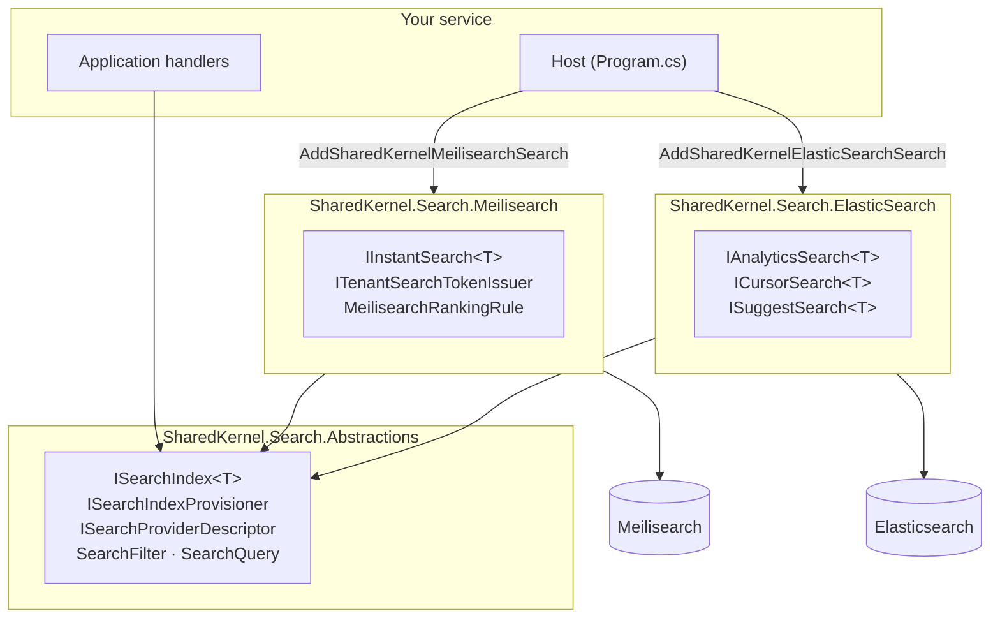

<div align="center">

# SharedKernel Search

**Full-text search for multi-tenant .NET services. Meilisearch and Elasticsearch behind one contract, a tenant scope
on every read, and no engine allowed to answer approximately while claiming to be exact.**

[](https://dotnet.microsoft.com/)
[](../../../LICENSE)

[](SharedKernel.Search.Meilisearch/README.md)
[](SharedKernel.Search.ElasticSearch/README.md)

[Packages](#packages) · [Architecture](#architecture) · [Get started](#get-started) · [Sample](#sample-catalogapi) · [Guarantees](#guarantees)

</div>

---

## What this domain gives you

- **One search contract for two engines.** Application code depends on `ISearchIndex<TDocument>`,
  `ISearchIndexProvisioner` and a fluent query builder — never on `MeilisearchClient` or `ElasticsearchClient`.
- **Tenant isolation by construction.** `TenantScope` is a separate, mandatory parameter on every read; a tenanted
  index called without a tenant fails before any I/O.
- **Engine-only features without leaky abstractions.** Instant search and tenant tokens (Meilisearch), aggregations,
  deep cursors and completion suggestions (Elasticsearch) live in their provider package, so a provider swap is a
  build error listing every non-portable call.
- **Failures as values.** Outages, timeouts and bad credentials come back as `search.unreachable`, `search.timeout` and
  `search.unauthorized` on both engines — not as exceptions.
- **Safe rebuilds.** Idempotent provisioning, staging → live cutover, and a check that the live schema matches the
  code.
- **Readiness for free.** Every registered index gets a `search-{provider}-{index}` readiness probe.

## Packages

| Package | Tier | When you need it |
| --- | --- | --- |
| [`SharedKernel.Search.Abstractions`](SharedKernel.Search.Abstractions/README.md) | Abstractions | Always — your Application project searches through these contracts. No third-party dependencies |
| [`SharedKernel.Search.Meilisearch`](SharedKernel.Search.Meilisearch/README.md) | Adapter | User-facing, typo-tolerant search; instant search; tenant tokens a browser can hold |
| [`SharedKernel.Search.ElasticSearch`](SharedKernel.Search.ElasticSearch/README.md) | Adapter | Analytics and large corpora: aggregations, point-in-time paging, completion suggestions |

In-memory fakes for unit tests: [`SharedKernel.Search.Testing`](../../Testing/SharedKernel.Search.Testing/README.md).

## Architecture



The rule behind the design: **the Abstractions package contains nothing both providers cannot implement completely
and correctly.** A capability one engine lacks is declared as a typed contract inside the other engine's package —
never neutralised, never hidden behind a capability flag. The two providers never reference each other.

| | Meilisearch | Elasticsearch |
| --- | --- | --- |
| Best at | User-facing search | Analytics, large corpora |
| Type-ahead | `IInstantSearch<T>` — prefix matching, returns documents | `ISuggestSearch<T>` — completion suggester, returns strings |
| Aggregations | Facet counts and numeric min/max | `IAnalyticsSearch<T>` — terms, cardinality, stats, date histogram, range |
| Deep pagination | Capped by `MaxTotalHits`; walk with `EnumerateAsync` | `ICursorSearch<T>` — point-in-time + `search_after` |
| Client-side search | `ITenantSearchTokenIssuer` — engine-enforced tenant filter | Not available (document-level security is a commercial feature) |
| Counts | Capped; reported as a lower bound at the ceiling | Always exact |

## Get started

**1. Reference** `SharedKernel.Search.Abstractions` from your Application project and one provider from the host.

**2. Declare a document** — one stable id, primitive members, and the tenant as `TenantId.ToString()`:

```csharp
public sealed class ProductDocument : ISearchDocument
{
    public required string DocumentId { get; init; }
    public required string TenantId { get; init; }
    public required string Name { get; init; }
    public required string Category { get; init; }
}
```

**3. Register the index** (the host also registers `IClock`):

```csharp
builder.Services.AddSingleton<IClock, SystemClock>();

builder.Services
    .AddSharedKernelMeilisearchSearch(builder.Configuration)   // Search:Meilisearch:Url, :ApiKey
    .AddIndex<ProductDocument>("products", index => index
        .PrimaryKey(nameof(ProductDocument.DocumentId))
        .TenantField(nameof(ProductDocument.TenantId))
        .Field(nameof(ProductDocument.TenantId), SearchFieldKind.Keyword, filterable: true)
        .Field(nameof(ProductDocument.Name), SearchFieldKind.Text, searchable: true)
        .Field(nameof(ProductDocument.Category), SearchFieldKind.Keyword, filterable: true, facetable: true))
    .Build();

builder.Services.AddHealthChecks().AddSharedKernelReadiness();
builder.WithSearchTelemetry();
```

**4. Provision, write and search:**

```csharp
await provisioner.EnsureIndexAsync(definition, ct);                                  // deploy time
await index.IndexAsync(product, SearchWriteConsistency.Searchable, ct);

var request = SearchQuery.New()
    .Matching("wireless")
    .Where(SearchFilter.Eq(nameof(ProductDocument.Category), "electronics"))
    .Faceting(nameof(ProductDocument.Category))
    .Build();

var results = await index.SearchAsync(request.Value, TenantScope.For(tenantId), ct);
```

Switching to Elasticsearch changes step 3 only (`AddSharedKernelElasticSearchSearch(...).AddIndex<T>(readAlias,
writeAlias, …)`). Each package README has the full configuration table, error codes and log events.

## Sample: CatalogApi

[`samples/CatalogApi`](../../../samples/CatalogApi/README.md) runs **both** engines in one service against real containers:

- a Meilisearch storefront — search with facets and highlighting, instant search, tenant tokens, ranking rules, and a
  deliberately low `MaxTotalHits` that shows a lower-bound count;
- an Elasticsearch back office — revenue aggregations, cursor streaming and resumable cursors, completion
  suggestions, exact counts;
- operations endpoints — provisioning, seeding, `VerifyRegisteredIndexesAsync`, per-index readiness probes and
  telemetry;
- every endpoint sending a query through the kernel's `ISender`, with failures as RFC 9457 problems (503 for an
  outage, 504 for a timeout).

## Guarantees

- **A dropped tenant clause is structurally impossible.** The tenant is never part of the request or the filter tree;
  providers add it as the outermost `AND`. `TenantScope.Global` on a tenanted index is refused with no I/O.
- **Nothing is silently dropped or approximated.** Undeclared fields, over-ceiling pages and invalid ids are rejected
  before the engine is called. Totals carry their accuracy; `ToPagedList()` refuses a total that is not exact.
- **The same failure vocabulary on both engines**, even though one SDK throws and the other returns invalid responses.
  Requested cancellation always propagates.
- **A forgotten rebuild is caught.** Every provisioned index carries a fingerprint of its definition;
  `VerifyRegisteredIndexesAsync` compares it with the code.
- **Private data stays out of telemetry.** Spans and metrics on the `SharedKernel.Search` source and meter never
  record query text, filter values or document ids.
- **Public API tracked** in all three packages; both providers are tested against real Meilisearch and Elasticsearch
  containers with one shared conformance suite, and composed through a real host in `consumer-verify/`.

---

**For maintainers:** the rules, invariants and decisions are in [`CLAUDE.md`](CLAUDE.md); the history is in
[`state-map.md`](state-map.md).
