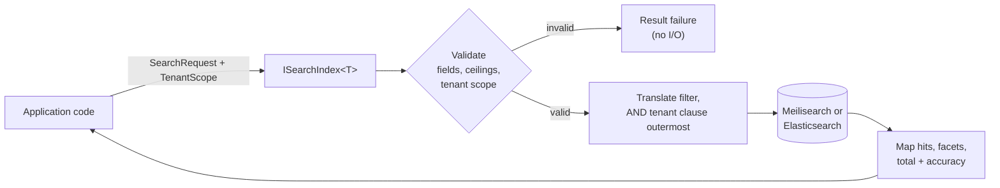

# SharedKernel.Search.Abstractions

[](https://dotnet.microsoft.com/)
[](https://github.com/Gresta-Vertex-Labs/platform-shared-kernel/blob/main/LICENSE)


> **The provider-neutral full-text search contract: index, search, count, walk and rebuild documents with an explicit
> tenant scope on every read, without your application code ever touching a Meilisearch or Elasticsearch SDK.**

| You get | So that |
| --- | --- |
| `ISearchIndex<TDocument>` | One contract for writes, search, get, count and corpus walks on either engine |
| `TenantScope` as a separate, mandatory parameter | A tenant predicate can never be dropped with a business filter; a tenanted index refuses `TenantScope.Global` before any I/O |
| `SearchQuery.New()` over a closed 8-node `SearchFilter` AST | Queries are validated before they reach the engine; nothing is silently dropped or approximated |
| `SearchCount` and `TotalHitsAccuracy` | A capped or estimated total is never reported as exact; `ToPagedList()` refuses one |
| `ISearchIndexProvisioner` | Idempotent, additive-only provisioning, staging → live cutover, and a check that the live schema matches the code |
| `SearchIndexReadinessProbe` | One `search-{provider}-{index}` readiness probe per registered index, registered by the provider |
| `SearchErrors` | Outages, timeouts and auth failures are `Result` values (`search.unreachable`, `search.timeout`, `search.unauthorized`) on both engines |

## Contents

- [Install](#install)
- [Quick start](#quick-start)
- [How it works](#how-it-works)
- [Recipes](#recipes)
- [Reference](#reference)
- [Testing](#testing)
- [Pitfalls](#pitfalls)
- [Design decisions](#design-decisions)

## Install

```xml
<PackageReference Include="SharedKernel.Search.Abstractions" />
```

The version comes from your central `SharedKernelVersion` property — every SharedKernel package ships at the same
version. See [Using the packages](https://github.com/Gresta-Vertex-Labs/platform-shared-kernel#using-the-packages).

This package ships no DI extensions and no implementation. Your host also references one provider:
[`SharedKernel.Search.Meilisearch`](https://github.com/Gresta-Vertex-Labs/platform-shared-kernel/blob/main/src/Infrastructure/Search/SharedKernel.Search.Meilisearch/README.md)
or [`SharedKernel.Search.ElasticSearch`](https://github.com/Gresta-Vertex-Labs/platform-shared-kernel/blob/main/src/Infrastructure/Search/SharedKernel.Search.ElasticSearch/README.md).

| Requirement | Value |
| --- | --- |
| Target framework | `net10.0` |
| Tier | Abstractions — reference it from your **Application** project |
| Depends on | `SharedKernel.Primitives`, `SharedKernel.Execution` (`TenantScope`), `SharedKernel.Contracts` (`PagedList<T>`); no third-party packages |
| Namespaces | `SharedKernel.Search.Abstractions.Abstractions`, `.Models`, `.Querying`, `.Errors`, `.Constants`, `.Exceptions` |

## Quick start

**1. Declare the document and its field names.** Fields are strings; a constants class with `nameof` keeps them in
sync with the document type.

```csharp
using SharedKernel.Search.Abstractions.Abstractions;

public sealed class ProductDocument : ISearchDocument
{
    public required string DocumentId { get; init; }   // A-Z a-z 0-9 - _ only; stable across rebuilds
    public required string TenantId { get; init; }     // TenantId.ToString() of the owning tenant
    public required string Name { get; init; }
    public required string Category { get; init; }
    public required double Price { get; init; }
}

public static class ProductFields
{
    public const string DocumentId = nameof(ProductDocument.DocumentId);
    public const string TenantId = nameof(ProductDocument.TenantId);
    public const string Name = nameof(ProductDocument.Name);
    public const string Category = nameof(ProductDocument.Category);
    public const string Price = nameof(ProductDocument.Price);
}
```

**2. Register the index** with a provider in the host (see the provider README for configuration):

```csharp
builder.Services
    .AddSharedKernelMeilisearchSearch(builder.Configuration)          // or AddSharedKernelElasticSearchSearch
    .AddIndex<ProductDocument>("products", index => index
        .PrimaryKey(ProductFields.DocumentId)
        .TenantField(ProductFields.TenantId)
        .Field(ProductFields.TenantId, SearchFieldKind.Keyword, filterable: true)
        .Field(ProductFields.Name, SearchFieldKind.Text, searchable: true)
        .Field(ProductFields.Category, SearchFieldKind.Keyword, filterable: true, facetable: true)
        .Field(ProductFields.Price, SearchFieldKind.Decimal, filterable: true, sortable: true))
    .Build();
```

**3. Search from application code:**

```csharp
using SharedKernel.Execution.Tenancy;
using SharedKernel.Primitives.Results;
using SharedKernel.Search.Abstractions.Abstractions;
using SharedKernel.Search.Abstractions.Models;
using SharedKernel.Search.Abstractions.Querying;

public sealed class ProductSearch(ISearchIndex<ProductDocument> index)
{
    public async Task<Result<SearchResults<ProductDocument>>> FindAsync(
        TenantId tenantId, string? text, string? category, CancellationToken ct)
    {
        var query = SearchQuery.New()
            .Matching(text)
            .OrderByDescending(ProductFields.Price)
            .Faceting(ProductFields.Category)
            .Page(page: 1, pageSize: 20);

        if (category is not null)
            query = query.Where(SearchFilter.Eq(ProductFields.Category, category));

        var request = query.Build();
        if (request.IsFailure)
            return Result<SearchResults<ProductDocument>>.Failure(request.Error);

        return await index.SearchAsync(request.Value, TenantScope.For(tenantId), ct);
    }
}
```

Swapping the provider registration changes nothing in this class.

## How it works



- **Tenancy.** `TenantScope` (`SharedKernel.Execution.Tenancy`) is a separate parameter on every read
  (`SearchAsync`, `GetAsync`, `CountAsync`, `EnumerateAsync`) and every filtered write (`DeleteByFilterAsync`). The
  provider injects `tenantField = TenantId.ToString()` as the outermost `AND` after translating your filter. An index
  that declares a `TenantField` and receives `TenantScope.Global` fails with `search.tenant_scope_missing` before any
  I/O. `GetAsync` never returns another tenant's document by id.
- **Validation before I/O.** Undeclared or wrongly-roled fields, pages past `MaxTotalHits`, facet caps, invalid
  document ids and a missing tenant scope are `Result` failures returned before the engine is called.
- **Writes state their consistency.** `SearchWriteConsistency.Accepted` returns at the engine's fastest
  acknowledgement; `Searchable` waits until the write is visible to search. There is no default.
- **Bulk writes report per document.** `IndexManyAsync`/`DeleteManyAsync` return a *successful* `Result` whose
  `SearchBulkReceipt.Failures` lists the documents that failed; `Result.Failure` means the request itself did not run.
- **Operational failures are values.** An outage is `search.unreachable` (`ErrorType.Unavailable`, 503), a timeout
  `search.timeout` (504), bad credentials `search.unauthorized` — identical on both providers. Cancellation you
  requested propagates as `OperationCanceledException`.
- **Streams throw.** `EnumerateAsync` returns `IAsyncEnumerable<TDocument>`; a mid-stream fault surfaces as
  `SearchStreamException` (carrying the `Error`) from `MoveNextAsync`. Its order is unspecified.
- **Honest totals.** `SearchResults<T>.TotalHits` comes with `Accuracy` (`Exact`, `LowerBound`, `Estimated`);
  `CountAsync` returns a `SearchCount` whose `ToString()` renders a lower bound as `>=N`.
- **Telemetry.** Providers emit a `search {operation}` span and the `search.client.operation.duration` (s) and
  `search.client.documents` instruments on the `SharedKernel.Search` source and meter, tagged `search.index`,
  `search.operation`, `search.provider`, `error.type`. Query text, filter values and document ids are never recorded.
  Wire them with `builder.WithSearchTelemetry()` (`SharedKernel.ServiceDefaults`).

## Recipes

### 1. Build filters

```csharp
var filter = SearchFilter.All(
    SearchFilter.Eq(ProductFields.Category, "electronics"),              // string → SearchValue implicitly
    SearchFilter.Between(ProductFields.Price, from: 10.0, to: 100.0),   // Int64, Double or DateTimeOffset bounds only
    SearchFilter.Negate(SearchFilter.In(ProductFields.Category, "outlet", "refurbished")));

var request = SearchQuery.New().Where(filter).Build();
```

The eight nodes are `Eq`, `Ne`, `In`, `Between`, `Exists`, `All`, `Any` and `Negate`, over `SearchValue`
(`String`, `Int64`, `Double`, `Boolean`, `DateTimeOffset`; a `Guid` is stored as a string). Repeated `Where(...)`
calls AND together; the builder is immutable. `SearchRequest.Default with { FreeText = "x" }` is an equivalent,
builder-free path.

### 2. Filter on a list of objects

There is no nested filter node: Meilisearch flattens arrays of objects and would match `size == "M" AND colour ==
"red"` across different variants. Precompute a composite field at mapping time and filter it with `In`:

```csharp
// On the document: IReadOnlyList<string> VariantSizeColour, filled at mapping time with
// variants.Select(v => $"{v.Size}|{v.Colour}")  →  ["M|blue", "L|red"], declared filterable.
var filter = SearchFilter.In(ProductFields.VariantSizeColour, "M|red");
```

### 3. Page into a `PagedList<T>`

```csharp
var request = SearchQuery.New().Matching(text).Page(page, pageSize).RequireExactTotalHits().Build();
// …SearchAsync…
Result<PagedList<ProductDocument>> paged = results.ToPagedList();
```

`ToPagedList()` fails with `search.total_hits_not_exact` unless the request set `RequireExactTotalHits` and the
provider returned `TotalHitsAccuracy.Exact`. Facets, ranks and highlights are dropped in the projection.

### 4. Count documents

```csharp
Result<SearchCount> count = await index.CountAsync(filter, TenantScope.For(tenantId), ct);
if (count.IsSuccess && count.Value.IsExact) { /* count.Value.Value is the real total */ }
```

Elasticsearch counts are always exact. Meilisearch has no count endpoint; a count that reaches the index's
`MaxTotalHits` is `LowerBound`.

### 5. Pace a large bulk write

```csharp
Result<SearchBulkReceipt> receipt = await index.IndexManyAsync(
    documents, SearchWriteConsistency.Accepted,
    new SearchBulkWriteOptions { MaxBatchesPerSecond = 5 }, ct);
```

`MaxBatchesPerSecond` caps the rate of the provider's own sequential batches (it adds no concurrency). The 3-argument
overload uses `SearchBulkWriteOptions.Default` (unthrottled). `DeleteManyAsync` accepts the options for parity only:
both providers send a delete-by-id bulk call as one request.

### 6. Add synonyms and stop words

```csharp
.AddIndex<ProductDocument>("products", index => index
    .Field(ProductFields.Name, SearchFieldKind.Text, searchable: true)
    .Synonym("tv", "television")     // one-way: a query for "tv" also matches "television"
    .StopWords("the", "a", "of"))    // supply them lowercased
```

Both are applied when the index is created and are part of its schema fingerprint. Changing them on a live index
returns `search.index_definition_conflict`; rebuild through a staging index (recipe 7).

### 7. Rebuild an index without downtime

```csharp
await provisioner.EnsureIndexAsync(stagingDefinition, ct);                     // 1. create staging
await stagingIndex.IndexManyAsync(allDocuments, SearchWriteConsistency.Accepted, ct);    // 2. bulk-load it
                                                                               //    (an index registered on the staging name)
await provisioner.CutoverAsync(new IndexCutoverRequest                         // 3. atomic switch
{
    StagingIndexName = "products-v2",
    LiveIndexName = "products",
}, ct);
```

`EnsureIndexAsync` is idempotent and additive-only. The cutover mechanics differ per engine (Meilisearch swaps
indexes, Elasticsearch moves an alias) — read the provider README before relying on `DeleteStagingAfterCutover`
(default `true`).

### 8. Catch a schema change that was never deployed

```csharp
Result verification = await provisioner.VerifyRegisteredIndexesAsync(ct);
```

Checks every registered index exists, is addressable with this service's credentials and carries the fingerprint of
the definition the code declares; a mismatch fails with `search.probe_failed` naming each index. One round trip per
index — call it from a startup task or a deployment smoke test.

### 9. Run both engines in one service

Give each engine its own document type (`ISearchIndex<TDocument>` is then unambiguous) and resolve the non-generic
contracts by key:

```csharp
var meili = sp.GetRequiredKeyedService<ISearchIndexProvisioner>(SearchWellKnown.MeilisearchProviderName);
var elastic = sp.GetRequiredKeyedService<ISearchIndexProvisioner>(SearchWellKnown.ElasticSearchProviderName);
```

An unkeyed resolution returns whichever provider registered last.

## Reference

### Contracts

| Type | Lifetime (as registered by a provider) | Members |
| --- | --- | --- |
| `ISearchDocument` | — | `string DocumentId` |
| `ISearchIndex<TDocument>` | scoped | `IndexAsync`, `IndexManyAsync` (3/4 args), `DeleteAsync`, `DeleteManyAsync` (3/4 args), `DeleteByFilterAsync`, `ClearAsync`, `WaitUntilSearchableAsync`, `SearchAsync`, `GetAsync`, `CountAsync`, `EnumerateAsync`, `IndexName` |
| `ISearchIndexProvisioner` | singleton, keyed by provider name + unkeyed | `EnsureIndexAsync`, `IndexExistsAsync`, `DeleteIndexAsync`, `CutoverAsync`, `VerifyRegisteredIndexesAsync` |
| `ISearchProviderDescriptor` | singleton, keyed + unkeyed | `ProviderName`, `MaxTotalHits`, `MaxFacetValues`, `RegisteredIndexes`, `Validate(indexName, request)` (zero I/O) |
| `IQueryBuilder` (`SearchQuery.New()`) | — | `Matching`, `MatchAllTerms`, `SearchingIn`, `Where`, `OrderBy`, `OrderByDescending`, `Faceting`, `WithNumericFacetStats`, `Page`, `Highlighting`, `Returning`, `RequireExactTotalHits`, `Build` → `Result<SearchRequest>` |
| `SearchIndexDefinitionBuilder` | — | `PrimaryKey`, `TenantField`, `Field(name, kind, searchable, filterable, sortable, facetable)`, `Synonym`, `StopWords`, `MaxTotalHits`, `MaxFacetValues`, `Build` |

`SearchFieldKind`: `Text`, `Keyword`, `Integer`, `Decimal`, `Boolean`, `DateTimeOffset`. `SearchWellKnown` holds
`DefaultPageSize` (20), `MaxPageSize` (1000), `DefaultMaxTotalHits` (1000), `DefaultMaxFacetValues` (100),
`DefaultPrimaryKeyField` (`documentId`), the provider names (`meilisearch`, `elasticsearch`) and the telemetry names.

### Errors

All from `SearchErrors`; each factory takes the details it names.

| Code | Type | When |
| --- | --- | --- |
| `search.index_not_found` | NotFound | The index does not exist |
| `search.document_not_found` | NotFound | `GetAsync` found no document for this id and tenant |
| `search.invalid_request` | Validation | A malformed request, or an invalid `ToPagedList()` projection |
| `search.invalid_filter` | Validation | A filter the index cannot evaluate |
| `search.invalid_index_definition` | Validation | `SearchIndexDefinitionBuilder.Build()` rejected the definition |
| `search.invalid_document_id` | Validation | A document id outside `A-Z a-z 0-9 - _` |
| `search.field_not_searchable` / `_filterable` / `_sortable` / `_facetable` | Validation | A field used in a role it was not declared for |
| `search.pagination_limit_exceeded` | Validation | `page × pageSize` past the index's `MaxTotalHits` |
| `search.facet_limit_exceeded` | Validation | More facet values than `MaxFacetValues` |
| `search.total_hits_not_exact` | Validation | `ToPagedList()` on a non-exact total |
| `search.unsupported_capability` | Validation | Reserved; unreachable with the closed filter set |
| `search.index_already_exists` | Conflict | Creating an index that exists |
| `search.index_definition_conflict` | Conflict | An incompatible field, synonym or stop-word change on a live index |
| `search.cutover_failed` | Conflict | `CutoverAsync` could not complete |
| `search.schema_fingerprint_mismatch` | Conflict | Declared for a live index built from another definition |
| `search.unauthorized` | Unauthorized | The engine refused this service's credentials |
| `search.tenant_scope_missing` | Unauthorized | `TenantScope.Global` on an index that declares a `TenantField` |
| `search.unreachable` | Unavailable | The engine did not answer |
| `search.timeout` | Timeout | The operation timed out |
| `search.write_timeout` | Timeout | A `Searchable` write was not visible in time |
| `search.write_rejected` | Unexpected | The engine rejected a write |
| `search.bulk_partially_failed` | Unexpected | Declared; bulk writes report failures in `SearchBulkReceipt.Failures` instead |
| `search.probe_failed` | Unexpected | A readiness probe or `VerifyRegisteredIndexesAsync` failed |
| `search.engine_version_unsupported` | Unexpected | The engine version is outside the supported range |
| `search.engine_fault` | Unexpected | Any other engine error |

### Logging

This package does not log. Its EventId sub-block 9000–9099 is reserved; the providers log in 9100–9199
(Meilisearch) and 9200–9299 (Elasticsearch).

### Health

`SearchIndexReadinessProbe` implements `IReadinessProbe`. Each provider's `Build()` registers one per index, named
`search-{provider}-{index}` (`SearchIndexReadinessProbe.ProbeNameFor`). Ready means the engine is reachable, the index
is addressable with this service's credentials and a zero-row search succeeds; a write backlog never fails readiness.
The report data carries `Provider`, `Index`, `Reachable`, `IndexAddressable`, `Searchable`, `DocumentCount`,
`EngineVersion`, and when known `PendingWriteCount` and `SchemaFingerprint` (`ErrorCode` on failure). The host exposes
all probes with `services.AddHealthChecks().AddSharedKernelReadiness()`.

## Testing

Reference [`SharedKernel.Search.Testing`](https://github.com/Gresta-Vertex-Labs/platform-shared-kernel/blob/main/src/Testing/SharedKernel.Search.Testing/README.md)
(namespace `SharedKernel.Testing.Search`) from your test project. No engine is needed.

```csharp
var definition = new SearchIndexDefinitionBuilder("products")
    .TenantField(ProductFields.TenantId)
    .Field(ProductFields.TenantId, SearchFieldKind.Keyword, filterable: true)
    .Field(ProductFields.Category, SearchFieldKind.Keyword, filterable: true, facetable: true)
    .Build().Value;

services.AddInMemorySearchIndex<ProductDocument>(definition);   // ISearchIndex<ProductDocument>
services.AddInMemorySearchProvisioning();                         // ISearchIndexProvisioner + ISearchProviderDescriptor
```

`InMemorySearchIndex<TDocument>` evaluates the full `SearchFilter` tree and the tenant scope, and exposes `Seed`,
`WasIndexed`, `WasDeleted`, `IsSearchable`, `IndexedDocumentIds`, `DeletedDocumentIds`, `LastBulkWriteOptions`,
`SimulateFailure` and `Reset`. `InMemorySearchIndexProvisioner` and `InMemorySearchProviderDescriptor` have
`SimulateFailure`/`Reset` and `RegisterIndex` respectively.

## Pitfalls

| Don't | Do | Why |
| --- | --- | --- |
| Put the tenant into the `SearchFilter` | Pass `TenantScope.For(tenantId)` | The scope is applied as the outermost clause; a clause in your filter is just another predicate |
| Store the tenant as a slug or `Guid` value in the document | Store `TenantId.ToString()` in the tenant field | The provider compares against that exact string |
| Repeat field names as literals | Use a field-constants class with `nameof` | A typo is a rejected filter on Meilisearch and a silent zero-result on Elasticsearch |
| Call `ToPagedList()` without `RequireExactTotalHits()` | Request an exact total first | Otherwise it fails with `search.total_hits_not_exact` |
| Build resumable state on `EnumerateAsync` order | Treat it as an unordered corpus walk | The order is unspecified |
| Pass `SearchFilter.Any()` with no operands | Guard an empty operand list | Meilisearch rejects it (`search.engine_fault`), Elasticsearch matches everything |
| Treat `Result.Success` from a bulk write as "all written" | Check `SearchBulkReceipt.HasFailures` | Per-document failures are reported in the receipt |
| Resolve `ISearchIndexProvisioner` unkeyed in a two-engine host | Resolve it keyed by `SearchWellKnown.*ProviderName` | Unkeyed returns the provider registered last |
| Register both providers for the same `TDocument` | Give each engine its own document type | The second `ISearchIndex<TDocument>` registration silently wins |

## Design decisions

**Why is everything here implementable by both engines?** A member that one adapter would have to throw on, degrade
or approximate does not belong in the neutral contract. Engine-only capabilities (instant search, tenant tokens,
aggregations, cursors, suggestions) are declared in their provider package, so a provider swap is a build error that
lists every non-portable call site. There is no capability-flags enum for the same reason.

**Why string field names instead of LINQ?** An `IQueryable` promises a completeness no search engine delivers. Field
constants plus `nameof` give refactor safety without the promise.

**Why no score?** Meilisearch ranking buckets and Elasticsearch BM25 share no scale. `SearchHit<T>.Rank` (0-based
position in the page) is the only portable ordering signal.

**Why `SearchCount` instead of `long`?** Meilisearch cannot count past its `maxTotalHits`; the accuracy has to travel
with the number.

---

Part of [Platform.SharedKernel](https://github.com/Gresta-Vertex-Labs/platform-shared-kernel) ·
[Search domain](https://github.com/Gresta-Vertex-Labs/platform-shared-kernel/blob/main/src/Infrastructure/Search/README.md) ·
[MIT license](https://github.com/Gresta-Vertex-Labs/platform-shared-kernel/blob/main/LICENSE)
