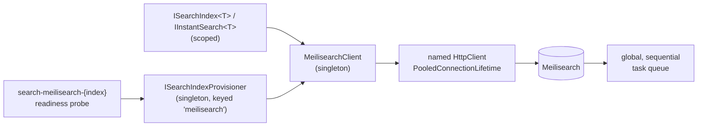

# SharedKernel.Search.Meilisearch

[](https://dotnet.microsoft.com/)
[](https://github.com/Gresta-Vertex-Labs/platform-shared-kernel/blob/main/LICENSE)


[](https://www.meilisearch.com/)

> **The Meilisearch provider for `SharedKernel.Search.Abstractions`: fast, typo-tolerant user-facing search behind
> `ISearchIndex<TDocument>`, plus instant search and engine-enforced tenant tokens a browser can hold.**
> Pick it for storefront and type-ahead search; pick `SharedKernel.Search.ElasticSearch` when you need aggregations,
> paging past `MaxTotalHits` or analytics over large corpora.

| You get | So that |
| --- | --- |
| `AddSharedKernelMeilisearchSearch(configuration).AddIndex<T>(…).Build()` | One chain registers the client, every index, its provisioner and its readiness probe, validated at startup |
| `ISearchIndex<TDocument>` over Meilisearch | Application code stays on the neutral contract; the tenant clause is added by the provider |
| `IInstantSearch<TDocument>` | Typo-tolerant, prefix-matching type-ahead and facet-value search |
| `ITenantSearchTokenIssuer` (`.WithTenantTokens()`) | A short-lived token whose tenant filter the engine enforces, safe to hand to a browser |
| `.WithRankingRules(index, …)` | Typed, ordered relevance tie-breakers instead of raw strings |
| One `search-meilisearch-{index}` readiness probe per index | `/health/ready` reflects each index, with nothing to register |

## Contents

- [Install](#install)
- [Quick start](#quick-start)
- [How it works](#how-it-works)
- [Recipes](#recipes)
- [Configuration](#configuration)
- [Reference](#reference)
- [Testing](#testing)
- [Pitfalls](#pitfalls)
- [Design decisions](#design-decisions)

## Install

```xml
<PackageReference Include="SharedKernel.Search.Meilisearch" />
```

The version comes from your central `SharedKernelVersion` property — every SharedKernel package ships at the same
version. See [Using the packages](https://github.com/Gresta-Vertex-Labs/platform-shared-kernel#using-the-packages).

| Requirement | Value |
| --- | --- |
| Target framework | `net10.0` |
| Tier | Adapter — reference it from your **Infrastructure** project (or the host) |
| Depends on | `SharedKernel.Search.Abstractions`, `SharedKernel.Configuration`, the `MeiliSearch` SDK, `Microsoft.Extensions.Http` |
| Host must register | `IClock` (`SharedKernel.Primitives.Clocks`) and logging |
| Namespaces | `SharedKernel.Search.Meilisearch.Extensions`, `.Options`, `.Instant`, `.Tenancy`, `.Provisioning`, `.Errors`, `.Raw` |

## Quick start

```csharp
using SharedKernel.Primitives.Clocks;
using SharedKernel.Search.Abstractions.Models;
using SharedKernel.Search.Meilisearch.Extensions;

builder.Services.AddSingleton<IClock, SystemClock>();

builder.Services
    .AddSharedKernelMeilisearchSearch(builder.Configuration)    // section Search:Meilisearch
    .AddIndex<ProductDocument>("products", index => index
        .PrimaryKey(ProductFields.DocumentId)
        .TenantField(ProductFields.TenantId)
        .Field(ProductFields.TenantId, SearchFieldKind.Keyword, filterable: true)
        .Field(ProductFields.Name, SearchFieldKind.Text, searchable: true)
        .Field(ProductFields.Category, SearchFieldKind.Keyword, filterable: true, facetable: true)
        .Field(ProductFields.Price, SearchFieldKind.Decimal, filterable: true, sortable: true))
    .Build();

builder.Services.AddHealthChecks().AddSharedKernelReadiness();   // SharedKernel.ServiceDefaults
```

```json
{
  "Search": {
    "Meilisearch": {
      "Url": "http://localhost:7700",
      "ApiKey": "<a key with the permissions this service needs>"
    }
  }
}
```

Provision once (a deployment step or startup task), then use the neutral contract:

```csharp
using SharedKernel.Execution.Tenancy;
using SharedKernel.Primitives.Results;
using SharedKernel.Search.Abstractions.Abstractions;
using SharedKernel.Search.Abstractions.Models;
using SharedKernel.Search.Abstractions.Querying;

public sealed class ProductCatalog(ISearchIndexProvisioner provisioner, ISearchIndex<ProductDocument> index)
{
    public Task ProvisionAsync(SearchIndexDefinition definition, CancellationToken ct) =>
        provisioner.EnsureIndexAsync(definition, ct);          // idempotent, additive-only

    public async Task<Result<SearchResults<ProductDocument>>> SearchAsync(TenantId tenantId, string text, CancellationToken ct)
    {
        var request = SearchQuery.New().Matching(text).Page(1, 20).Build();
        return request.IsFailure
            ? Result<SearchResults<ProductDocument>>.Failure(request.Error)
            : await index.SearchAsync(request.Value, TenantScope.For(tenantId), ct);
    }
}
```

The document type, field constants and the rest of the neutral API are described in
[`SharedKernel.Search.Abstractions`](https://github.com/Gresta-Vertex-Labs/platform-shared-kernel/blob/main/src/Infrastructure/Search/SharedKernel.Search.Abstractions/README.md).

## How it works



- **Registration.** `AddSharedKernelMeilisearchSearch` binds and validates `MeilisearchOptions` and registers one
  singleton `MeilisearchClient` over a named `IHttpClientFactory` client. Each `AddIndex<T>` registers scoped
  `ISearchIndex<T>` and `IInstantSearch<T>`. `Build()` registers `ISearchIndexProvisioner` and
  `ISearchProviderDescriptor` as singletons, keyed `meilisearch` and unkeyed (the same instance), plus one readiness
  probe per index. A bad index definition throws from `AddIndex`; bad options fail on host start.
- **Writes.** Meilisearch writes are tasks. `SearchWriteConsistency.Accepted` returns once the task is enqueued;
  `Searchable` polls the task every `TaskPollIntervalMilliseconds` up to `TaskWaitTimeoutSeconds`
  (`search.write_timeout` after that). A failed task is `search.meilisearch.indexing_task_failed`.
- **The task queue is global.** Every write on an instance, for every index, goes through one sequential queue. A bulk
  import on one index delays writes to every other index, and the probe's `PendingWriteCount` is instance-wide.
- **Tenancy.** The tenant clause (`tenantField = "<TenantId>"`) is ANDed outside your translated filter; `GetAsync`
  checks the tenant field of the returned document.
- **Counts.** Meilisearch has no count endpoint: `CountAsync` reads the total of a search, capped at the index's
  `MaxTotalHits`, and reports `LowerBound` when it reaches the cap (EventId 9122).
- **Cutover.** `CutoverAsync` uses `POST /swap-indexes`: it creates an empty live index if none exists, swaps, and the
  staging name then holds the previous data. `DeleteStagingAfterCutover` (default `true`) deletes it; `false` keeps it
  and logs 9113.
- **Failures.** SDK exceptions are classified onto `search.unreachable`, `search.timeout`, `search.unauthorized` or
  `search.engine_fault` (EventId 9123).
- **Connection recycling.** The singleton client never returns its handler to the factory, so
  `PooledConnectionLifetimeMinutes` recycles connections and re-resolves DNS after a pod moves.

## Recipes

### 1. Instant search and facet-value type-ahead

```csharp
using SharedKernel.Search.Meilisearch.Instant;

Result<SearchResults<ProductDocument>> hits = await instantSearch.InstantAsync(
    new InstantSearchRequest { FreeText = "wireles head", Limit = 10 },
    TenantScope.For(tenantId), ct);

Result<IReadOnlyList<FacetValue>> brands = await instantSearch.SearchFacetValuesAsync(
    ProductFields.Category, facetQuery: "elec", filter: null, TenantScope.For(tenantId), ct);
```

`InstantAsync` applies typo tolerance, prefix matching and cropping. `InstantSearchRequest` defaults: `Limit` 10,
`MatchingStrategy` `Last` (`All`, `Frequency` also available), `CropMarker` `"…"`, plus optional `Filter`,
`AttributesToSearchOn`, `Highlight` and `CropLength`. `SearchFacetValuesAsync` searches *within* one facet's values;
it is not the facet distribution `SearchAsync` returns.

### 2. Issue a tenant search token for a browser

```csharp
using SharedKernel.Search.Meilisearch.Tenancy;

builder.Services.AddSharedKernelMeilisearchSearch(builder.Configuration)
    .AddIndex<ProductDocument>("products", index => index.TenantField(ProductFields.TenantId) /* … */)
    .WithTenantTokens()                       // registers ITenantSearchTokenIssuer (scoped)
    .Build();

public sealed class StorefrontTokens(ITenantSearchTokenIssuer issuer)
{
    public Task<Result<TenantSearchToken>> IssueAsync(TenantId tenantId, CancellationToken ct) =>
        issuer.IssueAsync(TenantScope.For(tenantId), ProductFields.TenantId, ["products"], TimeSpan.FromMinutes(10), ct);
}
```

The token is a signed JWT whose search rules — built by this package from the `TenantScope` and tenant field, never
by the caller — are enforced by the engine. It requires `ApiKeyUid` (the uid of the key that signs, which Meilisearch
does not allow to be the master key). The issuer fails with `search.tenant_scope_missing` for `TenantScope.Global`,
`search.meilisearch.tenant_token_ttl_out_of_range` for a TTL above `TenantTokenMaxTtlMinutes`, and
`search.meilisearch.tenant_token_issuance_failed` for a missing `ApiKeyUid`, tenant field or index list.
**Tokens cannot be revoked before they expire** and scope search only, not writes: keep the TTL short and re-issue.

### 3. Set ranking rules

```csharp
using SharedKernel.Search.Meilisearch.Provisioning;

builder.Services.AddSharedKernelMeilisearchSearch(builder.Configuration)
    .AddIndex<ProductDocument>("products", index => index /* … */)
    .WithRankingRules("products",
        MeilisearchRankingRule.Words, MeilisearchRankingRule.Typo, MeilisearchRankingRule.Proximity,
        MeilisearchRankingRule.Attribute, MeilisearchRankingRule.Sort, MeilisearchRankingRule.Exactness,
        MeilisearchRankingRule.Descending(ProductFields.Price))
    .Build();
```

Call it after the matching `AddIndex` (otherwise it throws). The list **replaces** the engine default, in the order
given — include every rule you still want. Applied by `EnsureIndexAsync` (EventId 9127).

### 4. Pace a reindex on a shared instance

```csharp
await index.IndexManyAsync(products, SearchWriteConsistency.Accepted,
    new SearchBulkWriteOptions { MaxBatchesPerSecond = 5 }, ct);
```

Documents are sent in `DefaultBatchSize` batches with a computed delay between them (EventId 9121). Better still,
keep bulk imports and latency-sensitive traffic on separate instances.

### 5. Rebuild through a staging index

```csharp
await provisioner.EnsureIndexAsync(stagingDefinition, ct);    // e.g. "products-staging"
// bulk-load products-staging
await provisioner.CutoverAsync(new IndexCutoverRequest
{
    StagingIndexName = "products-staging",
    LiveIndexName = "products",                              // a real index name on Meilisearch
}, ct);                                                      // staging (now holding old data) is deleted
```

## Configuration

Section `Search:Meilisearch` (`MeilisearchOptions.SectionName`), validated when the host starts. Every setting applies
to every index registered on the builder.

| Key | Type | Default | Meaning |
| --- | --- | --- | --- |
| `Search:Meilisearch:Url` | `string` | — (required, URL) | The Meilisearch base address |
| `Search:Meilisearch:ApiKey` | `string` | — (required) | The API key this service authenticates with; also signs tenant tokens |
| `Search:Meilisearch:ApiKeyUid` | `string?` | `null` | The uid of `ApiKey`; required only by `.WithTenantTokens()` |
| `Search:Meilisearch:HttpTimeoutSeconds` | `int` | `30` | HTTP client timeout, 1–300 |
| `Search:Meilisearch:TaskWaitTimeoutSeconds` | `int` | `120` | How long a `Searchable` write or `WaitUntilSearchableAsync` waits, 1–3600 |
| `Search:Meilisearch:TaskPollIntervalMilliseconds` | `int` | `250` | Task polling interval, 25–5000 |
| `Search:Meilisearch:MaxTotalHits` | `int` | `1000` | Pagination and count ceiling, 1–100000 |
| `Search:Meilisearch:MaxFacetValues` | `int` | `100` | Values returned per facet, 1–10000 |
| `Search:Meilisearch:DefaultBatchSize` | `int` | `1000` | Documents per bulk batch, 1–100000 |
| `Search:Meilisearch:TenantTokenMaxTtlMinutes` | `int` | `15` | Longest tenant-token lifetime allowed, 1–60 |
| `Search:Meilisearch:PooledConnectionLifetimeMinutes` | `int` | `5` | How long a pooled connection is reused before it is recycled (not a timeout), 1–60 |

## Reference

### Registration

| Method | Registers |
| --- | --- |
| `AddSharedKernelMeilisearchSearch(IConfiguration)` / `(IConfigurationSection)` | `MeilisearchOptions`, the named HTTP client, `MeilisearchClient` (singleton); returns `MeilisearchSearchBuilder` |
| `.AddIndex<TDocument>(indexName, configure)` | `ISearchIndex<TDocument>`, `IInstantSearch<TDocument>` (scoped) |
| `.WithRankingRules(indexName, params MeilisearchRankingRule[])` | Ranking rules applied at provisioning |
| `.WithTenantTokens()` | `ITenantSearchTokenIssuer` (scoped) |
| `.AllowRawClientAccess()` | `IMeilisearchRawClientAccessor` (singleton; `Client`, `IndexHandle(name)`) — bypasses tenant scoping |
| `.Build()` | `ISearchIndexProvisioner`, `ISearchProviderDescriptor` (singleton, keyed `meilisearch` + unkeyed), one readiness probe per index |

### Errors

Neutral codes come from `SearchErrors` (see the Abstractions README). Meilisearch-only codes, from `MeilisearchErrors`:

| Code | Type | When |
| --- | --- | --- |
| `search.meilisearch.indexing_task_failed` | Unexpected | A write task finished as failed |
| `search.meilisearch.tenant_token_issuance_failed` | Unexpected | Token signing failed, or `ApiKeyUid`, tenant field or index list missing |
| `search.meilisearch.tenant_token_ttl_out_of_range` | Validation | The TTL is not positive or exceeds `TenantTokenMaxTtlMinutes` |

### Logging

| Event id | Level | Event |
| --- | --- | --- |
| 9100 | Information | Client configured for `{Url}` with `{IndexCount}` indexes |
| 9101 | Information | Index ensured with `{FieldCount}` fields |
| 9102 | Information | Index settings applied (filterable, sortable, facetable counts) |
| 9103 | Debug | Documents enqueued as a task |
| 9104 | Debug | Document deletion enqueued as a task |
| 9105 | Debug | Task completed |
| 9106 | Warning | Waiting for a task timed out |
| 9107 | Error | Task failed with an engine error code |
| 9108 | Warning | Bulk operation partially failed |
| 9109 | Debug | Search returned hits |
| 9110 | Warning | Search request rejected before any I/O |
| 9111 | Warning | Tenanted index called with `TenantScope.Global` |
| 9112 | Information | Indexes swapped (cutover) |
| 9113 | Warning | Staging index retained after cutover |
| 9114 | Debug | Tenant search token issued |
| 9115 | Warning | Raw client access enabled — bypasses tenant scoping |
| 9116 | Warning | Probe degraded |
| 9117 | Warning | Write backlog is deep |
| 9118 | Warning | Schema fingerprint mismatch |
| 9119 | Error | Operation faulted |
| 9120 | Debug | Document walk started |
| 9121 | Debug | Bulk operation throttled |
| 9122 | Debug | `CountAsync` reached the `maxTotalHits` ceiling (lower bound) |
| 9123 | Warning | Operation faulted and was mapped to an error code |
| 9124 | Information | Synonyms and stop words applied |
| 9125 | Warning | Index settings drifted from the registered definition |
| 9126 | Information | Index settings verified against the registered definition |
| 9127 | Information | Ranking rules applied |

### Health

`Build()` registers one `IReadinessProbe` per index, named `search-meilisearch-{index}`. Ready means the instance is
reachable, the index is addressable with `ApiKey` and a zero-row search succeeds; a deep task queue does not fail it.
Expose them with `services.AddHealthChecks().AddSharedKernelReadiness()` (`SharedKernel.ServiceDefaults`).

## Testing

In a service's unit tests, replace the provider with the in-memory fakes of
[`SharedKernel.Search.Testing`](https://github.com/Gresta-Vertex-Labs/platform-shared-kernel/blob/main/src/Infrastructure/Search/SharedKernel.Search.Testing/README.md)
(`AddInMemorySearchIndex<TDocument>(definition)`, `AddInMemorySearchProvisioning()`). They cover the neutral contract
only: code that uses `IInstantSearch<T>` or `ITenantSearchTokenIssuer` needs a real engine. For integration tests run
`getmeili/meilisearch:v1.20.0` (the version this package is tested against) in a container.

## Pitfalls

| Don't | Do | Why |
| --- | --- | --- |
| Share one instance between a bulk import and a latency-sensitive storefront | Use separate instances, or pace imports with `MaxBatchesPerSecond` | The task queue is global and sequential per instance |
| Read `PendingWriteCount` as per-index | Treat it as instance-wide | Meilisearch's task listing is not per index |
| Issue long-lived tenant tokens | Keep the TTL short and re-issue | Tokens cannot be revoked before expiry |
| Sign tenant tokens with the master key | Provision a search key and set `ApiKeyUid` to its uid | Meilisearch will not sign a tenant token with the master key |
| Forget to register `IClock` | `services.AddSingleton<IClock, SystemClock>()` | The index and the token issuer resolve it |
| Set `WithRankingRules` with only the rule you care about | List every rule in order | The list replaces the engine default |
| Index a document without the primary key | Always set `DocumentId` | Meilisearch fails the whole write task, not one document |
| Use `IMeilisearchRawClientAccessor` for routine queries | Stay on `ISearchIndex<T>` | The raw client bypasses tenant scoping |

## Design decisions

**Why is instant search not on the neutral contract?** Typo tolerance and prefix matching have no faithful
Elasticsearch equivalent (`fuzziness` and `match_phrase_prefix` behave and cost differently). Declaring
`IInstantSearch<T>` here makes a provider swap a build error at each call site.

**Why build the tenant-token rules for the caller?** The SDK takes an untyped rule dictionary, where a mistake is a
silent cross-tenant leak. Building it from `TenantScope` removes that mistake.

**Why accept an SDK that is not AOT-safe?** The `MeiliSearch` SDK uses `dynamic` and runtime generics; it is contained
behind `ISearchIndex<T>` and can be replaced without touching application code.

---

Part of [Platform.SharedKernel](https://github.com/Gresta-Vertex-Labs/platform-shared-kernel) ·
[Search packages](https://github.com/Gresta-Vertex-Labs/platform-shared-kernel/blob/main/src/Infrastructure/Search/README.md) ·
[MIT license](https://github.com/Gresta-Vertex-Labs/platform-shared-kernel/blob/main/LICENSE)
