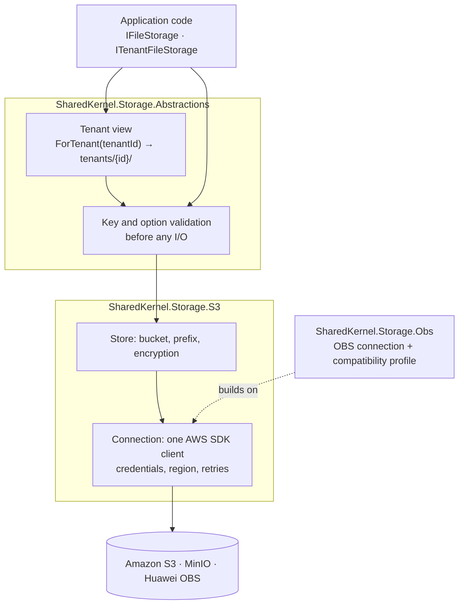

<div align="center">

# SharedKernel Storage

**Object storage for multi-tenant .NET services — Amazon S3, MinIO and Huawei Cloud OBS behind one contract, with
tenant isolation by construction, writes that never overwrite by accident and presigned uploads clients cannot abuse.**

[](https://dotnet.microsoft.com/)
[](../../../LICENSE)


[](https://github.com/aws/aws-sdk-net)

[What you get](#what-you-get) · [Packages](#packages) · [How it fits together](#how-it-fits-together) · [Get started](#get-started) · [See it run](#see-it-run) · [Guarantees](#guarantees)

<sub>📂 <code>src/Infrastructure/Storage</code> · <a href="../../../docs/packages.md">all packages by tier</a> · <a href="../../../README.md">Platform.SharedKernel</a></sub>

</div>

---

## What you get

- **Named stores.** Code names a purpose (`[FromKeyedServices("invoices")] IFileStorage`); buckets, prefixes,
  encryption, credentials and link lifetimes are configuration, validated when the host starts.
- **Tenant isolation you cannot bypass.** A tenant store is reachable only through `ITenantFileStorage.ForTenant(TenantId)`;
  every key is validated and confined to `tenants/{tenantId}/`, so no key, listing or copy reaches another tenant.
- **No silent overwrites.** `WriteCondition.IfNotExists` and `IfMatch(etag)` are enforced atomically by the provider;
  a provider that would ignore them refuses the request with `storage.not_supported` instead.
- **Direct client transfers with limits.** Presigned URLs, forms with a signed size range and content-type policy,
  and presigned multipart let clients move gigabytes without the bytes passing through your service.
- **Failures as values.** Not found, conflict, throttling and outages are `Result` errors with stable `storage.*`
  codes (`StorageErrorCodes`); every store registers a `storage-{store}` readiness probe.

## Packages

| Package | Tier | Reference it from | Use it for |
| --- | --- | --- | --- |
| [SharedKernel.Storage.Abstractions](SharedKernel.Storage.Abstractions/README.md) | Abstractions | Application | `IFileStorage`, `ITenantFileStorage`, `IFileStorageFactory`, the store registry and tenant views. No cloud SDK |
| [SharedKernel.Storage.S3](SharedKernel.Storage.S3/README.md) | Adapter | Infrastructure | Buckets on Amazon S3, MinIO or another S3-compatible service (`AddS3`, `AddS3Compatible`) |
| [SharedKernel.Storage.Obs](SharedKernel.Storage.Obs/README.md) | Adapter | Infrastructure | Buckets on Huawei Cloud OBS (`AddObs`), built on the S3 package; both can be used together |
| [SharedKernel.Storage.Testing](SharedKernel.Storage.Testing/README.md) | Testing | test projects | `AddInMemoryStore(name)` / `AddInMemoryTenantStore(name)` — the production validation and tenant rules, no bucket |

Start with Abstractions in the Application project and S3 in Infrastructure; add Obs when a store lives on Huawei
Cloud. `SharedKernel.ServiceDefaults` maps the probes (`AddSharedKernelReadiness()`) and exports telemetry
(`WithStorageTelemetry()`).

## How it fits together



- **A store** is a bucket, optionally narrowed to a key prefix, with its own encryption, default tier and maximum
  link lifetime (`SharedKernel:Storage:Stores:{name}`). **A connection** is one set of credentials and one endpoint;
  stores on the same connection copy server-side, stores on different connections copy by streaming.
- **Tenancy lives in Abstractions**, so every provider and the in-memory fake share one implementation; the provider
  never sees a key outside the tenant's prefix, and the caller never sees the prefix — not even in error messages.
- **Failures map to codes:** 404 → `storage.not_found`, 412 → `storage.precondition_failed`, throttling, 5xx and
  network errors → `storage.unavailable` after the SDK's own retries. Only cancellation and `ListAsync` throw.

| Capability | Amazon S3 | MinIO | Huawei OBS |
| --- | :---: | :---: | :---: |
| Streaming I/O, ranges, metadata, copy, listing, batch delete, presigned transfers | ✅ | ✅ | ✅ |
| SSE-S3 / SSE-KMS encryption | ✅ | needs a KMS | ✅ |
| Create-only and `If-Match` writes | ✅ | ✅ (not on deletes) | ⛔ `storage.not_supported` |
| Provider-verified SHA-256 checksums | ✅ | ✅ | ⛔ `storage.not_supported` |

⛔ means the request is refused **before** it is sent: OBS accepts those headers and then ignores them.

## Get started

```xml
<PackageReference Include="SharedKernel.Storage.Abstractions" />   <!-- Application -->
<PackageReference Include="SharedKernel.Storage.S3" />             <!-- Infrastructure -->
```

```csharp
builder.Services.AddSharedKernelStorage()
    .AddS3(builder.Configuration)          // SharedKernel:Storage:S3 — no keys on AWS: the pod's IAM role
    .AddStore("invoices")                  // SharedKernel:Storage:Stores:invoices
    .AddTenantStore("documents");          // SharedKernel:Storage:Stores:documents

builder.Services.AddHealthChecks().AddSharedKernelReadiness();   // storage-invoices, storage-documents
builder.WithStorageTelemetry();

public sealed class ContractFiles(
    [FromKeyedServices("documents")] ITenantFileStorage documents, IRequestContext request)
{
    public Task<Result<FileReference>> SaveAsync(string name, Stream content, CancellationToken ct) =>
        documents.ForTenant(request.TenantId!.Value).UploadAsync($"contracts/{name}", content, new FileUploadOptions
        {
            ContentType = "application/pdf",
            Condition = WriteCondition.IfNotExists,   // never overwrite a signed contract
        }, ct);
}
```

Persist the returned `FileReference` and reopen it later with `IFileStorageFactory.Open(reference)`. The full setup —
configuration keys, named connections, presigned uploads — is in the
[SharedKernel.Storage.S3 Quick start](SharedKernel.Storage.S3/README.md#quick-start) and the
[SharedKernel.Storage.Abstractions Quick start](SharedKernel.Storage.Abstractions/README.md#quick-start).

## See it run

The [**Shop**](../../../samples/Shop/README.md) uses all three packages against MinIO:
[Catalog](../../../samples/Shop/Catalog/) keeps product images in a tenant store on `SharedKernel.Storage.S3` and hands
them out through presigned downloads, and [Reports](../../../samples/Shop/Reports/) writes exports to an S3 tenant store
and an OBS archive (the OBS provider runs path-style against MinIO) behind presigned downloads. `Shop.E2E` drives both
end to end:

```bash
samples/Shop/build.sh --e2e      # pack the kernel, build the Shop, run its end-to-end flows (Docker)
```

## Guarantees

| Guarantee | How it is held |
| --- | --- |
| **No cross-tenant access** | `TenantIsolationTests` and `TenantStoreTests` (real MinIO): tenants cannot read, list or delete each other's objects; the default tenant id is refused |
| **No path escapes** | `StorageValidationTests`: keys with `..`, a leading `/`, `\` or control characters are rejected before any I/O |
| **No silent overwrites** | `ObjectOperationTests` and `PresignedRequestTests`: a create-only upload, copy or upload URL never overwrites |
| **No silent degradation** | `ObsStorageTests.Features_obs_lacks_fail_as_not_supported_before_any_request` |
| **Outages are values, not exceptions** | `An_unreachable_endpoint_returns_unavailable_instead_of_throwing`; `StorageErrorsTests` pins the error types |
| **Bounded link lifetimes** | `Expiries_beyond_the_store_maximum_are_refused`; `MaxPresignExpiry` defaults to 1 hour |
| **Bad configuration fails at startup** | `RegistrationTests`: missing credentials and an unknown region are reported when the host starts |
| **Provider-neutral contracts** | `StorageTopologyRules`: Abstractions references no cloud SDK, S3 never references OBS, only provider packages reference `AWSSDK.S3`; analyzer `SK0023` keeps `IAmazonS3` a singleton |

**Out of scope:** Azure Blob Storage and Google Cloud Storage, archive tiers that need a restore step, bucket
administration, in-library upload validation and virus scanning (presigned uploads bypass the service).

---

<div align="center">
<sub>Part of <a href="../../../README.md">Platform.SharedKernel</a> · <a href="../../../docs/packages.md">all packages</a> · MIT license</sub>
</div>
