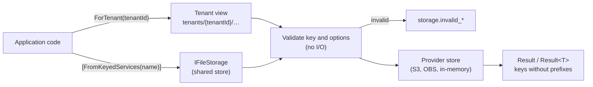

# SharedKernel.Storage.Abstractions

[](https://dotnet.microsoft.com/)
[](https://github.com/Gresta-Vertex-Labs/platform-shared-kernel/blob/main/LICENSE)


> **Provider-neutral object-storage contracts: named stores, tenant isolation by construction, conditional writes,
> and presigned uploads that clients cannot abuse. Expected failures are `Result` values, never exceptions.**

Application code depends only on this package; the host picks a provider —
[`SharedKernel.Storage.S3`](https://github.com/Gresta-Vertex-Labs/platform-shared-kernel/blob/main/src/Infrastructure/Storage/SharedKernel.Storage.S3/README.md)
for Amazon S3, MinIO and other S3-compatible services, or
[`SharedKernel.Storage.Obs`](https://github.com/Gresta-Vertex-Labs/platform-shared-kernel/blob/main/src/Infrastructure/Storage/SharedKernel.Storage.Obs/README.md)
for Huawei Cloud OBS.

| You get | So that |
| --- | --- |
| Named stores — `[FromKeyedServices("invoices")] IFileStorage` | Code names a purpose; buckets, prefixes, encryption and credentials are configuration |
| `ITenantFileStorage.ForTenant(TenantId)` | A tenant's keys live under its own prefix; no key, listing or copy can leave it |
| `WriteCondition.IfNotExists` / `IfMatch(etag)` | Create-only and optimistic-concurrency writes, checked atomically by the provider |
| `FileUploadOptions.ChecksumSha256` | The provider rejects bytes that were corrupted on the way |
| `CreateUploadFormAsync` and presigned multipart | Browser uploads limited in size and type, and multi-gigabyte uploads that never pass through your service |
| `Result` values with `StorageErrorCodes` | Not found, conflict, throttling and outages are values you handle, not exceptions |
| One `storage-{store}` readiness probe per store | Kubernetes stops routing to a pod whose bucket is unreachable, with nothing to register |

## Contents

- [Install](#install)
- [Quick start](#quick-start)
- [How it works](#how-it-works)
- [Recipes](#recipes)
- [Reference](#reference)
- [Testing](#testing)
- [Pitfalls](#pitfalls)
- [Design decisions](#design-decisions)

## Install

```xml
<PackageReference Include="SharedKernel.Storage.Abstractions" />
```

The version comes from your central `SharedKernelVersion` property — every SharedKernel package ships at the same
version. See [Using the packages](https://github.com/Gresta-Vertex-Labs/platform-shared-kernel#using-the-packages).

| Requirement | Value |
| --- | --- |
| Target framework | `net10.0` |
| Tier | Abstractions — reference it from your **Application** project |
| Depends on | `SharedKernel.Primitives` (`Result`, `Error`), `SharedKernel.Execution` (`TenantId`), `Microsoft.Extensions.DependencyInjection.Abstractions` |
| Namespaces | `SharedKernel.Storage` |
| Provider (host) | `SharedKernel.Storage.S3` or `SharedKernel.Storage.Obs` — reference it from your **Infrastructure** or **Api** project |

## Quick start

The host registers the registry, a provider and its stores:

```csharp
using SharedKernel.Storage;

builder.Services.AddSharedKernelStorage()
    .AddS3(builder.Configuration)          // SharedKernel:Storage:S3 (SharedKernel.Storage.S3)
    .AddStore("invoices")                  // SharedKernel:Storage:Stores:invoices
    .AddTenantStore("documents");          // SharedKernel:Storage:Stores:documents
```

```json
{
  "SharedKernel": {
    "Storage": {
      "S3": { "Region": "eu-central-1" },
      "Stores": {
        "invoices":  { "Bucket": "acme-invoices", "Encryption": "Kms" },
        "documents": { "Bucket": "acme-documents", "MaxPresignExpiry": "00:15:00" }
      }
    }
  }
}
```

Application code names the store and nothing else:

```csharp
using Microsoft.Extensions.DependencyInjection;
using SharedKernel.Primitives.Results;
using SharedKernel.Storage;

public sealed class InvoiceArchive([FromKeyedServices("invoices")] IFileStorage invoices)
{
    public Task<Result<FileReference>> SaveAsync(Guid invoiceId, Stream pdf, CancellationToken ct) =>
        invoices.UploadAsync($"{invoiceId}.pdf", pdf, new FileUploadOptions
        {
            ContentType = "application/pdf",
            Condition = WriteCondition.IfNotExists,   // never overwrite an issued invoice
        }, ct);

    public Task<Result<PresignedRequest>> LinkAsync(Guid invoiceId, CancellationToken ct) =>
        invoices.CreateDownloadUrlAsync($"{invoiceId}.pdf", new PresignedDownloadOptions
        {
            Expiry = TimeSpan.FromMinutes(10),
            ContentDisposition = $"attachment; filename=\"invoice-{invoiceId}.pdf\"",
        }, ct);
}
```

Persist the returned `FileReference` (store, tenant, key, ETag) — never a presigned URL, which expires, and never a
bucket name, which is configuration.

## How it works



### Stores and keys

- **A store** is a bucket, optionally narrowed to a key prefix, on one provider connection. Each store is a keyed
  singleton registered under its name; the name is the only thing application code knows. Store names are unique
  across every provider of the service, ignoring case.
- **Keys are relative to the store** (and to the tenant, for a tenant store): `2026/09/invoice-42.pdf`. Use `/` to
  make folders.
- **Keys are validated before any request**: not empty, no leading `/`, no `\`, no empty, `.` or `..` segment, no
  control characters, at most 1,024 UTF-8 bytes including every prefix. An invalid key is `storage.invalid_key`.
- **Stores copy between each other**: `source.CopyToAsync(key, destinationStore, newKey)` copies server-side when both
  stores share a provider connection, and streams through the process otherwise.

### Tenant stores

```text
store "documents"  (bucket acme-docs, prefix documents/)
   ForTenant(tenantA)   "contracts/nda.pdf"  →  documents/tenants/3f2c…-…/contracts/nda.pdf
   ForTenant(tenantB)   "contracts/nda.pdf"  →  documents/tenants/9a41…-…/contracts/nda.pdf
```

- A tenant store is **only** reachable through `ForTenant(tenantId)`. It is registered as a keyed
  `ITenantFileStorage`, never as `IFileStorage`, so it cannot be used without choosing a tenant.
- The tenant is a `SharedKernel.Execution.Tenancy.TenantId` (a non-empty GUID) written in its `D` form, so two tenants
  can never produce the same prefix. `ForTenant(default)` throws `ArgumentException`.
- A view returns keys, listings, folders and error messages **without** the prefix, and its `FileReference` carries
  the tenant, so `IFileStorageFactory.Open(reference)` reopens the right view.
- Take the tenant from the authenticated request (`IRequestContext.TenantId`), never from input the caller controls.

### Results, errors and streaming

- Every member returns `Result` or `Result<T>`. Expected failures carry a stable code from `StorageErrorCodes`. Only
  three things throw: cancellation of your token, `ListAsync` (an async stream with no `Result` to return; it throws
  `StorageException` carrying the error), and programming errors (a `null` argument, `default(TenantId)`, an unknown
  store name).
- Error messages name the store and the key you passed, never the bucket, endpoint or provider request id — they may
  reach an HTTP response. Providers log those details instead.
- Nothing is buffered. `UploadAsync` reads your stream from its current position to its end and never disposes or
  rewinds it; streams of unknown length are sent in parts with at most one part in memory. `DownloadAsync` returns
  the provider's response stream inside a `FileDownload` you dispose.
- Keys, tenants, options and expiries are validated here, before a provider sees the request, so every provider
  returns the same errors. A feature a provider lacks is refused with `storage.not_supported` before anything is
  sent, never silently dropped.

## Recipes

### 1. Accept an upload in an API endpoint

```csharp
app.MapPut("/files/{**key}", async (string key, HttpRequest request,
    [FromKeyedServices("uploads")] IFileStorage store, CancellationToken ct) =>
{
    Result<FileReference> saved = await store.UploadAsync(key, request.Body, new FileUploadOptions
    {
        ContentType = request.ContentType,
        ContentLength = request.ContentLength,   // a request body cannot report its own length
    }, ct);
    return saved.ToCreated(_ => $"/files/{key}");   // SharedKernel.Presentation.WebApi: 201, or a problem response
});
```

`ContentLength` lets a small body go in a single request, and is **required** together with `ChecksumSha256` on a
stream that cannot report its length.

### 2. Never overwrite, or overwrite only what you read

```csharp
// Create only: a concurrent upload of the same key fails with storage.already_exists.
await store.UploadAsync(key, content, new FileUploadOptions { Condition = WriteCondition.IfNotExists }, ct);

// Optimistic concurrency: replace only the version you read.
FileProperties current = (await store.GetPropertiesAsync(key, ct)).Value;
Result<FileReference> saved = await store.UploadAsync(key, updated,
    new FileUploadOptions { Condition = WriteCondition.IfMatch(current.ETag!) }, ct);
// saved.Error.Code == StorageErrorCodes.PreconditionFailed when someone else changed it first
```

### 3. Verify integrity end to end

```csharp
string sha256 = Convert.ToBase64String(SHA256.HashData(bytes));
Result<FileReference> saved = await store.UploadAsync(key, new MemoryStream(bytes),
    new FileUploadOptions { ChecksumSha256 = sha256 }, ct);
// storage.checksum_mismatch when the provider received different bytes; nothing is stored
```

### 4. Stream a download, or part of one

```csharp
await using FileDownload file = (await store.DownloadAsync(key, new FileDownloadOptions
{
    Range = new ByteRange(0, 1_048_575),   // the first MiB
    IfMatch = etag,                        // every range from the same version
}, ct)).Value;

await file.Content.CopyToAsync(destination, ct);
// file.Length = bytes in this response; file.Properties.ContentLength = size of the whole object
```

### 5. List a folder, page by page

```csharp
FileListPage page = (await store.ListPageAsync(new FileListRequest
{
    Prefix = "2026/",
    Recursive = false,        // objects directly under 2026/, and its sub-folders in page.Folders
    PageSize = 100,           // at most FileListRequest.MaxPageSize (1,000)
    ContinuationToken = token,
}, ct)).Value;

await foreach (FileListItem item in store.ListAsync("2026/09/", ct)) { /* everything, one page in memory */ }
```

### 6. Let a browser upload directly, with limits

```csharp
PresignedPost form = (await store.CreateUploadFormAsync($"avatars/{userId}.png", new PresignedPostOptions
{
    Expiry = TimeSpan.FromMinutes(5),
    MaxSize = 2 * 1024 * 1024,
    ContentType = "image/",       // a prefix ending with '/' allows any image type
}, ct)).Value;
```

The browser posts a `multipart/form-data` body to `form.Url`: every entry of `form.Fields`, a `Content-Type` field, then
the file as the last field, named `file`. The provider rejects anything outside the policy. Use a presigned `PUT`
(`CreateUploadUrlAsync`) only for trusted clients — it cannot limit the size.

### 7. Upload a very large file from the client in parts

```csharp
MultipartUpload upload = (await store.StartMultipartUploadAsync(key,
    new MultipartUploadOptions { ContentType = "video/mp4" }, ct)).Value;

// For each part (1..n, each at least 5 MiB except the last):
PresignedRequest partUrl = (await store.CreateUploadPartUrlAsync(upload, partNumber, TimeSpan.FromMinutes(30), ct)).Value;
// The client PUTs the part and returns the response's ETag header as an UploadedPart(partNumber, etag).

Result<FileReference> done = await store.CompleteMultipartUploadAsync(upload, parts, cancellationToken: ct);
// or: await store.AbortMultipartUploadAsync(upload, ct);
```

Configure a bucket lifecycle rule that aborts incomplete multipart uploads after a few days.

### 8. Move a file out of quarantine into a tenant's folder

```csharp
IFileStorage tenantDocuments = documents.ForTenant(tenantId);
Result<FileReference> moved = await quarantine.CopyToAsync(key, tenantDocuments, $"inbox/{fileName}",
    new FileCopyOptions { Condition = WriteCondition.IfNotExists }, ct);
if (moved.IsSuccess)
{
    await quarantine.DeleteAsync(key, cancellationToken: ct);
}
```

### 9. Delete a tenant's files

```csharp
IFileStorage view = documents.ForTenant(tenantId);
var keys = new List<string>();
await foreach (FileListItem item in view.ListAsync(cancellationToken: ct))
{
    keys.Add(item.Key);
}

BatchDeleteResult result = (await view.DeleteManyAsync(keys, ct)).Value;
// result.Failed lists every key that could not be deleted, with its error
```

### 10. Reopen a stored file later

```csharp
public sealed class Attachments(IFileStorageFactory stores)
{
    public Task<Result<FileDownload>> OpenAsync(FileReference reference, CancellationToken ct) =>
        stores.Open(reference).DownloadAsync(reference.Key, cancellationToken: ct);   // right store, right tenant view
}
```

## Reference

### Choosing a type

| You want to | Use |
| --- | --- |
| Read and write files of one store shared by the whole service | `[FromKeyedServices("name")] IFileStorage` |
| …and the service has exactly one shared store | `IFileStorage` (unkeyed; resolving it throws if there are several) |
| Read and write files that belong to a tenant | `[FromKeyedServices("name")] ITenantFileStorage` → `ForTenant(tenantId)` |
| Open a store named in data — a stored `FileReference`, a job argument | `IFileStorageFactory.Open(reference)` / `GetStore(name)` / `GetTenantStore(name)` |
| Validate input the way every store does | `StorageValidation` (rarely needed: every member validates already) |
| Write a provider package | `IStorageBuilder`, `FileStoreRegistration`, `AddStore(FileStoreRegistration)`, `StorageErrors` |

### Registration

| Method | Registers |
| --- | --- |
| `services.AddSharedKernelStorage()` | `IFileStorageFactory` and the unkeyed `IFileStorage` / `ITenantFileStorage` (singletons); returns an `IStorageBuilder`. Calling it again is harmless |
| `builder.AddStore(FileStoreRegistration)` | For provider packages: the store as a keyed singleton (`ITenantFileStorage` when `TenantScoped`, otherwise `IFileStorage`) and its readiness probe. A duplicate name throws `InvalidOperationException` |

Application code calls the provider's `AddStore(name)` / `AddTenantStore(name)` (`SharedKernel.Storage.S3`), or
`AddInMemoryStore(name)` in tests.

### `IFileStorage`

| Member | Purpose |
| --- | --- |
| `UploadAsync(key, content, options?, ct)` | Streams content; returns `Result<FileReference>` |
| `DownloadAsync(key, options?, ct)` | `Result<FileDownload>` — `Content`, `Properties`, `Length`, `Range`; dispose it |
| `GetPropertiesAsync` / `ExistsAsync` | Size, content type, ETag, version, headers, SHA-256, tier, metadata / `Result<bool>` |
| `DeleteAsync(key, options?, ct)` / `DeleteManyAsync(keys, ct)` | Delete one (optionally `IfMatch` or `VersionId`) / many, with a `BatchDeleteResult` |
| `CopyAsync(source, destination, options?, ct)` / `CopyToAsync(source, store, destination, options?, ct)` | Copy within the store / to another store or tenant view |
| `ListPageAsync(request, ct)` / `ListAsync(prefix, ct)` | One page with `Items`, `Folders`, `HasMore`, `ContinuationToken` / everything as an async stream |
| `CreateDownloadUrlAsync` / `CreateUploadUrlAsync` | Presigned `GET` / `PUT`: `PresignedRequest` with `Url`, `Method`, required `Headers`, `ExpiresAt` |
| `CreateUploadFormAsync` | Presigned `POST` form: `PresignedPost` with `Url`, `Fields`, `ExpiresAt` |
| `StartMultipartUploadAsync` / `CreateUploadPartUrlAsync` / `CompleteMultipartUploadAsync` / `AbortMultipartUploadAsync` | Presigned multipart upload |

`IFileStorageFactory` adds `StoreNames`, `IsTenantScoped(name)`, `GetStore`, `GetTenantStore` and `Open(FileReference)`.

### `FileUploadOptions`

| Option | Default | Rules |
| --- | --- | --- |
| `ContentType` | `application/octet-stream` | A MIME type such as `application/pdf` |
| `ContentDisposition`, `CacheControl`, `ContentEncoding` | none | Printable ASCII, at most 1,024 characters |
| `Metadata` | none | Keys of letters, digits, `-`, `_` (stored lower-case); printable ASCII values; 2 KiB in total |
| `Tags` | none | At most 10; keys up to 128, values up to 256 characters |
| `Tier` | the store's default | `StorageTier.Default` or `StorageTier.InfrequentAccess` |
| `Condition` | none | `WriteCondition.IfNotExists` or `WriteCondition.IfMatch(etag)` |
| `ContentLength` | the stream's length, if it can report one | Not negative; required with `ChecksumSha256` on a stream of unknown length |
| `ChecksumSha256` | none | Base64 of a 32-byte SHA-256 |

### Errors

| Code | Type (HTTP) | When |
| --- | --- | --- |
| `storage.not_found` | NotFound (404) | The object, version or multipart upload does not exist (not returned by `ExistsAsync` or deletes) |
| `storage.access_denied` | Forbidden (403) | The credentials may not do this, or the bucket belongs to another account than expected |
| `storage.already_exists` | Conflict (409 / 412) | A create-only write found an object |
| `storage.precondition_failed` | Conflict (409 / 412) | An `If-Match` ETag no longer matches — the object changed or is gone |
| `storage.invalid_key` | Validation (400) | The key or prefix breaks the key rules; before any I/O |
| `storage.invalid_request` | Validation (400) | An option is invalid: content type, headers, metadata, tags, tier, checksum format, length, page size, part number, form sizes, or parts that do not complete an upload |
| `storage.expiry_too_long` | Validation (400) | A presign expiry is not positive or exceeds the store's maximum; before any I/O |
| `storage.checksum_mismatch` | Validation (400) | The provider received bytes that do not match `ChecksumSha256`; nothing was stored |
| `storage.invalid_range` | Validation (400) | The range starts at or beyond the end of the object |
| `storage.not_supported` | Unexpected (500) | The store's provider lacks the feature; nothing was sent |
| `storage.unavailable` | Unavailable (503) | Unreachable, throttled, timing out or failing after the provider client's retries — retry later |
| `storage.provider_error` | Unexpected (500) | Any other rejection (missing bucket, wrong region, server-side copy over 5 GiB); details are logged, never returned |

The HTTP statuses are those `SharedKernel.Presentation.WebApi` answers. The two conflicts become 412 only on a request
that itself carried `If-Match` or `If-None-Match`; the same conflict from a condition the service set itself, such as
`WriteCondition.IfNotExists` on a plain `PUT`, stays 409.

### Exceptions

| Exception | Thrown by | When |
| --- | --- | --- |
| `ArgumentNullException` | Every member | A stream, options object, collection or store is `null` |
| `ArgumentException` | `ForTenant`, `IFileStorageFactory.Open`, `FileStoreRegistration`, `WriteCondition.IfMatch` | `default(TenantId)`, an invalid store name or an empty ETag |
| `ArgumentOutOfRangeException` | `ByteRange`, `FileDownload` | A negative position, or an end before the start |
| `InvalidOperationException` | `IFileStorageFactory`, unkeyed `IFileStorage`/`ITenantFileStorage`, `AddStore` | An unknown store, a tenancy mismatch, an ambiguous unkeyed store, a duplicate store name |
| `OperationCanceledException` | Every async member | Your `CancellationToken` was cancelled |
| `StorageException` | `ListAsync` | A page could not be read; `Error` carries the storage error |

### Health

Every store registers an `IReadinessProbe` named `storage-{store}` (`StorageReadinessProbeNames.ForStore(name)`); it
checks that the store's bucket is reachable with the configured credentials. The host maps every probe with
`services.AddHealthChecks().AddSharedKernelReadiness()` (`SharedKernel.ServiceDefaults`).

## Testing

Reference [`SharedKernel.Storage.Testing`](https://github.com/Gresta-Vertex-Labs/platform-shared-kernel/blob/main/src/Infrastructure/Storage/SharedKernel.Storage.Testing/README.md)
from your test project. Its in-memory store applies the same key, option and tenant rules as the real providers:

```csharp
using SharedKernel.Storage;
using SharedKernel.Testing.Storage;

services.AddSharedKernelStorage()
    .AddInMemoryStore("invoices")
    .AddInMemoryTenantStore("documents");

InMemoryFileStorage invoices = provider.GetInMemoryStore("invoices");
invoices.Seed("2026/42.pdf", pdfBytes, "application/pdf");
// … run the code under test …
Assert.True(invoices.WasUploaded("2026/43.pdf"));

invoices.SimulateFailure = true;       // writes now return storage.unavailable; reads still work
invoices.SimulateUnavailable = true;   // the storage-invoices readiness probe now reports unavailable
```

`InMemoryFileStorage` also records `UploadedKeys`, `DeletedKeys`, `CopiedPairs` and issued presigned URLs.
`InMemoryStorage.CreateFactory(...)` builds an `IFileStorageFactory` without a container.

## Pitfalls

| Don't | Do | Why |
| --- | --- | --- |
| Persist a presigned URL or a bucket name | Persist the `FileReference` | URLs expire; buckets are configuration |
| Build tenant prefixes by hand (`$"{tenantId}/{key}"`) | `AddTenantStore` + `ForTenant(tenantId)` | Hand-built prefixes are not validated and can be escaped |
| Take the tenant id from a header or the request body | Take it from `IRequestContext.TenantId` | The tenant view isolates tenants only if the tenant is real |
| Check that a file exists before writing it | `WriteCondition.IfNotExists` | The check and the write race; the condition is atomic |
| Give untrusted clients a presigned `PUT` URL | `CreateUploadFormAsync` with `MaxSize` and `ContentType` | A presigned `PUT` cannot limit size |
| Upload a request body with a checksum and no length | Set `ContentLength = request.ContentLength` | The single request that verifies a checksum needs the length |
| Forget to dispose a `FileDownload` | `await using` | It holds a pooled HTTP connection |
| Treat `storage.unavailable` as "not found" | Retry later or fail the request | The object may well exist |
| Match on error messages | Match on `Error.Code` against `StorageErrorCodes` | Messages are for people and may change |
| Leave abandoned multipart uploads | Abort them, and add a bucket lifecycle rule | Their parts are stored and billed |
| Send a form upload's file part with `filename*=` (.NET's `MultipartFormDataContent.Add(content, name, fileName)`) | A plain `filename`, as browsers send | Some providers (OBS) reject the encoded form |
| Inject a cloud SDK client (`IAmazonS3`) in application code | Inject a named store | The provider, bucket and credentials stay configuration |

## Design decisions

**Why named stores instead of a bucket argument?** Bucket names are configuration and differ per environment. Passing
them on every call spreads them through code, and a per-call bucket lets one registered client serve every bucket —
including the wrong provider's.

**Why is tenant isolation in the contracts package, not in each provider?** One implementation protects every provider
and the in-memory test store alike. Providers only ever see keys that were validated and prefixed.

**Why `ForTenant(tenantId)` instead of a tenant argument on every member?** Same explicitness, one entry point. A view
cannot be used without a tenant, and a tenant store cannot be resolved without a view.

**Why a typed `TenantId` instead of a string?** A string tenant id needs its own validation and escaping rules, and two
services could disagree about them. A non-empty GUID in its `D` form has no separators and cannot collide.

**Why `Result` instead of exceptions?** A missing file, a lost race or a throttled provider is an outcome the caller
must handle. Exceptions remain for bugs and cancellation.

**Why refuse a feature a provider lacks instead of ignoring it?** Some S3-compatible services accept `If-None-Match`
and checksums and then ignore them. A silently ignored create-only condition overwrites data.

**What is deliberately not included?** An implementation (see the provider packages), bucket administration
(creation, lifecycle rules, policies, CORS), archive tiers that need a restore step, an ambient tenant, virus
scanning (quarantine in one store and copy on after scanning — recipe 8) and client-side encryption (use the
provider's server-side encryption, or `SharedKernel.Cryptography`'s envelope encryption before uploading).

---

Part of [Platform.SharedKernel](https://github.com/Gresta-Vertex-Labs/platform-shared-kernel) ·
[Storage domain](https://github.com/Gresta-Vertex-Labs/platform-shared-kernel/blob/main/src/Infrastructure/Storage/README.md) ·
[MIT license](https://github.com/Gresta-Vertex-Labs/platform-shared-kernel/blob/main/LICENSE)
