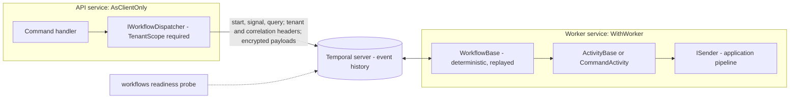

<div align="center">

# SharedKernel Workflows

**Durable business processes on Temporal: start one that runs for thirty days, survives every deploy and crash on
the way, and can only ever be addressed within its own tenant.**

[](https://dotnet.microsoft.com/)
[](../../../LICENSE)


[](https://github.com/temporalio/sdk-dotnet)

[What you get](#what-you-get) · [Packages](#packages) · [How it fits together](#how-it-fits-together) · [Get started](#get-started) · [See it run](#see-it-run) · [Guarantees](#guarantees)

<sub>📂 <code>src/Infrastructure/Workflows</code> · <a href="../../../docs/packages.md">all packages by tier</a> · <a href="../../../README.md">Platform.SharedKernel</a></sub>

</div>

---

## What you get

- **A `Result`-shaped dispatch surface.** `IWorkflowDispatcher` and `IWorkflowHandle<TResult>` start, signal, query,
  cancel and await workflows and return `Result` values; no `Temporalio.*` type reaches a command handler.
- **Tenant-safe workflow ids.** Every dispatch call takes a `TenantScope`, and `IWorkflowIdFactory` composes
  `{tenant}:{workflowType}:{businessKey}`; `TenantScope.Global` is refused before any I/O.
- **Authoring bases that keep you deterministic.** `WorkflowBase` exposes replay-safe time, ids and logging;
  `ActivityBase` is ordinary DI code with explicit failure mapping; `CommandActivity<TCommand>` sends a kernel
  command through `ISender` as one activity.
- **Failures mapped by `ErrorType`.** Validation, NotFound, Conflict, Unauthorized, Forbidden and BusinessRule become
  non-retryable failures so the workflow can compensate at once; Unexpected, Unavailable and Timeout retry.
- **The caller travels with the work.** The dispatcher's tenant and correlation id reach every activity as its
  `IRequestContext`, and from there every outbound call; `.WithPayloadEncryption()` keeps inputs and outputs out of
  server history in plaintext.

## Packages

| Package | Tier | Reference it from | Use it for |
| --- | --- | --- | --- |
| [SharedKernel.Workflows.Temporal](SharedKernel.Workflows.Temporal/README.md) | Adapter | Infrastructure | Workflows, activities, the client and the worker registration |
| [SharedKernel.Workflows.Testing](SharedKernel.Workflows.Testing/README.md) | Testing | test projects | `InMemoryWorkflowDispatcher`: records starts, signals and queries per tenant; the test decides how each workflow ends |

Take it for several steps, long waits, signals or compensation that must survive restarts. One unit of work on a
timer is [Scheduling](../Scheduling/README.md) (a job may start a workflow); reacting to another service's event is
a consumer in [Messaging](../Messaging/README.md), which deliberately has no sagas.

## How it fits together



- **Workflow code is replay code.** Every statement in a workflow re-executes from history, possibly months later
  on another pod; clocks, randomness, I/O and DI belong in activities. Analyzer SK0028 flags the common violations.
- **API pods dispatch, worker pods run.** `.AsClientOnly()` registers the client with no hosted worker, so an API
  rolling deploy never becomes a workflow outage.
- **The workflow id is the idempotency key.** No dispatch member takes a raw id; with `IdConflictPolicy.Fail` a
  duplicate start returns `workflow.already_started`.
- **A propagated caller is attribution only.** It grants no permission: an activity that sends a `[RequirePermission]`
  command opens a `SystemRequestContext` scope with exactly the permission it needs.

## Get started

```xml
<PackageReference Include="SharedKernel.Workflows.Temporal" />
```

```csharp
// API: starts workflows, hosts no worker
builder.Services.AddSharedKernelTemporalWorkflows(builder.Configuration)   // Workflows:Temporal
    .AsClientOnly()
    .WithPayloadEncryption()
    .Build();

Result<IWorkflowHandle> started = await workflows.StartAsync<OrderFulfilmentWorkflow, string>(
    orderId,
    new WorkflowStartOptions
    {
        TaskQueue = "orders-fulfilment",
        BusinessKey = orderId,
        IdReusePolicy = WorkflowIdReusePolicy.RejectDuplicate,
        IdConflictPolicy = WorkflowIdConflictPolicy.Fail,
    },
    TenantScope.FromNullable(caller.TenantId),
    ct);

// Worker: runs them
builder.Services.AddSharedKernelTemporalWorkflows(builder.Configuration)
    .AddWorkflow<OrderFulfilmentWorkflow>()
    .AddActivities<ChargeCardActivity>()
    .WithWorker("orders-fulfilment")
    .WithPayloadEncryption()
    .Build();
```

```json
{ "Workflows": { "Temporal": { "TargetHost": "temporal-frontend:7233", "Namespace": "orders" } } }
```

The [Quick start](SharedKernel.Workflows.Temporal/README.md#quick-start) has the full workflow and activity example,
the determinism table, the `Workflow.Patched` procedure for changing a deployed workflow, and the encryption costs.

## See it run

No reference service under `samples/` uses Workflows yet. The [`consumer-verify`](consumer-verify/Program.cs)
harness composes the package through a real host: the client-only shape, a worker that completes a full
start → activity → result round trip against a `Temporalio.Testing` `WorkflowEnvironment` (never a live cluster),
and the startup failures for a missing configuration section or an empty worker.

```bash
dotnet run --project src/Infrastructure/Workflows/consumer-verify
```

## Guarantees

| Guarantee | How it is held |
| --- | --- |
| A workflow is only addressable within its tenant | `DispatchFailClosedTests`: every dispatch member given `TenantScope.Global` returns `workflow.tenant_scope_missing` with no I/O; `WorkflowIdFactoryTests` pins the tenant segment |
| A duplicate start never creates a second execution | `IdempotencyTests` (`RejectDuplicate` + `Fail` returns `workflow.already_started`, no second execution) |
| Expected errors fail fast, transient ones retry | `WorkflowFailureMapperTests` |
| `CommandActivity<>` never swallows a failed `Result` | `CommandActivitySwallowFailureTests` |
| Activities and child workflows know who started them | `PropagationTests` (tenant and correlation id reach the activity and the child workflow) |
| Ciphertext is never passed through as plaintext | `EncryptionPayloadCodecTests` and `EncryptionPayloadCodecAadBindingTests`: tampered data, an unknown key or another workflow's id throws |
| A mis-wired worker fails at startup | `BuildCompositionValidationTests` |
| Workflow code stays deterministic; the raw client stays fenced | Analyzers SK0028 (clocks, randomness, I/O in a workflow) and SK0029 (injected raw Temporal client); `ReplayDeterminismTests` |

---

<div align="center">
<sub>Part of <a href="../../../README.md">Platform.SharedKernel</a> · <a href="../../../docs/packages.md">all packages</a> · MIT license</sub>
</div>
