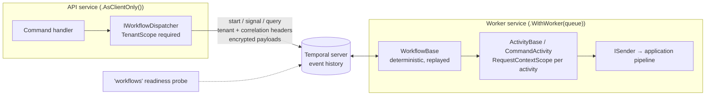

<div align="center">

# 17.Workflows

**Durable, crash-proof business processes on Temporal — start a process that may run for thirty days, survive every
deploy and restart on the way, and address it safely by tenant and business key.**

[](https://dotnet.microsoft.com/)
[](../../../LICENSE)

[](SharedKernel.Workflows.Temporal/README.md)

</div>

`SharedKernel.Workflows.Temporal` is how a SharedKernel service runs a multi-step process that must finish even when
pods die mid-way: "reserve stock, charge the card, wait up to 30 days for delivery, then settle — or compensate". It
wraps the official Temporal .NET SDK with the platform's rules: a mandatory tenant scope, `Result`-shaped dispatch,
caller propagation into activities, error mapping that fails fast on expected errors, and optional payload
encryption.

## What this domain gives you

- **A dispatch surface for application code** — `IWorkflowDispatcher` and `IWorkflowHandle<TResult>` return `Result`
  values; no `Temporalio.*` type leaks into handlers.
- **Tenant-safe workflow ids** — every id is composed as `{tenant}:{workflowType}:{businessKey}`; a global scope is
  refused before any I/O.
- **Authoring bases that keep you deterministic** — `WorkflowBase` (replay-safe time, ids and logging),
  `ActivityBase` (ordinary DI code with explicit failure mapping), `CommandActivity<TCommand>` (a kernel command sent
  through `ISender`).
- **The caller travels with the work** — the dispatcher's tenant and correlation id reach every activity as its
  `IRequestContext`, and from there every outbound call.
- **Operable by default** — eager composition checks, the `workflows` readiness probe, OpenTelemetry tracing and
  metrics, EventIds 17000–17012.

## Packages

| Package | Tier | When you need it |
| --- | --- | --- |
| [`SharedKernel.Workflows.Temporal`](SharedKernel.Workflows.Temporal/README.md) | Adapter | Any process with several steps, long waits, signals or compensation that must survive restarts |

It is deliberately **one** package: determinism, replay and `Workflow.Patched` versioning *are* the programming
model, and no other engine is swap-compatible with them.

Test double: [`SharedKernel.Workflows.Testing`](./SharedKernel.Workflows.Testing/README.md)
(`InMemoryWorkflowDispatcher`, `AddInMemoryWorkflowDispatcher()`).

## Workflows, scheduling or messaging?

| You need… | Use |
| --- | --- |
| Several steps, long waits, signals, compensation, crash-resumable | **`17.Workflows`** |
| One unit of work on a timer, once across replicas | [`19.Scheduling`](../Scheduling/README.md) — a job may *start* a workflow |
| React to an event another service published | [`07.Messaging`](../Messaging/README.md) — no sagas there |

## How it fits together



## Get started

The API that starts the process:

```csharp
builder.Services.AddSharedKernelTemporalWorkflows(builder.Configuration)   // Workflows:Temporal
    .AsClientOnly()
    .WithPayloadEncryption()
    .Build();

builder.Services.AddHealthChecks().AddSharedKernelReadiness();
```

```json
{ "Workflows": { "Temporal": { "TargetHost": "temporal-frontend:7233", "Namespace": "orders" } } }
```

```csharp
Result<IWorkflowHandle> started = await workflows.StartAsync<OrderFulfilmentWorkflow, string>(
    orderId,
    new WorkflowStartOptions
    {
        TaskQueue = "orders-fulfilment",
        BusinessKey = orderId,
        IdReusePolicy = WorkflowIdReusePolicy.RejectDuplicate,
        IdConflictPolicy = WorkflowIdConflictPolicy.Fail,
    },
    TenantScope.For(tenantId),
    ct);
```

The worker that runs it:

```csharp
builder.Services.AddSharedKernelTemporalWorkflows(builder.Configuration)
    .AddWorkflow<OrderFulfilmentWorkflow>()
    .AddActivities<ChargeCardActivity>()
    .AddActivities<ApproveOrderActivity>()          // CommandActivity<ApproveOrderCommand>
    .WithWorker("orders-fulfilment")
    .WithPayloadEncryption()
    .WithOpenTelemetry()
    .Build();
```

The [package README](SharedKernel.Workflows.Temporal/README.md) has the full workflow and activity example, the
determinism rules, the `Workflow.Patched` procedure and the encryption trade-offs.

## Guarantees

| Guarantee | How |
| --- | --- |
| A workflow can only be addressed within its tenant | `IWorkflowIdFactory` puts the tenant in every id; `TenantScope.Global` returns `workflow.tenant_scope_missing` with no I/O |
| The workflow id is the durable idempotency key | No dispatch member takes a raw id; with `IdConflictPolicy.Fail` a duplicate start returns `workflow.already_started` |
| Expected errors fail fast | Validation, NotFound, Conflict, Unauthorized, Forbidden and BusinessRule map to non-retryable failures; Unexpected, Unavailable and Timeout retry |
| An activity cannot silently swallow a failure | `ActivityBase.Fail`/`FailFrom` and `CommandActivity<>` map every failed `Result`; the test suite checks the swallowed-failure defect |
| Activities know who started them | A `PropagatedRequestContext` per activity carries the tenant and correlation id — attribution only, never permissions |
| A mis-wired worker fails at startup | `Build()` rejects an empty worker, client-only plus workflows, a second worker or build, missing `TargetHost`/`Namespace` |
| Payloads can stay private in history | `.WithPayloadEncryption()`: AES-256-GCM bound to the workflow id; a bad ciphertext throws, never passes through |
| Dead workers stop taking traffic | The `workflows` probe fails when a worker's pollers stop; a backlog alone never does |
| Workflow code stays deterministic | `WorkflowBase` exposes replay-safe APIs; analyzer SK0028 flags clocks, randomness and DI in workflows; SK0029 flags raw client injection |

## Limits

- No workflow Update, list/search, schedules or worker deployment versioning in the dispatch surface.
- One worker (one task queue) per builder.
- `Temporalio` is not AOT-safe (native core per runtime identifier, reflection-based JSON by default).

---

For maintainers: [CLAUDE.md](CLAUDE.md) (domain rules and invariants) · [state-map.md](state-map.md) (phase history).
