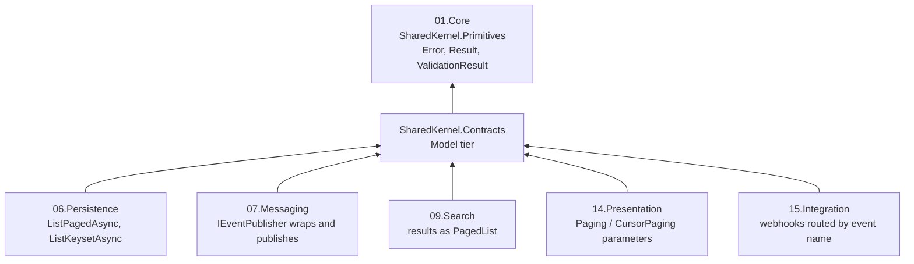

<div align="center">

# SharedKernel Contracts

**The wire shapes one .NET service shares with another — integration events in a validated CloudEvents 1.0 envelope,
offset and cursor pages, validated page requests and opaque cursors — with no business logic and no domain types.**

[](https://dotnet.microsoft.com/)
[](../../../LICENSE)


[Package](#package) · [How it fits together](#how-it-fits-together) · [Get started](#get-started) ·
[See it run](#see-it-run) · [Guarantees](#guarantees)

</div>

---

## What this domain gives you

- **Integration events with a stable identity.** A `sealed record` implementing `IIntegrationEvent` and marked
  `[IntegrationEvent("orders.order-placed", Version = 1)]` — renaming the class never changes what brokers route on.
- **One envelope, validated both ways.** `EventEnvelope.Wrap` is the only way to build a CloudEvents 1.0 document, and
  deserializing checks `type`, `id` and `time` against the data, so a misrouted message fails instead of becoming an
  empty object.
- **One page shape for every API.** `PagedList<T>` (with a `long` total) and `CursorPagedList<T>`, both projectable with
  `Map`, returned by the persistence repositories and the search packages.
- **Client input that cannot crash you.** `PageRequest.Create` / `CursorPageRequest.Create` return every problem as a
  `pagination.*` validation error; `PageCursor.Decode` never throws for bad input.

## Package

| Package | Tier | When you need it |
| --- | --- | --- |
| [SharedKernel.Contracts](SharedKernel.Contracts/README.md) | Model | Declaring or reading integration events, or returning and accepting pages — depends on `SharedKernel.Primitives` only |

The package README is the full guide: quick start, offset-versus-cursor comparison, a publish/consume/paging
walkthrough, the envelope and paging reference and the pitfalls. Test helpers (`EventEnvelopeBuilder<TEvent>`,
`IntegrationEventFaker<TEvent>`, `PagedListBuilder<T>`, `PagedListAssertions`) are in
[SharedKernel.Testing](../../Testing/SharedKernel.Testing/README.md).

## How it fits together



Arrows point from a package to what it depends on. `SharedKernel.Contracts` never references `SharedKernel.Domain`
(and the reverse), so a service can share its contracts without sharing its domain model; integration events are
mapped from domain events at the publishing service's boundary.

## Get started

```xml
<PackageReference Include="SharedKernel.Contracts" />
```

```csharp
using System.Text.Json;
using SharedKernel.Contracts.Events;
using SharedKernel.Contracts.Pagination;

[IntegrationEvent("orders.order-placed", Version = 1)]
public sealed record OrderPlaced(
    Guid EventId, DateTimeOffset OccurredOn, Guid OrderId, decimal TotalAmount, string Currency) : IIntegrationEvent;

// Publishing service (07.Messaging's IEventPublisher does this for you):
var envelope = EventEnvelope.Wrap(orderPlaced, source: "orders-service", subject: $"order/{orderPlaced.OrderId}");
string json = JsonSerializer.Serialize(envelope);

// Consuming service: a message of another type throws JsonException here.
var received = JsonSerializer.Deserialize<EventEnvelope<OrderPlaced>>(json)!;

// An API endpoint: validate client paging input without exceptions.
var request = PageRequest.Create(page: 2, pageSize: 50);
if (!request.IsValid) { /* request.Errors: pagination.page.out_of_range, pagination.page_size.out_of_range */ }
```

## See it run

- [samples/ShippingApi](../../../samples/ShippingApi/README.md) publishes a `[IntegrationEvent("shipping.shipment-dispatched", Version = 1)]`
  record through `IEventPublisher` over a real RabbitMQ broker.
- [samples/BillingApi](../../../samples/BillingApi/README.md) returns `PagedList<InvoiceView>` from a `PageRequest` and
  `CursorPagedList<InvoiceView>` from a `CursorPageRequest`, both through the persistence repositories.

## Guarantees

| Guarantee | How |
| --- | --- |
| **Fixed wire names** | Every member carries `[JsonPropertyName]`; a serializer naming policy never changes an envelope or a page |
| **Nothing invalid on the wire** | JSON constructors enforce the same rules as the factories; `EventEnvelope.Wrap` is the only construction path and requires the event's concrete runtime type |
| **Stable event identity** | Names are validated (lowercase, 1–128 characters), `Version` ≥ 1, and one type per name + version per process |
| **Readable during rollouts** | Deserialization does not pin `dataversion`, so consumers read older versions while producers move |
| **Bounded paging** | `PageRequest.MaxPageSize` = `CursorPageRequest.MaxLimit` = 1000 is the platform's only ceiling; `Offset` always fits `int` |
| **Safe cursor decoding** | `PageCursor.Decode` returns `pagination.cursor.invalid` for any malformed, oversized or foreign cursor; the format is versioned (`v1.`) |
| **Pure contracts** | Model tier, `SharedKernel.Primitives` only; architecture tests forbid `SharedKernel.Domain` and logging |

**Deliberately out of scope:** a response envelope (errors are RFC 9457 ProblemDetails from `14.Presentation`),
domain-value DTOs such as money, transport, and signed cursors — a cursor is readable by clients, so every keyset query
still applies its own tenant and authorization filters.

---

**For maintainers:** design rules and invariants live in [CLAUDE.md](CLAUDE.md); phase history in
[state-map.md](state-map.md).
