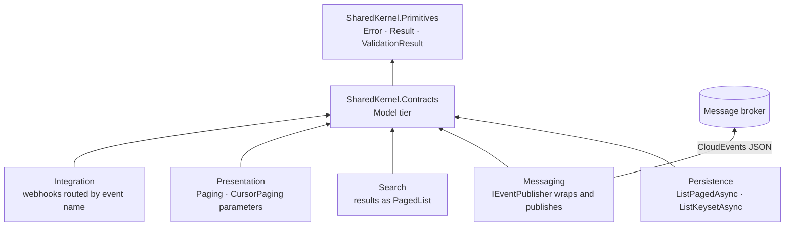

<div align="center">

# SharedKernel Contracts

**The wire shapes services share — integration events in a validated CloudEvents 1.0 envelope, offset and cursor
pages, validated page requests and opaque cursors — with no business logic and no domain types to couple you.**

[](https://dotnet.microsoft.com/)
[](../../../LICENSE)


[](https://cloudevents.io/)

[What you get](#what-you-get) · [Packages](#packages) · [How it fits together](#how-it-fits-together) · [Get started](#get-started) · [See it run](#see-it-run) · [Guarantees](#guarantees)

<sub>📂 <code>src/Model/Contracts</code> · <a href="../../../docs/packages.md">all packages by tier</a> · <a href="../../../README.md">Platform.SharedKernel</a></sub>

</div>

---

## What you get

- **Integration events with a stable identity.** A `sealed record` implementing `IIntegrationEvent` and marked
  `[IntegrationEvent("orders.order-placed", Version = 1)]` — renaming the class never changes what brokers route on.
- **One envelope, validated both ways.** `EventEnvelope.Wrap` is the only way to build a CloudEvents 1.0 document, and
  deserializing checks `type`, `id` and `time` against the data, so a misrouted message fails instead of becoming an
  empty object.
- **One page shape for every API.** `PagedList<T>` (with a `long` total) and `CursorPagedList<T>`, both projectable with
  `Map`, returned by the persistence repositories and the search packages.
- **Client input that cannot crash you.** `PageRequest.Create` and `CursorPageRequest.Create` return every problem as a
  `pagination.*` validation error; `PageCursor.Decode` never throws for bad input.

## Packages

| Package | Tier | Reference it from | Use it for |
| --- | --- | --- | --- |
| [SharedKernel.Contracts](SharedKernel.Contracts/README.md) | Model | Domain, or whichever project declares the events | Declaring and reading integration events; returning and accepting pages |

One package, depending on `SharedKernel.Primitives` only. Test helpers (`EventEnvelopeBuilder<TEvent>`,
`IntegrationEventFaker<TEvent>`, `PagedListBuilder<T>`, `PagedListAssertions`) are in
[SharedKernel.Testing](../../Testing/SharedKernel.Testing/README.md).

## How it fits together



- **Contracts are not the domain.** `SharedKernel.Contracts` and `SharedKernel.Domain` never reference each other; a
  publishing service maps its domain events to integration events at its boundary.
- **Readable during rollouts.** Deserialization does not pin `dataversion`, so consumers keep reading older versions
  while producers move. The [Messaging](../../Infrastructure/Messaging/README.md) publisher wraps for you.
- **Cursors are readable, not signed.** Every keyset query still applies its own tenant and authorization filters —
  see [Persistence](../../Infrastructure/Persistence/README.md).

## Get started

```xml
<PackageReference Include="SharedKernel.Contracts" />
```

```csharp
using System.Text.Json;
using SharedKernel.Contracts.Events;
using SharedKernel.Contracts.Pagination;

[IntegrationEvent("orders.order-placed", Version = 1)]
public sealed record OrderPlaced(
    Guid EventId, DateTimeOffset OccurredOn, Guid OrderId, decimal TotalAmount, string Currency) : IIntegrationEvent;

// Publishing service (the Messaging IEventPublisher does this for you):
var envelope = EventEnvelope.Wrap(orderPlaced, source: "orders-service", subject: $"order/{orderPlaced.OrderId}");
string json = JsonSerializer.Serialize(envelope);

// Consuming service: a message of another type throws JsonException here.
var received = JsonSerializer.Deserialize<EventEnvelope<OrderPlaced>>(json)!;

// An API endpoint: validate client paging input without exceptions.
var request = PageRequest.Create(page: 2, pageSize: 50);
if (!request.IsValid) { /* request.Errors: pagination.page.out_of_range, pagination.page_size.out_of_range */ }
```

The offset-versus-cursor comparison and the full walkthrough are in the
[SharedKernel.Contracts Quick start](SharedKernel.Contracts/README.md#quick-start).

## See it run

- The Shop's [Ordering](../../../samples/Shop/Ordering/) publishes
  `[IntegrationEvent("ordering.order-placed", Version = 1)]` and its sibling records (in
  [`Shop.Contracts`](../../../samples/Shop/Shop.Contracts/)) through `IEventPublisher` and the EF Core outbox over a
  real RabbitMQ broker, and consumes `EventEnvelope<OrderPlaced>` to start fulfilment.
- The Shop's [Billing](../../../samples/Shop/Billing/) publishes `billing.receipt-due`, consumed as
  `EventEnvelope<ReceiptDue>` by [Notify](../../../samples/Shop/Notify/) and [Reports](../../../samples/Shop/Reports/).
  `samples/Shop/build.sh --e2e`

## Guarantees

| Guarantee | How it is held |
| --- | --- |
| **Fixed wire names** | Every member carries `[JsonPropertyName]`; `EventEnvelopeTests.Json_IsACloudEventsStructuredDocument_WhateverTheNamingPolicy` runs under two naming policies |
| **Nothing invalid on the wire** | JSON constructors enforce the factory rules and `Wrap` rejects a base-typed event — `EventEnvelopeTests` (`Json_RejectsAnInconsistentDocument`, `Wrap_AsABaseType_Throws`) |
| **Stable event identity** | Names validated, `Version` ≥ 1, one type per name + version (`IntegrationEventDescriptorTests`); analyzers `SK0038`/`SK0039` flag a missing or invalid attribute |
| **Bounded paging** | `PageRequest.MaxPageSize` = `CursorPageRequest.MaxLimit` = 1000, every problem reported — `PageRequestTests`, `CursorPageRequestTests` |
| **Safe cursor decoding** | `PageCursor.Decode` returns `pagination.cursor.invalid` for malformed or foreign input; the format is versioned `v1.` — `PageCursorTests` |
| **Pure contracts** | Model tier (`SKTIER001`/`SKTIER003`); `SharedKernelLayeringRules.ContractsNeverReferencesDomain`, `ModelNeverReferencesLogging` and `ContractsPurityRules` (sealed events, no domain types on the surface) |

**Deliberately out of scope:** a response envelope (errors are RFC 9457 ProblemDetails from
[Presentation](../../Hosting/Presentation/README.md)), domain-value DTOs such as money, transport, and signed cursors.

---

<div align="center">
<sub>Part of <a href="../../../README.md">Platform.SharedKernel</a> · <a href="../../../docs/packages.md">all packages</a> · MIT license</sub>
</div>
