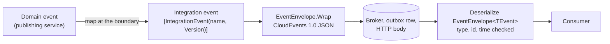

# SharedKernel.Contracts

[](https://dotnet.microsoft.com/)
[](https://github.com/Gresta-Vertex-Labs/platform-shared-kernel/blob/main/LICENSE)


> **Cross-service wire contracts for .NET services: integration events in a validated CloudEvents 1.0 envelope, and
> paged results with validated requests and opaque cursors — shapes that cross a process boundary, with no business
> logic and no I/O.**

| You get | So that |
| --- | --- |
| `IIntegrationEvent` with a required `[IntegrationEvent("name", Version = n)]` | Renaming a class never changes what brokers route on or consumers branch on |
| `EventEnvelope<TEvent>`, a CloudEvents 1.0 JSON document built only by `EventEnvelope.Wrap` | Any CloudEvents-aware tool can read your events, and a misrouted message fails at deserialization |
| `PagedList<T>` and `CursorPagedList<T>` | Every API returns pages in one shape, with totals as `long` |
| `PageRequest` and `CursorPageRequest` | Bad `page`, `pageSize` or `limit` input becomes a validation error, never an exception |
| `PageCursor` | Keyset positions travel as short, URL-safe, versioned strings, and garbage input decodes to a failure |

## Contents

- [Install](#install)
- [Quick start](#quick-start)
- [How it works](#how-it-works)
- [Recipes](#recipes)
- [Reference](#reference)
- [Testing](#testing)
- [Pitfalls](#pitfalls)
- [Design decisions](#design-decisions)

## Install

```xml
<PackageReference Include="SharedKernel.Contracts" />
```

The version comes from your central `SharedKernelVersion` property — every SharedKernel package ships at the same
version. See [Using the packages](https://github.com/Gresta-Vertex-Labs/platform-shared-kernel#using-the-packages).

| Requirement | Value |
| --- | --- |
| Target framework | `net10.0` |
| Tier | Model — reference it from your **Domain** project, or any project that declares or reads wire shapes |
| Depends on | `SharedKernel.Primitives` only |
| Registration | None: records, static factories and one attribute |
| Namespaces | `SharedKernel.Contracts.Events`, `SharedKernel.Contracts.Pagination` |

## Quick start

```csharp
using System.Text.Json;
using SharedKernel.Contracts.Events;

[IntegrationEvent("orders.order-placed")]
public sealed record OrderPlaced(
    Guid EventId,
    DateTimeOffset OccurredOn,
    Guid OrderId,
    Guid CustomerId,
    decimal TotalAmount,
    string Currency) : IIntegrationEvent;

var envelope = EventEnvelope.Wrap(
    orderPlaced,
    source: "orders-service",
    subject: $"order/{orderPlaced.OrderId}",
    tenantId: tenantId,
    correlationId: "4bf92f3577b34da6a3ce929d0e0e4736");

string json = JsonSerializer.Serialize(envelope);
```

```json
{
  "specversion": "1.0",
  "id": "0199a1b2-7c3d-7e4f-8a5b-6c7d8e9f0a1b",
  "source": "orders-service",
  "type": "orders.order-placed",
  "dataversion": 1,
  "time": "2026-09-15T12:00:00+00:00",
  "subject": "order/3f2b8c1e-5d4a-4b6c-9e8f-7a1b2c3d4e5f",
  "datacontenttype": "application/json",
  "tenantid": "7c9e6679-7425-40de-944b-e07fc1f90ae7",
  "correlationid": "4bf92f3577b34da6a3ce929d0e0e4736",
  "data": {
    "eventId": "0199a1b2-7c3d-7e4f-8a5b-6c7d8e9f0a1b",
    "occurredOn": "2026-09-15T12:00:00+00:00",
    "orderId": "3f2b8c1e-5d4a-4b6c-9e8f-7a1b2c3d4e5f",
    "customerId": "9a8b7c6d-5e4f-4a3b-8c2d-1e0f9a8b7c6d",
    "totalAmount": 59.97,
    "currency": "USD"
  }
}
```

The envelope's member names are fixed and the same whatever naming policy you serialize with. The `data` members
follow your serializer options (camelCase above, from `JsonSerializerDefaults.Web`).

## How it works



_Events cross the wire as a validated CloudEvents document; a message of another type or version fails at
deserialization instead of producing an empty object. Pages and page requests follow the same rule: the JSON
constructor enforces what the factory enforces._

- **Fixed wire names.** Every member carries `[JsonPropertyName]`, so your serializer's naming policy never changes an
  envelope or a page on the wire. The event's own `data` members follow your serializer options.
- **Construction and deserialization agree.** No envelope, page or request can exist in a state its factory would
  reject — not through JSON, not through `with`.
- **Absent attributes are omitted**, never written as `null`, as CloudEvents requires.

### Which type do I need?

| I need to… | Use |
| --- | --- |
| Tell other services that something happened | A `sealed record` implementing `IIntegrationEvent`, marked `[IntegrationEvent]` |
| Put that event on a broker, an outbox row or an HTTP body | `EventEnvelope.Wrap(...)`; `07.Messaging`'s `IEventPublisher` calls it for you |
| Read an event's wire name outside an envelope (routing key, telemetry tag) | `IntegrationEventDescriptor.For<TEvent>()` |
| Return a page with "page 3 of 12" and a total | `PagedList<T>` |
| Return a page from a large, live or infinite-scroll list | `CursorPagedList<T>` |
| Validate `page` and `pageSize` from a query string | `PageRequest.Create(page, pageSize)` |
| Validate `cursor` and `limit` from a query string | `CursorPageRequest.Create(cursor, limit)` |
| Turn the last row's sort key and id into a next-page token, and back | `PageCursor.Encode` / `PageCursor.Decode` |

**Offset or cursor?**

| | `PagedList<T>` + `PageRequest` | `CursorPagedList<T>` + `CursorPageRequest` |
| --- | --- | --- |
| Jump to page N | Yes | No |
| Total count | Yes (costs a `COUNT` query) | No |
| Cost of a deep page | Grows with depth (`OFFSET`) | Constant (seek on an index) |
| Rows inserted while paging | Items shift, repeat or are skipped | Stable |
| Pairs with (`SharedKernel.Persistence`) | `IReadRepository.ListPagedAsync(spec, PageRequest)` | `IReadRepository.ListKeysetAsync(spec, CursorPageRequest, keySelector)` |

## Recipes

An orders service publishes `OrderPlaced`, a billing service consumes it, and the orders API lists orders both
ways.

### 1. Declare an integration event

```csharp
[IntegrationEvent("orders.order-placed", Version = 1)]
public sealed record OrderPlaced(
    Guid EventId,
    DateTimeOffset OccurredOn,
    Guid OrderId,
    Guid CustomerId,
    decimal TotalAmount,
    string Currency) : IIntegrationEvent;
```

- **Name it once, for good.** `orders.order-placed` is the CloudEvents `type`. Prefix it with the bounded context.
- **Carry primitives.** `Guid`, not `OrderId`; `decimal` plus a currency code, not `Money`. Consumers must not need
  your domain assembly.
- **Map at the boundary.** The domain raises `OrderPlacedDomainEvent`; a handler in the orders service builds
  `OrderPlaced` from it, reusing the domain event's `Id` as `EventId` so a retried publish deduplicates.

### 2. Publish it

With `07.Messaging`, the publisher wraps the event for you. There `tenantId` is the platform's
`SharedKernel.Execution.Tenancy.TenantId`, normally taken from the caller's `IRequestContext.TenantId`:

```csharp
await eventPublisher.PublishAsync(
    orderPlaced,
    ctx => ctx.WithTenantId(tenantId).WithSubject($"order/{orderPlaced.OrderId}"),
    ct);
```

Anywhere else (an outbox table, a raw HTTP callback, a file), wrap it yourself. Pass the optional arguments by
name: three of them are strings. The envelope carries the tenant as a plain `Guid?`, so this package needs no
reference beyond `SharedKernel.Primitives`; pass `TenantId.Value` when you hold a `TenantId`.

```csharp
var envelope = EventEnvelope.Wrap(orderPlaced, source: "orders-service", tenantId: tenantId.Value);
```

### 3. Consume it

```csharp
var envelope = JsonSerializer.Deserialize<EventEnvelope<OrderPlaced>>(body, options)!;

Console.WriteLine($"{envelope.Type} v{envelope.DataVersion} from {envelope.Source}");
// orders.order-placed v1 from orders-service
```

Deserializing validates the document. Reading an `orders.order-placed` message as `EventEnvelope<OrderShipped>`
throws instead of producing an empty `OrderShipped`:

```text
JsonException: Invalid event envelope for 'OrderShipped': 'type' is 'orders.order-placed' but the target type
declares 'orders.order-shipped'.
```

To route raw messages before you know the type, read `type` and `dataversion` with
`CloudEventAttributeNames.Type` and `CloudEventAttributeNames.DataVersion`, and build a lookup from
`IntegrationEventDescriptor.For<TEvent>().Name`.

### 4. Change its schema

Additive changes (a new optional member) keep the version. A breaking change gets a new type with the **same
name** and the next version, published alongside the old one until every consumer has moved:

```csharp
[IntegrationEvent("orders.order-placed", Version = 2)]
public sealed record OrderPlacedV2(
    Guid EventId, DateTimeOffset OccurredOn, Guid OrderId, Guid CustomerId, OrderLineDto[] Lines, string Currency)
    : IIntegrationEvent;
```

Two types may share a name only with different versions. Declaring the same name **and** version twice throws
`InvalidOperationException` the first time the second type is used.

### 5. An offset-paged endpoint

```csharp
app.MapGet("/orders", async (int? page, int? pageSize, IReadRepository<Order, OrderId> orders, CancellationToken ct) =>
{
    var request = PageRequest.Create(page, pageSize);
    if (!request.IsValid)
        return Results.ValidationProblem(request.Errors.ToDictionary(e => e.Code, e => new[] { e.Message }));

    PagedList<Order> result = await orders.ListPagedAsync(new OrdersPageSpec(request.Value), ct);
    return Results.Ok(result.Map(o => new OrderSummary(o.Id.Value, o.Status.Name)));
});
```

```json
{
  "items": [ "...", "..." ],
  "page": 2,
  "pageSize": 2,
  "totalCount": 5,
  "totalPages": 3,
  "hasNextPage": true,
  "hasPreviousPage": true
}
```

`PageRequest.Create(page: 0, pageSize: 5000)` reports both problems at once:

```text
pagination.page.out_of_range: Page must be at least 1.
pagination.page_size.out_of_range: Page size must be between 1 and 1000.
```

### 6. A cursor-paged endpoint

```csharp
app.MapGet("/orders/recent", async (string? cursor, int? limit, IReadRepository<Order, OrderId> orders, CancellationToken ct) =>
{
    var request = CursorPageRequest.Create(cursor, limit);
    if (!request.IsValid)
        return Results.ValidationProblem(...);

    DateTimeOffset? afterCreatedOn = null;
    OrderId? afterId = null;
    if (request.Value.Cursor is { } token)
    {
        var position = PageCursor.Decode<DateTimeOffset, Guid>(token);
        if (position.IsFailure)
            return Results.ValidationProblem(...);   // pagination.cursor.invalid
        (afterCreatedOn, afterId) = (position.Value.Key, new OrderId(position.Value.Id));
    }

    // Ask for one row more than the limit; FromLookahead uses it to decide whether a next page exists.
    var rows = await orders.ListAsync(
        new RecentOrdersSpec(afterCreatedOn, afterId, take: request.Value.Limit + 1), ct);

    var page = CursorPagedList<Order>
        .FromLookahead(rows, request.Value.Limit, last => PageCursor.Encode(last.CreatedOn, last.Id.Value))
        .Map(o => new OrderSummary(o.Id.Value, o.Status.Name));

    return Results.Ok(page);
});
```

```json
{
  "items": [ "...", "..." ],
  "nextCursor": "v1.WyIyMDI2LTA5LTE1VDA4OjAwOjAwKzAwOjAwIiwiMjIyMjIyMjItMjIyMi0yMjIyLTIyMjItMjIyMjIyMjIyMjIyIl0",
  "hasMore": true
}
```

The client sends `nextCursor` back verbatim as `?cursor=`. On the last page `nextCursor` is `null` and `hasMore`
is `false`.

## Reference

### Namespaces

| Namespace | Types |
| --- | --- |
| `SharedKernel.Contracts.Events` | `IIntegrationEvent`, `IntegrationEventAttribute`, `IntegrationEventDescriptor`, `EventEnvelope<TEvent>`, `EventEnvelope`, `CloudEventAttributeNames` |
| `SharedKernel.Contracts.Pagination` | `PagedList<T>`, `CursorPagedList<T>`, `PageRequest`, `CursorPageRequest`, `PageCursor`, `CursorPosition<TKey, TId>`, `PaginationErrorCodes` |

### Integration events

| Rule | Enforced by |
| --- | --- |
| Implements `IIntegrationEvent` (`EventId`, `OccurredOn`) | Compiler (`EventEnvelope<TEvent>` constraint) |
| Declares `[IntegrationEvent("name")]` directly on the concrete type (not inherited) | `IntegrationEventDescriptor.For`, which `Wrap` and deserialization call |
| Name: 1–128 lowercase ASCII letters and digits, segments joined by one `.`, `-` or `_` | `IntegrationEventDescriptor.For` |
| `Version` ≥ 1, default 1 | `IntegrationEventDescriptor.For` |
| One type per name and version in a process | `IntegrationEventDescriptor.For` |
| `EventId` not empty, `OccurredOn` not `default` | `Wrap` and deserialization |

`IntegrationEventDescriptor.For<TEvent>()` returns `Name`, `Version` and `EventType`, cached per type. Its
`ToString()` is `orders.order-placed v1`.

### EventEnvelope

| Property | JSON | Source | Notes |
| --- | --- | --- | --- |
| `SpecVersion` | `specversion` | constant | Always `1.0` |
| `Id` | `id` | `Data.EventId` | Deduplicate on it with `Source` |
| `Source` | `source` | `Wrap` argument | Non-blank URI reference, at most 256 characters |
| `Type` | `type` | attribute `Name` | |
| `DataVersion` | `dataversion` | attribute `Version` | Extension attribute |
| `Time` | `time` | `Data.OccurredOn` | |
| `Subject` | `subject` | `Wrap` argument | Omitted when `null` |
| `DataContentType` | `datacontenttype` | constant | `application/json` |
| `TenantId` | `tenantid` | `Wrap` argument (`Guid?`) | Extension; omitted when `null`; never `Guid.Empty`. Deliberately `Guid?`, not `TenantId?`: rebuild one with `TenantId.FromNullable(envelope.TenantId)` |
| `CorrelationId` | `correlationid` | `Wrap` argument | Extension; omitted when `null` |
| `CausationId` | `causationid` | `Wrap` argument | Extension; omitted when `null` |
| `Data` | `data` | the event | Serialized as its runtime type |

**`Wrap` throws** `ArgumentNullException` for a null event; `ArgumentException` when the generic type is not the
event's runtime type, the event has an empty `EventId` or default `OccurredOn`, or an argument breaks its rule;
`InvalidOperationException` when the event type's declaration is invalid.

**Deserialization throws `JsonException`** when any `Wrap` rule fails, or `specversion` is not `1.0`, `type` is
not the target type's name, `dataversion` is below 1, `id` or `time` disagrees with `data`, or `datacontenttype`
is not a JSON media type (`application/json`, with parameters, or a `+json` suffix).

Envelopes compare by value, including `Data`.

### Paged results

| Member | `PagedList<T>` | `CursorPagedList<T>` |
| --- | --- | --- |
| Items | `Items` (copied, at most `PageSize`) | `Items` (copied) |
| Position | `Page`, `PageSize` | `NextCursor` |
| Totals | `TotalCount` (`long`), `TotalPages` (`long`) | none |
| Navigation | `HasNextPage`, `HasPreviousPage` | `HasMore` (`NextCursor is not null`) |
| Create | `Create(items, request, totalCount)`, `Create(items, page, pageSize, totalCount)` | `Create(items, nextCursor)`, `FromLookahead(fetched, limit, cursorFor)` |
| Empty | `Empty(request)` | `Empty()` |
| Project | `Map(selector)` | `Map(selector)` |
| Equality | By position, total and every item | By cursor and every item |

- A page past the end is valid and empty.
- `TotalCount` may disagree slightly with `Items`: the count and the page are usually separate queries, so the
  only item-count rule is `Items.Count ≤ PageSize`.
- JSON member names are fixed. Computed members (`totalPages`, `hasNextPage`, `hasPreviousPage`, `hasMore`) are
  written and ignored on read. An invalid document throws `JsonException`.

### Page requests

| | `PageRequest` | `CursorPageRequest` |
| --- | --- | --- |
| Create | `Create(page?, pageSize?, maxPageSize = 1000)` | `Create(cursor?, limit?, maxLimit = 1000)` |
| Defaults | page 1, size 20 (capped at `maxPageSize`) | first page, limit 20 (capped at `maxLimit`) |
| Returns | `ValidationResult<PageRequest>` with every error | `ValidationResult<CursorPageRequest>` with every error |
| Members | `Page`, `PageSize`, `Offset` | `Cursor`, `Limit`, `IsFirstPage` |
| Shortcut | `PageRequest.First` | `CursorPageRequest.First` |

- `maxPageSize`/`maxLimit` outside 1–1000 throws `ArgumentOutOfRangeException`: that is a programming error, not
  bad input.
- `PageRequest.Offset` always fits in an `int`; a page too deep for that is a validation error.
- An empty `cursor` is the first page. `CursorPageRequest` checks only the cursor's length; decode it with
  `PageCursor`.

### PageCursor

| Member | Behaviour |
| --- | --- |
| `Encode(key, id, options?)` | `v1.` + base64url of the JSON array `[key, id]`; throws for a null key or id, or a result above 512 characters |
| `Decode<TKey, TId>(cursor, options?)` | `Result<CursorPosition<TKey, TId>>`; **never throws for bad input**, returns `pagination.cursor.invalid` |
| `MaxLength` | 512 |

- Encode and decode with the same types and options. Pass `order.Id.Value`, not `order.Id`, unless your options
  carry a converter for the identifier.
- A cursor is **not signed**: clients can read and forge it. The query must still apply every tenant and
  authorization filter.

### Error codes

All are `ErrorType.Validation`, available as `PaginationErrorCodes` constants.

| Code | When |
| --- | --- |
| `pagination.page.out_of_range` | `page` below 1, or so deep the offset exceeds `int.MaxValue` |
| `pagination.page_size.out_of_range` | `pageSize` below 1 or above the endpoint maximum |
| `pagination.limit.out_of_range` | `limit` below 1 or above the endpoint maximum |
| `pagination.cursor.invalid` | Cursor blank, too long, malformed, or of other types |

### Logging

None. The package is logging-free by design: `ILogger` is never injected into a contract type.

## Testing

Reference [`SharedKernel.Testing`](https://github.com/Gresta-Vertex-Labs/platform-shared-kernel/blob/main/src/Testing/SharedKernel.Testing/README.md)
from your test project (namespace `SharedKernel.Testing.Contracts`):

| Helper | Use |
| --- | --- |
| `EventEnvelopeBuilder<TEvent>` | `WithData`, `WithSource`, `WithSubject`, `WithTenantId`, `WithCorrelationId`, `WithCausationId`, then `Build()` — an envelope built through `Wrap` |
| `IntegrationEventFaker<TEvent>` | A Bogus `Faker<TEvent>` base for realistic integration events |
| `PagedListBuilder<T>` | `WithItems`, `WithPage`, `WithPageSize`, `WithRequest`, `WithTotalCount`, `Build()`; `PagedListBuilder<T>.Empty()` |
| `PagedListAssertions` | `ShouldHaveTotalCount`, `ShouldHaveItems`, `ShouldBeEmpty`, and for cursor pages `ShouldHaveNextPage` / `ShouldBeLastPage` |

For a round-trip test of your own event, wrap it, serialize it with the options your transport uses, and deserialize
it as `EventEnvelope<TEvent>` — a missing `[IntegrationEvent]` or a duplicate name and version fails there.

## Pitfalls

| Don't | Do | Why |
| --- | --- | --- |
| Publish a domain event, or a DTO with domain types in it | Map to an integration event with primitive members | Consumers would need your domain assembly, and every internal change breaks them |
| Derive a routing key from `typeof(T).Name` | Use `IntegrationEventDescriptor.For<T>().Name` | Class names change; the declared name must not |
| Change an event's members in a breaking way and keep its version | Publish a new type with the same name and `Version + 1` | Old consumers deserialize the new shape into the old type |
| Call `Wrap(evt, "svc", "order/1", ...)` positionally | Pass `subject:`, `correlationId:`, `causationId:` by name | Three optional strings in a row are easy to swap |
| Wrap an event as its base type or an interface | Wrap the concrete type | `Wrap` throws; the data would otherwise lose members |
| Throw on bad `page`/`limit` query values | Use `PageRequest.Create` / `CursorPageRequest.Create` and return a validation problem | Bad client input is not a server error |
| Fetch exactly `limit` rows for a cursor page | Fetch `limit + 1` and call `FromLookahead` | Without the extra row you cannot tell whether a next page exists |
| Trust a decoded cursor for authorization | Filter by tenant and permissions in the query | The cursor is unsigned |
| Reuse a cursor across sort orders | Keep one sort per endpoint | A cursor from another sort decodes and starts in the wrong place |
| Wrap responses in an `{ isSuccess, value, error }` envelope | Return the body, and ProblemDetails for errors | The platform has one error format, RFC 9457 |

## Design decisions

**Why integration events and not domain events on the wire?** Domain events leak internals and couple consumers to the
producer's model. Publishers map at the boundary to a record of primitives.

**Why a required `[IntegrationEvent(name, Version)]` instead of the class name?** A class rename must not break
consumers or routing, so there is no class-name fallback.

**Why is `EventEnvelope.TenantId` a `Guid?`, not a `TenantId?`?** It keeps the wire contract free of
`SharedKernel.Execution`; publishers convert, consumers rebuild one with `TenantId.FromNullable`.

**Why is `TotalCount` a `long`?** Large tables and search engines exceed `int`.

**Why reflection-based `System.Text.Json`, not a `JsonSerializerContext`?** A source-generated context cannot cover
consumers' generic envelopes and pages and fights naming policies. The package is therefore not trim- or
NativeAOT-safe for generic envelopes and pages.

**Why is the cursor not signed?** Signing would need key management in every service, and tampering can only move a
page's start position; filtering is the query's job. A new cursor format goes behind a new prefix (`v2.`), and `v1.`
stays decodable for at least one release.

**What is deliberately not included?**

- **No response envelope** (`{ isSuccess, value, error }`). Success bodies are returned as-is and errors as
  RFC 9457 ProblemDetails (`SharedKernel.Presentation.WebApi`); the REST client (`SharedKernel.Communication.Rest`)
  maps them back to `Result<T>`.
- **No domain dependency.** `SharedKernel.Contracts` and `SharedKernel.Domain` never reference each other.
- **No transport.** Publishing, outboxes and consumers live in `SharedKernel.Messaging.*`; webhooks in
  `SharedKernel.Integration.Webhooks`.
- **No propagation constants.** Correlation, tenant and actor header names are `WellKnownHeaders` in
  `SharedKernel.Primitives`, because the gRPC packages may not reference this one.
- **No money DTO or other shared value shapes** until a real cross-service need appears.

---

Part of [Platform.SharedKernel](https://github.com/Gresta-Vertex-Labs/platform-shared-kernel) ·
[Contracts domain](https://github.com/Gresta-Vertex-Labs/platform-shared-kernel/blob/main/src/Model/Contracts/README.md) ·
[MIT license](https://github.com/Gresta-Vertex-Labs/platform-shared-kernel/blob/main/LICENSE)
