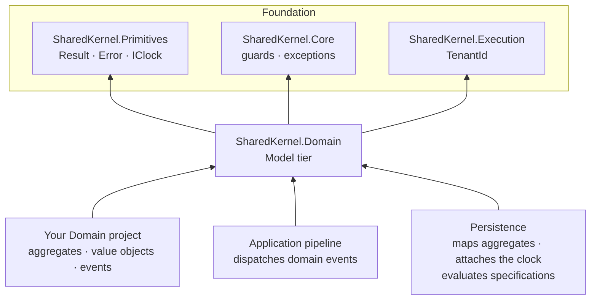

<div align="center">

# SharedKernel Domain

**Domain-driven design building blocks — aggregates, value objects, strongly-typed ids, business rules,
specifications and money — as pure domain code with no I/O, no system clock and no infrastructure to leak in.**

[](https://dotnet.microsoft.com/)
[](../../../LICENSE)


[What you get](#what-you-get) · [Packages](#packages) · [How it fits together](#how-it-fits-together) · [Get started](#get-started) · [See it run](#see-it-run) · [Guarantees](#guarantees)

<sub>📂 <code>src/Model/Domain</code> · <a href="../../../docs/packages.md">all packages by tier</a> · <a href="../../../README.md">Platform.SharedKernel</a></sub>

</div>

---

## What you get

- **Aggregates that keep their invariants.** `AggregateRoot<TId>` with `CheckRule`, `RaiseDomainEvent` and a
  `TryCreate` factory that turns invalid input into a `ValidationResult<T>` holding every error — plus audited,
  soft-delete and `Tenanted…AggregateRoot<TId>` bases that persistence understands from their interfaces alone.
- **Time you can test.** Aggregates read time only from an injected `IClock`; an aggregate loaded without one throws
  instead of stamping `0001-01-01`.
- **Values that cannot be confused.** `ValueObject` reports every validation error, `StronglyTypedId<TValue>` stops an
  `OrderId` flowing into a `CustomerId`, and `Money` handles ISO 4217 minor units, allocation and currency mismatches.
- **Queries as named objects.** `Specification<T>` and the inline `Spec.For<T>()` builder compose with
  `And`/`Or`/`Not` and are translated by the persistence packages; paging stays at the repository call site.
- **Versioned domain events.** `DomainEvent` records carry a UUID v7 `Id` and declare `[DomainEventVersion(n)]`;
  `IDomainEventDispatcher` is the port the application pipeline implements.

## Packages

| Package | Tier | Reference it from | Use it for |
| --- | --- | --- | --- |
| [SharedKernel.Domain](SharedKernel.Domain/README.md) | Model | Domain | Every aggregate, entity, value object, identifier, domain event, rule, policy, specification and monetary amount |

One package by design: the service's Domain project references it and nothing else. Test helpers (`FakeClock`, event
and rule assertions, `SpecificationAssert`, `MoneyFaker`) are in [SharedKernel.Testing](../../Testing/SharedKernel.Testing/README.md).

## How it fits together



- **Arrows point at dependencies.** The package depends only on Foundation packages and on no third-party package; the
  build enforces it.
- **Ports, not implementations.** `IDomainEventDispatcher` is implemented by the
  [Application](../../Application/README.md) pipeline and called by [Persistence](../../Infrastructure/Persistence/README.md)
  before each save; `IExchangeRateProvider` is implemented by your service.
- **Events dispatch inside the save.** Handlers run before the physical commit, in order; anything external goes
  through the outbox or a post-commit callback.

## Get started

```xml
<PackageReference Include="SharedKernel.Domain" />
```

```csharp
public sealed record InvoiceId(Guid Value) : StronglyTypedId<Guid>(Value);

[DomainEventVersion(1)]
public sealed record InvoiceIssued(InvoiceId InvoiceId) : DomainEvent;

public sealed class InvoiceMustHaveLines(int lineCount) : IBusinessRule
{
    public string Code => "invoice.no_lines";
    public string Message => "An invoice needs at least one line.";
    public bool IsBroken() => lineCount == 0;
}

public sealed class Invoice : AggregateRoot<InvoiceId>
{
    private Invoice(InvoiceId id, int lineCount, IClock clock) : base(id, clock)
    {
        CheckRule(new InvoiceMustHaveLines(lineCount));
        RaiseDomainEvent(at => new InvoiceIssued(id) { OccurredOn = at });
    }

    private Invoice() { } // ORM

    public static ValidationResult<Invoice> Issue(InvoiceId id, int lineCount, IClock clock) =>
        TryCreate(() => new Invoice(id, lineCount, clock));
}
```

`Invoice.Issue(id, 0, clock)` returns an invalid result whose first error has code `invoice.no_lines`; a valid call
returns the aggregate with one pending `InvoiceIssued` event and `Version` 1. Namespaces, the decision table and the
walkthrough are in the [SharedKernel.Domain Quick start](SharedKernel.Domain/README.md#quick-start).

## See it run

- [samples/OrderApi](../../../samples/OrderApi/README.md) — `OrderApi.Domain` references only `SharedKernel.Domain`:
  an `Order` aggregate with `Place` and `Cancel`, a `ValueObject`, a `StronglyTypedId<Guid>` and two domain events; an
  architecture test fails the build if the project reaches for anything else.
  `dotnet test samples/OrderApi/OrderApi.Tests -p:SharedKernelPackageVersion=<the packed version>`
- [samples/Shop](../../../samples/Shop/README.md) — `Shop.Catalog.Domain` models a tenant-owned `Product` on
  `TenantedAuditableAggregateRoot<ProductId>`, persisted under row-level security.

## Guarantees

| Guarantee | How it is held |
| --- | --- |
| **Pure domain code** | Model tier: the build rejects references above Foundation and any third-party package (`SKTIER001`/`SKTIER003`); `SharedKernelLayeringRules` reject logging and `SharedKernel.Contracts` |
| **No hidden clock reads** | Analyzer `SK0001`; an aggregate without a clock throws — `AggregateRootEventTests`, `DomainHardeningTests` |
| **Every validation error reported** | `TryCreate` returns them all (`TryCreateTests`); `SK0037` reports a value object that never calls `EnsureValid()`; `AggregateFactoriesMustCreateValidationResults` |
| **Versioned, time-ordered events** | `SK0009` requires `[DomainEventVersion(n)]`; `DomainHardeningTests.DomainEventId_IsVersion7` |
| **No silent query surprises** | A second primary sort, two ordered specifications or a paged composition throws (`SpecificationBuilderTests`); `SK0010` catches the first at build time |
| **Money never mixes currencies** | Cross-currency arithmetic fails with `money.currency_mismatch` — `MoneyArithmeticTests`, `MoneyHardeningTests` |
| **Tracked public API** | Public API analyzers fail the build on an unrecorded change; every public member is documented |

---

<div align="center">
<sub>Part of <a href="../../../README.md">Platform.SharedKernel</a> · <a href="../../../docs/packages.md">all packages</a> · MIT license</sub>
</div>
