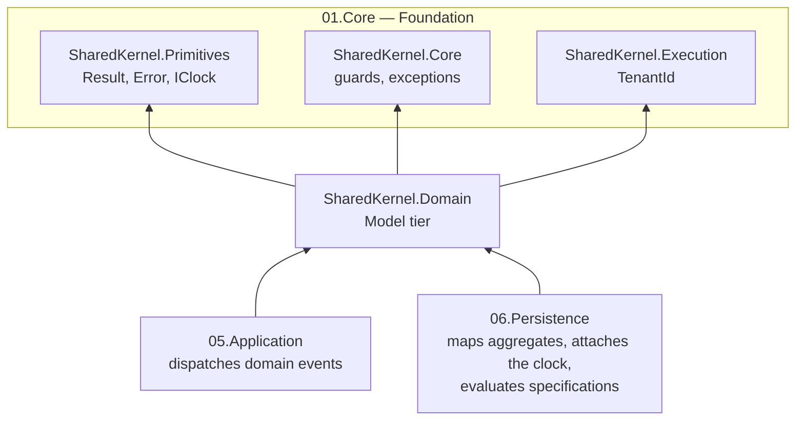

<div align="center">

# SharedKernel Domain

**Domain-driven design building blocks for .NET services — aggregates, value objects, strongly-typed identifiers,
business rules, specifications and money — as pure domain code with no I/O, no system clock and no infrastructure.**

[](https://dotnet.microsoft.com/)
[](../../../LICENSE)


[Package](#package) · [How it fits together](#how-it-fits-together) · [Get started](#get-started) ·
[See it run](#see-it-run) · [Guarantees](#guarantees)

<sub>📂 <code>src/Model/Domain</code> · domain <code>03.Domain</code> · <a href="../../../docs/packages.md">all packages by tier</a></sub>

</div>

---

## What this domain gives you

- **Aggregates that keep their invariants.** `AggregateRoot<TId>` with `CheckRule`, `RaiseDomainEvent` and a
  `TryCreate` factory that turns invalid input into a `ValidationResult<T>` holding every error — plus audit,
  soft-delete and `Tenanted…` bases that persistence understands from their interfaces alone.
- **Time you can test.** Aggregates read time only from an injected `IClock`; an aggregate loaded without a clock
  throws instead of stamping `0001-01-01`.
- **Values that cannot be confused.** `ValueObject` reports every validation error, `StronglyTypedId<TValue>` stops an
  `OrderId` flowing into a `CustomerId`, and `Money` handles ISO 4217 rounding, allocation and currency mismatches.
- **Queries as named objects.** `Specification<T>` and the inline `Spec.For<T>()` builder, composable with
  `And`/`Or`/`Not`, translated by the persistence packages; paging stays at the repository call site.

## Package

| Package | Tier | When you need it |
| --- | --- | --- |
| [SharedKernel.Domain](SharedKernel.Domain/README.md) | Model | Always, in a service's **Domain** project — every aggregate, entity, value object, identifier, domain event, rule, policy, specification and monetary amount derives from it |

The package README is the full guide: quick start, a decision table, an order-domain walkthrough, the reference and
the pitfalls. Test helpers (`FakeClock`, event and rule assertions, `SpecificationAssert`, `MoneyFaker`) are in
[SharedKernel.Testing](../../Testing/SharedKernel.Testing/README.md).

## How it fits together



Arrows point from a package to what it depends on. `SharedKernel.Domain` depends only on Foundation packages and on
no third-party package, and the build enforces it. It declares the ports the outer layers implement:
`IDomainEventDispatcher` (implemented by `05.Application`, called by persistence before each save) and
`IExchangeRateProvider` (implemented by your service).

## Get started

```xml
<PackageReference Include="SharedKernel.Domain" />
```

```csharp
using SharedKernel.Domain.Aggregates;
using SharedKernel.Domain.BusinessRules;
using SharedKernel.Domain.Events;
using SharedKernel.Domain.StronglyTypedIds;
using SharedKernel.Primitives.Clocks;
using SharedKernel.Primitives.Results;

public sealed record InvoiceId(Guid Value) : StronglyTypedId<Guid>(Value);

[DomainEventVersion(1)]
public sealed record InvoiceIssued(InvoiceId InvoiceId) : DomainEvent;

public sealed class InvoiceMustHaveLines(int lineCount) : IBusinessRule
{
    public string Code => "invoice.no_lines";
    public string Message => "An invoice needs at least one line.";
    public bool IsBroken() => lineCount == 0;
}

public sealed class Invoice : AggregateRoot<InvoiceId>
{
    private Invoice(InvoiceId id, int lineCount, IClock clock) : base(id, clock)
    {
        CheckRule(new InvoiceMustHaveLines(lineCount));
        RaiseDomainEvent(at => new InvoiceIssued(id) { OccurredOn = at });
    }

    private Invoice() { } // ORM

    public static ValidationResult<Invoice> Issue(InvoiceId id, int lineCount, IClock clock) =>
        TryCreate(() => new Invoice(id, lineCount, clock));
}
```

`Invoice.Issue(id, 0, clock)` returns an invalid result whose first error has code `invoice.no_lines`; a valid call
returns the aggregate with one pending `InvoiceIssued` event and `Version` 1.

## See it run

The Shop's [Ordering](../../../samples/Shop/Ordering/) keeps its domain in `Shop.Ordering.Domain`, a project that
references only `SharedKernel.Domain`: an `Order` aggregate (`TenantedAuditableAggregateRoot<OrderId>` with `Place`,
`Confirm`, `Reject` and `Cancel`), `IBusinessRule`s, a `StronglyTypedId<Guid>` and an `OrderStatusChanged` domain
event. `OrderingArchitectureTests` fails the build if the Domain project reaches for anything else.

## Guarantees

| Guarantee | How |
| --- | --- |
| **Pure domain code** | Model tier: the build rejects references above Foundation and any third-party package; architecture tests reject logging and `SharedKernel.Contracts` |
| **No hidden clock reads** | Analyzer `SK0001` reports `DateTime.UtcNow`/`DateTimeOffset.UtcNow`; `Now` throws when no clock is attached |
| **Every validation error reported** | `EnsureValid()` throws a `ValidationException` with all errors; `TryCreate` returns them all; `SK0037` reports a value object that never calls it |
| **Stable error codes** | `IBusinessRule.Code` is required; `money.currency_mismatch`, `currency.code.*`, `not_found.default` are fixed |
| **No silent query surprises** | A second primary sort throws (`SK0010` at build time); composing two ordered specifications, or a paged one, throws |
| **Versioned events** | Every concrete event declares `[DomainEventVersion(n)]` (`SK0009`); each `Id` is a UUID v7 that survives serialization |
| **Tracked public API** | Public API analyzers fail the build on an unrecorded change; every public member is documented |

---

**For maintainers:** design rules and invariants live in [CLAUDE.md](CLAUDE.md); phase history in
[state-map.md](state-map.md).
