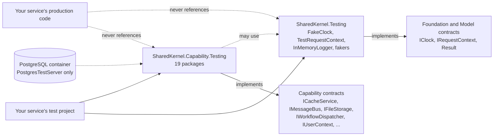

<div align="center">

# SharedKernel Testing

**Test doubles for every SharedKernel contract — one lightweight core and one package per capability — that fail
where production fails, honour tenant scope and run deterministically, so a service's unit tests need no mocking
framework, no container and no network.**

[](https://dotnet.microsoft.com/)
[](../../LICENSE)


[](https://github.com/bchavez/Bogus)

[What you get](#what-you-get) · [Packages](#packages) · [How it fits together](#how-it-fits-together) · [Get started](#get-started) · [See it run](#see-it-run) · [Guarantees](#guarantees)

<sub>📂 <code>src/Testing</code> · <a href="../../docs/packages.md">all packages by tier</a> · <a href="../../README.md">Platform.SharedKernel</a></sub>

</div>

---

## What you get

- **Doubles that honour the real contract.** Each fake implements the production interface it replaces, with its
  failure modes, its `Error` codes and its mandatory tenant scope — `FakeIdempotencyStore` reports a fingerprint
  mismatch, `InMemorySearchIndex<T>` refuses `TenantScope.Global` on a tenanted index.
- **Take only what you test.** `SharedKernel.Testing` depends on Foundation and Model packages and Bogus only; each
  `SharedKernel.{Capability}.Testing` depends on that capability's contract, so the messaging doubles pull in no Redis,
  no EF Core and no cloud SDK.
- **Deterministic by construction.** Time moves only when the test moves a `FakeClock`, fakers are seeded through
  `FakerSeeding`, and no double does real I/O.
- **Framework-free.** No packable package references xUnit, NUnit, MSTest or an assertion library; built-in assertions
  (`ShouldHavePublishedOnce<T>()`, `LoggerAssertions`, …) throw `InvalidOperationException`, so any runner works.
- **The doubles this repository tests itself with.** A behavioural fix happens once and reaches every consumer.

## Packages

All twenty are **Testing** tier. The core lives in this folder; each capability's double lives next to the contract it
fakes, so the links lead into those folders.

| Package | Tier | Reference it from | Use it for |
| --- | --- | --- | --- |
| [SharedKernel.Testing](SharedKernel.Testing/README.md) | Testing | test projects | **The core:** `FakeClock`, `TestRequestContext`, `InMemoryLogger` + `LoggerAssertions`, seeded fakers, domain, contract and privacy assertions |
| [SharedKernel.Application.Testing](../Application/SharedKernel.Application.Testing/README.md) | Testing | test projects | `ApplicationPipelineTestHarness` — the real request pipeline and its host-start checks |
| [SharedKernel.Persistence.Testing](../Infrastructure/Persistence/SharedKernel.Persistence.Testing/README.md) | Testing | test projects | `FakeRepository<,>`, `FakeUnitOfWork`, `FakeAuditTrailWriter`, `AddTestRequestContext()`; `PostgresTestServer` with the production role split |
| [SharedKernel.Caching.Testing](../Infrastructure/Caching/SharedKernel.Caching.Testing/README.md) | Testing | test projects | `FakeCacheService`, `FakeTenantCacheService`, `FakeDistributedLockService` |
| [SharedKernel.Caching.Redis.Testing](../Infrastructure/Caching/SharedKernel.Caching.Redis.Testing/README.md) | Testing | test projects | `FakeRedisChannelService`, `FakeRedisHashService`, `FakeTypedHashStore<T>` |
| [SharedKernel.Communication.Testing](../Infrastructure/Communication/SharedKernel.Communication.Testing/README.md) | Testing | test projects | `UseStubHttpMessageHandler(clientName, stub)` through a typed client's whole pipeline; `GrpcCalls` |
| [SharedKernel.Cryptography.Testing](../Foundation/SharedKernel.Cryptography.Testing/README.md) | Testing | test projects | `AddFakeCryptography()` — encryption, hashing, HMAC, signing, keys, TOTP replay guard |
| [SharedKernel.FeatureManagement.Testing](../Foundation/SharedKernel.FeatureManagement.Testing/README.md) | Testing | test projects | `FakeFeatureClient` via `AddFakeFeatureFlags()` |
| [SharedKernel.Idempotency.Testing](../Infrastructure/Idempotency/SharedKernel.Idempotency.Testing/README.md) | Testing | test projects | `FakeIdempotencyStore` via `AddFakeIdempotencyStore(purposes)` |
| [SharedKernel.Integration.Testing](../Infrastructure/Integration/SharedKernel.Integration.Testing/README.md) | Testing | test projects | `InMemoryWebhookDispatcher`, `InMemoryNotificationSender` and their delivery observers |
| [SharedKernel.Messaging.Testing](../Infrastructure/Messaging/SharedKernel.Messaging.Testing/README.md) | Testing | test projects | `InMemoryMessageBus`, `InMemoryEventPublisher` |
| [SharedKernel.Storage.Testing](../Infrastructure/Storage/SharedKernel.Storage.Testing/README.md) | Testing | test projects | Named and tenant stores in memory: `AddInMemoryStore(name)`, `AddInMemoryTenantStore(name)` |
| [SharedKernel.Search.Testing](../Infrastructure/Search/SharedKernel.Search.Testing/README.md) | Testing | test projects | `InMemorySearchIndex<T>`, in-memory provisioning |
| [SharedKernel.AI.Testing](../Infrastructure/AI/SharedKernel.AI.Testing/README.md) | Testing | test projects | Hash-derived embeddings, `InMemoryVectorCollection<T>`, `InMemorySemanticKernel` |
| [SharedKernel.Workflows.Testing](../Infrastructure/Workflows/SharedKernel.Workflows.Testing/README.md) | Testing | test projects | `InMemoryWorkflowDispatcher`, `InMemoryWorkflowHandle<TResult>` |
| [SharedKernel.Scheduling.Testing](../Infrastructure/Scheduling/SharedKernel.Scheduling.Testing/README.md) | Testing | test projects | `InMemoryScheduledJobRegistry` — the test fires each tick with `TriggerAsync` |
| [SharedKernel.Reporting.Testing](../Infrastructure/Reporting/SharedKernel.Reporting.Testing/README.md) | Testing | test projects | `InMemoryReportExporter<TRow>`, `InMemoryHtmlToPdfConverter` via `AddInMemoryReporting()` |
| [SharedKernel.Security.Testing](../Hosting/Security/SharedKernel.Security.Testing/README.md) | Testing | test projects | `FakeUserContext`, `SecurityTestContextBuilder`, in-memory key/DPoP/TOTP stores, DPoP proofs, mTLS certificates |
| [SharedKernel.Presentation.Testing](../Hosting/Presentation/SharedKernel.Presentation.Testing/README.md) | Testing | test projects | `TestServerCallContext` with an `HttpContext`, `GraphQLTestExecutorFactory`, `FakeHttpContextAccessor` |
| [SharedKernel.ServiceDefaults.Testing](../Hosting/ServiceDefaults/SharedKernel.ServiceDefaults.Testing/README.md) | Testing | test projects | `InMemoryTenantCatalog`, `FakeTenantResolutionStrategy`, health-tag assertions |

Start with the core; add the `.Testing` package of each capability your code under test injects. One more project lives
here but is **not published**: [SharedKernel.Testing.Internal](SharedKernel.Testing.Internal/README.md) — pinned
Testcontainers fixtures, EF Core helpers and a MassTransit harness for this repository's own suites.

## How it fits together



- **A double references the contract it fakes, not a provider** — unless the contract only exists in a concrete
  package (Workflows, Scheduling, the Security handlers, Webhooks, Communication). `SharedKernel.Security.Testing`
  therefore brings ASP.NET Core into the test project that uses it.
- **Asserted doubles are singletons.** The message bus, event publisher, search index, vector collection and workflow
  dispatcher are registered as singletons, even where production is scoped, so their history outlives the scope.
- **Simplifications are documented.** Exact search counts, substring free-text, hash-derived embeddings and a
  `FakeRepository<,>` that ignores optimistic concurrency are stated in each README; test those against the real engine.

## Get started

```xml
<PackageReference Include="SharedKernel.Testing" />
<PackageReference Include="SharedKernel.Messaging.Testing" />
```

```csharp
using SharedKernel.Execution.Tenancy;
using SharedKernel.Testing.Clocks;
using SharedKernel.Testing.Execution;
using SharedKernel.Testing.Messaging;

// InvoiceIssuer is the code under test: it reads IClock and IRequestContext and publishes on IMessageBus.
var clock = new FakeClock(new DateTimeOffset(2026, 3, 1, 9, 0, 0, TimeSpan.Zero));
var bus = new InMemoryMessageBus();
var caller = TestRequestContext.ForTenant(new TenantId(Guid.NewGuid())).WithPermissions("invoices.issue");

var result = await new InvoiceIssuer(clock, caller, bus).IssueAsync(Guid.NewGuid(), CancellationToken.None);

Assert.True(result.IsSuccess);
var issued = bus.ShouldHavePublishedOnce<InvoiceIssued>();
Assert.Equal(clock.UtcNow, issued.IssuedAt);
```

In a DI-based test each double registers with one call (`services.AddInMemoryMessageBus()`), then resolve the concrete
type to assert. The [SharedKernel.Testing Quick start](SharedKernel.Testing/README.md#quick-start) covers the core in
full; each capability package's README has its own.

## See it run

- The Shop's [Ordering](../../samples/Shop/Ordering/) — `Shop.Ordering.Tests` drives the real pipeline through
  `ApplicationPipelineTestHarness` with a `FakeClock`, `TestRequestContext.ForTenant(...)`, `AddFakeRepository<,>`
  and an `InMemoryEventPublisher`.
- [samples/Shop](../../samples/Shop/README.md) — `Shop.Catalog.Tests` runs the use cases over `FakeRepository<,>`,
  `InMemorySearchIndex<T>` and `InMemoryVectorCollection<T>`; `Shop.Inventory.Tests` covers locks with
  `FakeDistributedLockService`, the job schedule with `InMemoryScheduledJobRegistry` and the certificate allow-list
  with `MtlsTestCertificateBuilder`. `samples/Shop/build.sh --test`.

## Guarantees

| Guarantee | How it is held |
| --- | --- |
| No production project references a Testing package | The tier check (`SKTIER001`); `TestingPackagesNeverReferencedByProductionTests.NoProductionProject_ReferencesATestingPackage`; `SharedKernelLayeringRules.TestingNeverReferencedByProduction`, which a service can run against its own assemblies |
| The core stays light: Foundation/Model, Bogus and `Microsoft.Extensions.*.Abstractions` only — no test framework | `TestingPackagesNeverReferencedByProductionTests.CoreTestingPackage_DependsOnlyOnFoundationAndModelPackages` |
| Deterministic time and data | `FakeClockTests`, `FakerSeedingTests` (`Apply_SameSeed_ProducesIdenticalOutputAcrossIndependentCalls`) |
| Faithful failure modes and real `Error` codes | `FakeIdempotencyStoreTests.TryBeginAsync_SameKeyDifferentFingerprint_InFlight_ReturnsFingerprintMismatch`, and each package's nested `.Tests` project proving the double against its production contract |
| Mandatory tenant scope: a missing or global scope against tenanted data fails, as in production | `InMemorySearchIndexTests.SearchAsync_TenantScopeMissingOnTenantedIndex_ReturnsFailure`, `InMemoryWorkflowDispatcherTests` (`StartAsync_…_TenantScopeNone_ReturnsTenantScopeMissing_NoStateMutation`) |
| Asserted doubles resolve as one shared instance | Registration tests such as `AddInMemoryVectorCollection_ConcreteTypeAndInterface_ResolveSameSingletonInstance` |

The self-tests run in the Unit lane, except `SharedKernel.Persistence.Testing.Tests` and
`SharedKernel.Testing.Internal.Tests`, which need Docker (`Platform.SharedKernel.Integration.slnf`).

---

<div align="center">
<sub>Part of <a href="../../README.md">Platform.SharedKernel</a> · <a href="../../docs/packages.md">all packages</a> · MIT license</sub>
</div>
