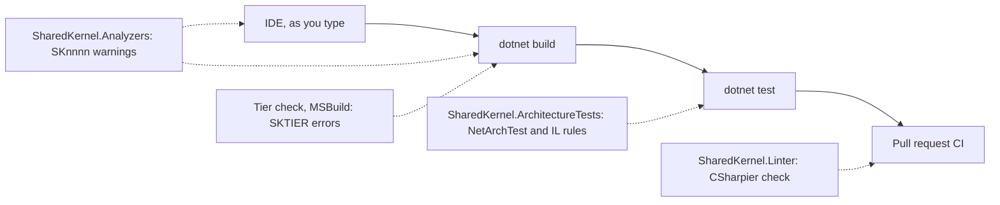

<div align="center">

# SharedKernel Governance

**The kernel's conventions as checks that fail the build, with the fix in the message — so a rule holds in every service, not only in the code a reviewer happened to read.**

[](https://dotnet.microsoft.com/)
[](../../LICENSE)


[What you get](#what-you-get) · [Packages](#packages) · [How it fits together](#how-it-fits-together) · [Get started](#get-started) · [See it run](#see-it-run) · [Guarantees](#guarantees)

<sub>📂 <code>tools/Governance</code> · <a href="../../docs/packages.md">all packages by tier</a> · <a href="../../README.md">Platform.SharedKernel</a></sub>

</div>

---

## What you get

- **Conventions as compiler warnings.** 45 Roslyn rules (`SK0001`–`SK0708`) flag a clock read instead of `IClock`, a
  discarded `Result`, a magic header name, `ILogger.LogXxx` instead of `[LoggerMessage]`, or personal data logged
  unmasked — in the IDE and on every `dotnet build`, each with a help link to the fix.
- **Adopt at your own pace.** Every rule defaults to **Warning**; escalate one rule or a whole category (`Security`)
  to error in `.editorconfig` when the codebase is clean.
- **Whole-assembly rules as tests.** `SharedKernel.ArchitectureTests` gives rule factories (`DomainLayerPurityRules`,
  `PersistenceLayerProtectionRules`, `RedisTopologyRules`, …) that return a `ConditionList`, asserted through
  `ArchitectureRuleBase.AssertRule` — domain purity, provider isolation, and what a method body does in IL.
- **One format for every repository.** `SharedKernel.Linter` ships the shared `.editorconfig` and a pinned CSharpier
  check that fails CI builds on unformatted files; `dotnet build -t:SharedKernelLinterFormat` fixes them.
- **Nothing reaches production.** All three are development dependencies: no runtime assembly, no API, nothing that
  flows to your service's consumers.

## Packages

| Package | Tier | Reference it from | Use it for |
| --- | --- | --- | --- |
| [SharedKernel.Analyzers](SharedKernel.Analyzers/README.md) | Tooling | every project (`Directory.Build.props`) | The `SKnnnn` rules in the IDE and the build |
| [SharedKernel.ArchitectureTests](SharedKernel.ArchitectureTests/README.md) | Tooling | test projects | Pinning your own layering and purity rules over compiled assemblies |
| [SharedKernel.Linter](SharedKernel.Linter/README.md) | Tooling | every project (`Directory.Build.props`) | The shared `.editorconfig` and the CSharpier format check |

Start with the Analyzers; add the Linter when you want formatting held on pull requests, and an architecture test
project once your service has layers worth pinning.

## How it fits together



- **Each check runs where it is cheapest.** A one-line mistake is an analyzer warning while you type; a rule about a
  whole assembly (no persistence in the domain, one `SaveChanges` call site) is an architecture test; formatting is
  checked only when `ContinuousIntegrationBuild=true` or `SharedKernelLinterEnforceFormatting=true`.
- **The tier check is MSBuild, not a package.** Inside this repository `eng/SharedKernelTiers.targets` fails a
  reference a tier may not take (`SKTIER000`–`SKTIER006`) before compile. A service gets the same layering from its
  own architecture test, as the Shop's [`Catalog`](../../samples/Shop/Catalog/) and
  [`Ordering`](../../samples/Shop/Ordering/) show.
- **Kernel types are matched by name.** The analyzers reference no SharedKernel assembly; they match kernel types by
  metadata name, so they run in any project, and tests compiled against the real kernel catch a rename.
- **Rule ids are never reused.** A retired rule keeps a row below, telling you to delete any suppression that names it.

<a id="analyzer-rule-index"></a>
<a id="rule-reference"></a>

### Analyzer rule index

Every diagnostic's IDE help link lands on its row here; the rule id links to the full entry in the
[Analyzers README](SharedKernel.Analyzers/README.md#rules).

| Rule | Category | Flags → fix |
| --- | --- | --- |
| <a id="sk0001-directdatetimeusage"></a>[SK0001](SharedKernel.Analyzers/README.md#sk0001) | Usage | `DateTime`/`DateTimeOffset` `.Now`/`.UtcNow` → inject `IClock` |
| <a id="sk0002-directmicrosoftfeaturemanagerusage"></a>[SK0002](SharedKernel.Analyzers/README.md#sk0002) | Usage | `IFeatureManager` family or `OpenFeature.Api.Instance` → `IFeatureClient` + `FeatureFlag<T>` |
| <a id="sk0003-rawexceptionthrow"></a>[SK0003](SharedKernel.Analyzers/README.md#sk0003) | Design | `throw new Exception`/`ApplicationException` → `Result` failure or typed kernel exception |
| <a id="sk0004-nullerrorreturn"></a>[SK0004](SharedKernel.Analyzers/README.md#sk0004) | Design | `return null` for `Error` → `Error.None` |
| <a id="sk0005-stringonlyexceptionconstructor"></a>[SK0005](SharedKernel.Analyzers/README.md#sk0005) | Design | Kernel exception built from a string only → pass an `Error` |
| <a id="sk0006-guardclausethrow"></a>[SK0006](SharedKernel.Analyzers/README.md#sk0006) | Design | A throwing `IGuardClause` method → return `Error?`; throw only in `Guard.Throw` |
| <a id="sk0007-redischannelservicemessagingsubstitute"></a>[SK0007](SharedKernel.Analyzers/README.md#sk0007) | Design | Redis Pub/Sub in messaging code → `IMessageBus` |
| <a id="sk0008-aggregaterootdispatchcoupling"></a>[SK0008](SharedKernel.Analyzers/README.md#sk0008) | Design | Dispatch code taking `IAggregateRoot` → `IHasDomainEvents` |
| <a id="sk0009-domaineventmissingversionattribute"></a>[SK0009](SharedKernel.Analyzers/README.md#sk0009) | Design | Domain event without `[DomainEventVersion]` → add it |
| <a id="sk0010-specificationorderingconflict"></a>[SK0010](SharedKernel.Analyzers/README.md#sk0010) | Design | Two primary orderings in a specification → one, then `ThenBy` |
| <a id="sk0011-guidformatcodemisuse"></a>[SK0011](SharedKernel.Analyzers/README.md#sk0011) | Design | `Guid.ToString("N")` and friends → `ToString()`/`"D"` |
| <a id="sk0013-rawhttpclientconstructorinjection"></a>[SK0013](SharedKernel.Analyzers/README.md#sk0013) | Usage | Explicit constructor taking `HttpClient` → typed client via `AddRestClient` |
| <a id="sk0014-closedgenericresiliencepipelineregistration"></a>[SK0014](SharedKernel.Analyzers/README.md#sk0014) | Usage | `ResiliencePipeline<T>` → string-keyed `ResiliencePipeline` |
| <a id="sk0015-streampipelinebehaviormisregistration"></a>SK0015 | — | **Retired** — delete any suppression that names it |
| <a id="sk0016-requesttypeshortnameusage"></a>[SK0016](SharedKernel.Analyzers/README.md#sk0016) | Design | `typeof(X).Name` as tag/key in `SharedKernel.Application*` → `FullName ?? Name` |
| <a id="sk0017-commandimplementscacheablequery"></a>[SK0017](SharedKernel.Analyzers/README.md#sk0017) | Design | Command marked `ICacheableQuery<T>` → caching is queries-only |
| <a id="sk0018-queryimplementsinvalidatescache"></a>[SK0018](SharedKernel.Analyzers/README.md#sk0018) | Design | Query marked `IInvalidatesCache` → invalidation is commands-only |
| <a id="sk0020-directiloggerextensionmethodusage"></a>[SK0020](SharedKernel.Analyzers/README.md#sk0020) | Design | `logger.LogInformation(…)` → `[LoggerMessage]` |
| <a id="sk0021-handwrittenloggermessagedefinedelegate"></a>[SK0021](SharedKernel.Analyzers/README.md#sk0021) | Design | `LoggerMessage.Define` → `[LoggerMessage]` |
| <a id="sk0022-crosscuttingmagicstringliteral"></a>[SK0022](SharedKernel.Analyzers/README.md#sk0022) | Usage | Literal header/baggage/tag/config/claim name → named constant (`WellKnownHeaders`, …) |
| <a id="sk0023-nonsingletonamazons3clientregistration"></a>[SK0023](SharedKernel.Analyzers/README.md#sk0023) | Usage | Scoped/transient `IAmazonS3` → singleton |
| <a id="sk0024-rawsearchfieldnameliteral"></a>[SK0024](SharedKernel.Analyzers/README.md#sk0024) | Usage | Literal search field name → `nameof`/constant |
| <a id="sk0025-obsoleteelasticsearchclientusage"></a>[SK0025](SharedKernel.Analyzers/README.md#sk0025) | Usage | NEST / `Elasticsearch.Net` → `Elastic.Clients.Elasticsearch` |
| <a id="sk0026-rawintelligenceproviderclientconstructorinjection"></a>[SK0026](SharedKernel.Analyzers/README.md#sk0026) | Usage | Raw `QdrantClient`/`Kernel` injected → `SharedKernel.AI.Abstractions` contracts |
| <a id="sk0027-rawintelligenceidentifierliteral"></a>[SK0027](SharedKernel.Analyzers/README.md#sk0027) | Usage | Literal collection/field/model id → `nameof`/constant |
| <a id="sk0028-nondeterministicapiusageinsideworkflow"></a>[SK0028](SharedKernel.Analyzers/README.md#sk0028) | Design | Non-deterministic API in a workflow → `Workflow.*` equivalent |
| <a id="sk0029-rawtemporalclientconstructorinjection"></a>[SK0029](SharedKernel.Analyzers/README.md#sk0029) | Usage | Raw Temporal client injected → `IWorkflowDispatcher` |
| <a id="sk0030-resultoutcomediscarded"></a>[SK0030](SharedKernel.Analyzers/README.md#sk0030) | Usage | `Result` never inspected → check, return, pass on, or `_ =` |
| <a id="sk0031-rawsecuritycontextconstructorinjection"></a>[SK0031](SharedKernel.Analyzers/README.md#sk0031) | Usage | `IHttpContextAccessor`/`HttpContext`/`ClaimsPrincipal` injected → `IUserContext`/`IRequestContext` |
| <a id="sk0032-corswildcardoriginwithcredentials"></a>[SK0032](SharedKernel.Analyzers/README.md#sk0032) | Security | CORS wildcard origin with credentials → explicit origins |
| <a id="sk0033-reflectionbasedobjectmapperusage"></a>[SK0033](SharedKernel.Analyzers/README.md#sk0033) | Usage | AutoMapper → Mapperly or hand-written mapping |
| <a id="sk0034-amountcurrencypaircoupling"></a>[SK0034](SharedKernel.Analyzers/README.md#sk0034) | Advisory | `decimal` amount + `string` currency → consider `Money` |
| <a id="sk0035-unmaskedclassifieddataatloggingcallsite"></a>[SK0035](SharedKernel.Analyzers/README.md#sk0035) | Security | Classified data to an unclassified log parameter → classify or mask |
| <a id="sk0036-rawrpcexceptionconstruction"></a>[SK0036](SharedKernel.Analyzers/README.md#sk0036) | Usage | `new RpcException`/`Status` → `Result` + `ThrowIfFailure()` |
| <a id="sk0037-valueobjectmissingensurevalid"></a>[SK0037](SharedKernel.Analyzers/README.md#sk0037) | Design | Value object never calls `EnsureValid()` → call it last in every constructor |
| <a id="sk0038-integrationeventmissingattribute"></a>[SK0038](SharedKernel.Analyzers/README.md#sk0038) | Design | Integration event without `[IntegrationEvent]` → add it |
| <a id="sk0039-invalidintegrationeventattribute"></a>[SK0039](SharedKernel.Analyzers/README.md#sk0039) | Design | Bad event name or `Version` < 1 → `orders.order-placed`, versions from 1 |
| <a id="sk0040-pipelinemarkerresponseshapemismatch"></a>[SK0040](SharedKernel.Analyzers/README.md#sk0040) | Design | `[RequirePermission]`/`IIdempotentRequest` on a non-`Result` request → return `Result` |
| <a id="sk0041-duplicatecacheablequeryname"></a>[SK0041](SharedKernel.Analyzers/README.md#sk0041) | Design | Two cacheable queries share a name → rename one |
| <a id="sk0042-nonconstantdappersqlargument"></a>[SK0042](SharedKernel.Analyzers/README.md#sk0042) | Security | Non-constant Dapper `sql` → fixed SQL, values as parameters |
| <a id="sk0201-tenanteddbcontextonmodelcreatingguard"></a>[SK0201](SharedKernel.Analyzers/README.md#sk0201) | Design | `TenantedDbContext.OnModelCreating` without `base` call → call it |
| <a id="sk0202-ignorequeryfiltersoutsidetenantedrepository"></a>[SK0202](SharedKernel.Analyzers/README.md#sk0202) | Design | `IgnoreQueryFilters()` outside persistence → cross-tenant scope + named filter |
| <a id="sk0703-messagebussingletonregistration"></a>[SK0703](SharedKernel.Analyzers/README.md#sk0703) | Usage | Singleton `IMessageBus`/`IEventPublisher` → scoped |
| <a id="sk0704-hardcodedqueueuriingetsendendpoint"></a>[SK0704](SharedKernel.Analyzers/README.md#sk0704) | Usage | Literal `queue:`/`exchange:` URI → convention-based endpoints |
| <a id="sk0705-faultconsumerdirectregistration"></a>[SK0705](SharedKernel.Analyzers/README.md#sk0705) | Usage | `IFaultConsumer<T>` registered directly → `AddFaultConsumer` |
| <a id="sk0708-batchconsumerregisteredviaaddconsumer"></a>[SK0708](SharedKernel.Analyzers/README.md#sk0708) | Usage | Batch consumer via `AddConsumer` → `AddBatchConsumer` |

Gaps in the numbering: `SK0012`, `SK0301`–`SK0303`, `SK0701`–`SK0702` and `SK0706` are architecture tests (they need a
whole assembly); `SK0015`, `SK0019` and `SK0707` are retired and never reused.

## Get started

Reference the build-time packages once, in `Directory.Build.props`, and the rule base in your architecture test project:

```xml
<!-- Directory.Build.props -->
<ItemGroup>
  <PackageReference Include="SharedKernel.Analyzers" PrivateAssets="all" />
  <PackageReference Include="SharedKernel.Linter" PrivateAssets="all" />
</ItemGroup>

<!-- YourService.ArchitectureTests.csproj -->
<PackageReference Include="SharedKernel.ArchitectureTests" />
```

```csharp
public sealed class ArchitectureTests : ArchitectureRuleBase
{
    private static readonly Assembly Domain = typeof(Order).Assembly;

    [Fact]
    public void Domain_does_not_read_the_system_clock() =>
        AssertRule(DomainLayerPurityRules.DomainAssembliesNeverCallSystemClock(Domain));

    [Fact]
    public void Domain_does_not_reference_persistence() =>
        AssertRule(PersistenceLayerProtectionRules.DomainAssembliesNeverReferencePersistenceStack(Domain));
}
```

```ini
# .editorconfig — escalate when ready
dotnet_analyzer_diagnostic.category-Security.severity = error
```

Install the shared style once with `dotnet build -t:InstallSharedKernelLinterConfig -p:SharedKernelLinterConfigDestination=.`
and format with `dotnet build -t:SharedKernelLinterFormat`. Full setup:
[Analyzers](SharedKernel.Analyzers/README.md#quick-start) ·
[ArchitectureTests](SharedKernel.ArchitectureTests/README.md#quick-start) ·
[Linter](SharedKernel.Linter/README.md#quick-start).

## See it run

- [**Shop**](../../samples/Shop/) — the whole set as a consuming platform uses it: `samples/Shop/Directory.Build.props`
  puts the Analyzers and the Linter on every project, and `Shop.Catalog.Tests/CatalogArchitectureTests.cs` derives from
  `ArchitectureRuleBase` to pin the four-project shape and apply the kernel's own domain-purity rules to the Catalog's
  assemblies. Run it with `samples/Shop/build.sh --test`.
- [**Shop Ordering**](../../samples/Shop/Ordering/) — `OrderingArchitectureTests` (in `Shop.Ordering.Tests`) asserts
  the four-project shape against the real restore graph through `Shop.TestSupport`'s `ServiceShape`; every other Shop
  service pins its own dependency graph the same way. The template to copy into a new service.

## Guarantees

| Guarantee | How it is held |
| --- | --- |
| Every diagnostic's help link opens a section that exists | `HelpLinkReadmeAnchorTests` matches each descriptor's anchor against the `<a id>` anchors on this page |
| Every analyzer fires on a violation and stays quiet on the fix | Firing and non-firing tests per rule in `SharedKernel.Analyzers.Tests` |
| A renamed kernel type cannot silently switch an analyzer off | `RealKernelTypeNameTests` compiles fixtures against the real kernel assemblies |
| Every public architecture rule has been seen failing | `RuleExecutionCoverageTests` fails on a rule no test calls |
| Rule ids are tracked and never reused | `AnalyzerReleases.Shipped.md` / `.Unshipped.md` (RS2008), retired ids under "Removed Rules" |
| The kernel's own package graph keeps its tiers, with no cycles | `DependencyGraphRulesTests`, plus `eng/verify-tier-errors.sh` proving SKTIER001/006 still fire |
| No production package references a Testing package | `TestingPackagesNeverReferencedByProductionTests` |
| The packed packages work for an outside consumer | Three standalone consumers in [`_verification/`](_verification) restore them in the package dry-run workflow; the analyzer consumer must report `SK0001` |

---

<div align="center">
<sub>Part of <a href="../../README.md">Platform.SharedKernel</a> · <a href="../../docs/packages.md">all packages</a> · MIT license</sub>
</div>
