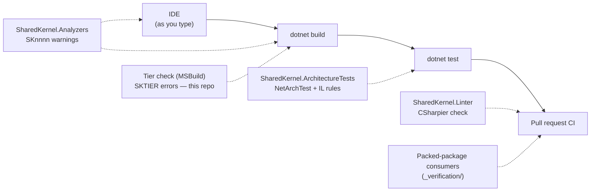

<div align="center">

# 00.Governance

**Automated guardrails for Platform.SharedKernel — conventions that fail the build, not the code review.**

[](https://dotnet.microsoft.com/)
[](../../LICENSE)


</div>

A shared kernel only stays coherent while every service follows the same rules: inject `IClock` instead of reading the
clock, never discard a `Result`, keep the domain free of persistence, never log personal data unmasked. Written down,
such rules get broken one reviewer blind spot at a time. This folder turns each of them into a check that fails where
the rule is broken, with a message that names the fix. None of it adds a runtime dependency to your service.

## What governance gives you

| Check | Runs in | Catches |
| --- | --- | --- |
| **Analyzers** (`SharedKernel.Analyzers`) | IDE and every `dotnet build` | One line of code: a clock read, a discarded `Result`, a magic header name, an unmasked PII log argument |
| **Tier check** (MSBuild, `eng/SharedKernelTiers.targets`) | Every build of this repository, before compile | A package referencing a tier it may not (`SKTIER000`–`SKTIER006`), such as ASP.NET Core below the Host tier |
| **Architecture tests** (`SharedKernel.ArchitectureTests`) | Your test suite | Whole assemblies: domain purity, provider isolation, what a method body does in IL |
| **Linter** (`SharedKernel.Linter`) | CI builds | Unformatted files, via a pinned CSharpier and the shared `.editorconfig` |

## Packages

| Package | Tier | When you need it |
| --- | --- | --- |
| [SharedKernel.Analyzers](SharedKernel.Analyzers/README.md) | Tooling | Always — reference it from every project (`Directory.Build.props`) |
| [SharedKernel.ArchitectureTests](SharedKernel.ArchitectureTests/README.md) | Tooling | In an architecture test project, to pin your own layering |
| [SharedKernel.Linter](SharedKernel.Linter/README.md) | Tooling | When you want formatting enforced on pull requests |

`SharedKernel.Benchmarks` (internal, not published) supplies one BenchmarkDotNet configuration,
`[SharedKernelBenchmark]`, for this repository's own benchmarks.

## Where each check runs



<a id="analyzer-rule-index"></a>
<a id="rule-reference"></a>

## Rule index

Every analyzer diagnostic's IDE help link lands on its row here; the rule ID links to the full entry in the
[Analyzers README](SharedKernel.Analyzers/README.md#rules). All rules default to **Warning**.

| Rule | Category | Flags → fix |
| --- | --- | --- |
| <a id="sk0001-directdatetimeusage"></a>[SK0001](SharedKernel.Analyzers/README.md#sk0001) | Usage | `DateTime`/`DateTimeOffset` `.Now`/`.UtcNow` → inject `IClock` |
| <a id="sk0002-directmicrosoftfeaturemanagerusage"></a>[SK0002](SharedKernel.Analyzers/README.md#sk0002) | Usage | `IFeatureManager` family or `OpenFeature.Api.Instance` → `IFeatureClient` + `FeatureFlag<T>` |
| <a id="sk0003-rawexceptionthrow"></a>[SK0003](SharedKernel.Analyzers/README.md#sk0003) | Design | `throw new Exception`/`ApplicationException` → `Result` failure or typed kernel exception |
| <a id="sk0004-nullerrorreturn"></a>[SK0004](SharedKernel.Analyzers/README.md#sk0004) | Design | `return null` for `Error` → `Error.None` |
| <a id="sk0005-stringonlyexceptionconstructor"></a>[SK0005](SharedKernel.Analyzers/README.md#sk0005) | Design | Kernel exception built from a string only → pass an `Error` |
| <a id="sk0006-guardclausethrow"></a>[SK0006](SharedKernel.Analyzers/README.md#sk0006) | Design | A throwing `IGuardClause` method → return `Error?`; throw only in `Guard.Throw` |
| <a id="sk0007-redischannelservicemessagingsubstitute"></a>[SK0007](SharedKernel.Analyzers/README.md#sk0007) | Design | Redis Pub/Sub in messaging code → `IMessageBus` |
| <a id="sk0008-aggregaterootdispatchcoupling"></a>[SK0008](SharedKernel.Analyzers/README.md#sk0008) | Design | Dispatch code taking `IAggregateRoot` → `IHasDomainEvents` |
| <a id="sk0009-domaineventmissingversionattribute"></a>[SK0009](SharedKernel.Analyzers/README.md#sk0009) | Design | Domain event without `[DomainEventVersion]` → add it |
| <a id="sk0010-specificationorderingconflict"></a>[SK0010](SharedKernel.Analyzers/README.md#sk0010) | Design | Two primary orderings in a specification → one, then `ThenBy` |
| <a id="sk0011-guidformatcodemisuse"></a>[SK0011](SharedKernel.Analyzers/README.md#sk0011) | Design | `Guid.ToString("N")` and friends → `ToString()`/`"D"` |
| <a id="sk0013-rawhttpclientconstructorinjection"></a>[SK0013](SharedKernel.Analyzers/README.md#sk0013) | Usage | Explicit constructor taking `HttpClient` → typed client via `AddRestClient` |
| <a id="sk0014-closedgenericresiliencepipelineregistration"></a>[SK0014](SharedKernel.Analyzers/README.md#sk0014) | Usage | `ResiliencePipeline<T>` → string-keyed `ResiliencePipeline` |
| <a id="sk0015-streampipelinebehaviormisregistration"></a>SK0015 | — | **Retired** — delete any suppression that names it |
| <a id="sk0016-requesttypeshortnameusage"></a>[SK0016](SharedKernel.Analyzers/README.md#sk0016) | Design | `typeof(X).Name` as tag/key in `SharedKernel.Application*` → `FullName ?? Name` |
| <a id="sk0017-commandimplementscacheablequery"></a>[SK0017](SharedKernel.Analyzers/README.md#sk0017) | Design | Command marked `ICacheableQuery<T>` → caching is queries-only |
| <a id="sk0018-queryimplementsinvalidatescache"></a>[SK0018](SharedKernel.Analyzers/README.md#sk0018) | Design | Query marked `IInvalidatesCache` → invalidation is commands-only |
| <a id="sk0020-directiloggerextensionmethodusage"></a>[SK0020](SharedKernel.Analyzers/README.md#sk0020) | Design | `logger.LogInformation(…)` → `[LoggerMessage]` |
| <a id="sk0021-handwrittenloggermessagedefinedelegate"></a>[SK0021](SharedKernel.Analyzers/README.md#sk0021) | Design | `LoggerMessage.Define` → `[LoggerMessage]` |
| <a id="sk0022-crosscuttingmagicstringliteral"></a>[SK0022](SharedKernel.Analyzers/README.md#sk0022) | Usage | Literal header/baggage/tag/config/claim name → named constant (`WellKnownHeaders`, …) |
| <a id="sk0023-nonsingletonamazons3clientregistration"></a>[SK0023](SharedKernel.Analyzers/README.md#sk0023) | Usage | Scoped/transient `IAmazonS3` → singleton |
| <a id="sk0024-rawsearchfieldnameliteral"></a>[SK0024](SharedKernel.Analyzers/README.md#sk0024) | Usage | Literal search field name → `nameof`/constant |
| <a id="sk0025-obsoleteelasticsearchclientusage"></a>[SK0025](SharedKernel.Analyzers/README.md#sk0025) | Usage | NEST / `Elasticsearch.Net` → `Elastic.Clients.Elasticsearch` |
| <a id="sk0026-rawintelligenceproviderclientconstructorinjection"></a>[SK0026](SharedKernel.Analyzers/README.md#sk0026) | Usage | Raw `QdrantClient`/`Kernel` injected → `SharedKernel.AI.Abstractions` contracts |
| <a id="sk0027-rawintelligenceidentifierliteral"></a>[SK0027](SharedKernel.Analyzers/README.md#sk0027) | Usage | Literal collection/field/model id → `nameof`/constant |
| <a id="sk0028-nondeterministicapiusageinsideworkflow"></a>[SK0028](SharedKernel.Analyzers/README.md#sk0028) | Design | Non-deterministic API in a workflow → `Workflow.*` equivalent |
| <a id="sk0029-rawtemporalclientconstructorinjection"></a>[SK0029](SharedKernel.Analyzers/README.md#sk0029) | Usage | Raw Temporal client injected → `IWorkflowDispatcher` |
| <a id="sk0030-resultoutcomediscarded"></a>[SK0030](SharedKernel.Analyzers/README.md#sk0030) | Usage | `Result` never inspected → check, return, pass on, or `_ =` |
| <a id="sk0031-rawsecuritycontextconstructorinjection"></a>[SK0031](SharedKernel.Analyzers/README.md#sk0031) | Usage | `IHttpContextAccessor`/`HttpContext`/`ClaimsPrincipal` injected → `IUserContext`/`IRequestContext` |
| <a id="sk0032-corswildcardoriginwithcredentials"></a>[SK0032](SharedKernel.Analyzers/README.md#sk0032) | Security | CORS wildcard origin with credentials → explicit origins |
| <a id="sk0033-reflectionbasedobjectmapperusage"></a>[SK0033](SharedKernel.Analyzers/README.md#sk0033) | Usage | AutoMapper → Mapperly or hand-written mapping |
| <a id="sk0034-amountcurrencypaircoupling"></a>[SK0034](SharedKernel.Analyzers/README.md#sk0034) | Advisory | `decimal` amount + `string` currency → consider `Money` |
| <a id="sk0035-unmaskedclassifieddataatloggingcallsite"></a>[SK0035](SharedKernel.Analyzers/README.md#sk0035) | Security | Classified data to an unclassified log parameter → classify or mask |
| <a id="sk0036-rawrpcexceptionconstruction"></a>[SK0036](SharedKernel.Analyzers/README.md#sk0036) | Usage | `new RpcException`/`Status` → `Result` + `ThrowIfFailure()` |
| <a id="sk0037-valueobjectmissingensurevalid"></a>[SK0037](SharedKernel.Analyzers/README.md#sk0037) | Design | Value object never calls `EnsureValid()` → call it last in every constructor |
| <a id="sk0038-integrationeventmissingattribute"></a>[SK0038](SharedKernel.Analyzers/README.md#sk0038) | Design | Integration event without `[IntegrationEvent]` → add it |
| <a id="sk0039-invalidintegrationeventattribute"></a>[SK0039](SharedKernel.Analyzers/README.md#sk0039) | Design | Bad event name or `Version` < 1 → `orders.order-placed`, versions from 1 |
| <a id="sk0040-pipelinemarkerresponseshapemismatch"></a>[SK0040](SharedKernel.Analyzers/README.md#sk0040) | Design | `[RequirePermission]`/`IIdempotentRequest` on a non-`Result` request → return `Result` |
| <a id="sk0041-duplicatecacheablequeryname"></a>[SK0041](SharedKernel.Analyzers/README.md#sk0041) | Design | Two cacheable queries share a name → rename one |
| <a id="sk0042-nonconstantdappersqlargument"></a>[SK0042](SharedKernel.Analyzers/README.md#sk0042) | Security | Non-constant Dapper `sql` → fixed SQL, values as parameters |
| <a id="sk0201-tenanteddbcontextonmodelcreatingguard"></a>[SK0201](SharedKernel.Analyzers/README.md#sk0201) | Design | `TenantedDbContext.OnModelCreating` without `base` call → call it |
| <a id="sk0202-ignorequeryfiltersoutsidetenantedrepository"></a>[SK0202](SharedKernel.Analyzers/README.md#sk0202) | Design | `IgnoreQueryFilters()` outside persistence → cross-tenant scope + named filter |
| <a id="sk0703-messagebussingletonregistration"></a>[SK0703](SharedKernel.Analyzers/README.md#sk0703) | Usage | Singleton `IMessageBus`/`IEventPublisher` → scoped |
| <a id="sk0704-hardcodedqueueuriingetsendendpoint"></a>[SK0704](SharedKernel.Analyzers/README.md#sk0704) | Usage | Literal `queue:`/`exchange:` URI → convention-based endpoints |
| <a id="sk0705-faultconsumerdirectregistration"></a>[SK0705](SharedKernel.Analyzers/README.md#sk0705) | Usage | `IFaultConsumer<T>` registered directly → `AddFaultConsumer` |
| <a id="sk0708-batchconsumerregisteredviaaddconsumer"></a>[SK0708](SharedKernel.Analyzers/README.md#sk0708) | Usage | Batch consumer via `AddConsumer` → `AddBatchConsumer` |

Gaps in the numbering: `SK0012`, `SK0301`–`SK0303`, `SK0701`–`SK0702` and `SK0706` are architecture tests (they need a
whole assembly); `SK0015`, `SK0019` and `SK0707` are retired and never reused.

## Get started

1. **Reference the build-time packages** once, in `Directory.Build.props`:

   ```xml
   <Project>
     <ItemGroup>
       <PackageReference Include="SharedKernel.Analyzers" PrivateAssets="all" />
       <PackageReference Include="SharedKernel.Linter" PrivateAssets="all" />
     </ItemGroup>
   </Project>
   ```

   Versions come from your central `SharedKernelVersion` property; see
   [Using the packages](../../README.md#using-the-packages) for the package feed.

2. **Build and read the warnings.** Most rules only fire on code that uses what they govern.
3. **Escalate the security rules** in `.editorconfig`:
   `dotnet_analyzer_diagnostic.category-Security.severity = error`.
4. **Add an architecture test project** with `SharedKernel.ArchitectureTests` and adopt rules one at a time — make each
   fail once on purpose ([quick start](SharedKernel.ArchitectureTests/README.md#quick-start)).
5. **Format once, then let CI hold the line**: install the shared `.editorconfig`, run
   `dotnet build -t:SharedKernelLinterFormat` as one commit ([Linter quick start](SharedKernel.Linter/README.md#quick-start)).

## How the tooling itself is verified

- Every analyzer and architecture rule has a firing and a non-firing test; analyzer fixtures compile against the real
  kernel assemblies, and a meta-test fails when a public architecture rule has no test.
- On every CI run the packages are packed and restored by three standalone consumers in [`_verification/`](_verification);
  the analyzer consumer's build must report `SK0001`.
- A test fails the build if any analyzer's help link points to an anchor missing from this page.

## For maintainers

Maintainer rules, invariants and decisions: [CLAUDE.md](CLAUDE.md). Phase history: [state-map.md](state-map.md).
