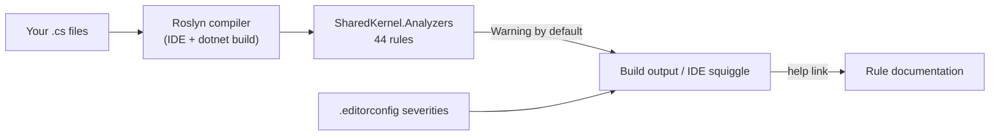

# SharedKernel.Analyzers

[](https://dotnet.microsoft.com/)
[](https://github.com/Gresta-Vertex-Labs/platform-shared-kernel/blob/main/LICENSE)


> **44 Roslyn rules that turn the Platform.SharedKernel conventions into compiler warnings in your own build. Every
> diagnostic names the fix, so a violation explains itself in the IDE instead of waiting for a reviewer to notice.**

| You get | So that |
| --- | --- |
| One `PackageReference`, no setup | The rules run on your next build, in the IDE and on CI |
| Every rule at **Warning** by default | You adopt incrementally and escalate per rule or per category in `.editorconfig` |
| Rules for clock access, `Result` handling, exceptions, logging, magic strings | Kernel conventions hold in every service, not only in reviewed code |
| `Security` category (`SK0032`, `SK0035`, `SK0042`) | CORS credential leaks, unmasked personal data in logs and SQL injection fail early |
| A help link on every diagnostic | The IDE opens the rule's documentation from the squiggle |
| No runtime assembly, no API | Nothing ships to production and nothing flows to your consumers |

## Contents

- [Install](#install)
- [Quick start](#quick-start)
- [How it works](#how-it-works)
- [Recipes](#recipes)
- [Reference](#reference)
- [Testing](#testing)
- [Pitfalls](#pitfalls)
- [Design decisions](#design-decisions)

## Install

```xml
<PackageReference Include="SharedKernel.Analyzers" PrivateAssets="all" />
```

The version comes from your central `SharedKernelVersion` property — every SharedKernel package ships at the same
version. See [Using the packages](https://github.com/Gresta-Vertex-Labs/platform-shared-kernel#using-the-packages).

| Requirement | Value |
| --- | --- |
| Analyzer target framework | `netstandard2.0` (required by the Roslyn compiler host); your project may target anything |
| Tier | Tooling — build only; reference it from **every** project you want checked |
| Built against | `Microsoft.CodeAnalysis.CSharp` 4.14.0 — needs a compiler at Roslyn 4.14 or later (.NET SDK 10) |
| Depends on | Nothing at run time (`DevelopmentDependency`, no `lib/` assembly) |

Analyzers are **not inherited transitively**: referencing another SharedKernel package does not bring these rules.
Put the reference in a repository-wide `Directory.Build.props` so every project picks it up once.

## Quick start

```xml
<!-- Directory.Build.props at the repository root -->
<Project>
  <ItemGroup>
    <PackageReference Include="SharedKernel.Analyzers" PrivateAssets="all" />
  </ItemGroup>
</Project>
```

Build. A violation reads like this:

```csharp
public sealed class OrderService(IOrderRepository repository)
{
    public async Task PlaceAsync(Order order, CancellationToken ct)
    {
        var now = DateTime.UtcNow;               // SK0001
        await repository.SaveAsync(order, ct);   // SK0030 when SaveAsync returns Task<Result>
    }
}
```

```text
warning SK0001: Direct access to 'DateTime.UtcNow' is not allowed — inject IClock via DI instead
warning SK0030: This Result's outcome is never checked — a failure will pass silently. Assign it, branch on it,
                return it, pass it as an argument, or explicitly discard it with '_ = ...'.
```

Make the rules you consider non-negotiable fail the build:

```ini
# .editorconfig
[*.cs]
dotnet_diagnostic.SK0030.severity = error
dotnet_analyzer_diagnostic.category-Security.severity = error
```

## How it works



- **Syntax or semantic matching.** Each rule matches a code shape; kernel types are recognised by metadata name, so the
  package references no SharedKernel assembly. Rules whose correctness depends on a real type resolve it through the
  semantic model; the syntax-only ones say so under their entry below.
- **Namespace exemptions.** A rule that polices a kernel API exempts the package that implements it (for example
  `SK0001` inside `SharedKernel.Primitives`). Rules unsafe anywhere (`SK0011`, `SK0014`, `SK0022`, `SK0023`, `SK0030`,
  `SK0703`) have no exemption.
- **Generated code** is skipped wherever it would false-positive (the `[LoggerMessage]` generator's output, for one).
- **Only what you use fires.** A service with no MassTransit bus never sees `SK0703`–`SK0708`; one without Temporal
  never sees `SK0028`/`SK0029`. The rules that apply to almost any project are `SK0001`, `SK0003`–`SK0005`, `SK0011`,
  `SK0020`/`SK0021`, `SK0022`, `SK0030` and `SK0033`.
- **Help links.** Each diagnostic's help link opens the rule index of the
  [00.Governance README](https://github.com/Gresta-Vertex-Labs/platform-shared-kernel/blob/main/tools/Governance/README.md#analyzer-rule-index),
  which links to the rule's entry below.

## Recipes

### 1. Adopt the security rules first

```ini
[*.cs]
dotnet_analyzer_diagnostic.category-Security.severity = error   # SK0032, SK0035, SK0042
```

### 2. Suppress one occurrence, with the reason

```csharp
#pragma warning disable SK0202 // Cross-tenant retention purge, approved in INF-4421
var expired = await db.AuditLogs.IgnoreQueryFilters().Where(x => x.CreatedAt < cutoff).ToListAsync(ct);
#pragma warning restore SK0202
```

For a member or type, use `[SuppressMessage("Usage", "SK0001", Justification = "…")]`. A per-site suppression
records one decision; `severity = none` erases the rule for everyone.

### 3. Relax a rule for part of the tree

```ini
[tests/**/*.cs]
dotnet_diagnostic.SK0001.severity = none
```

## Reference

### Categories

| Category | Meaning |
| --- | --- |
| `Usage` | An API is used in a way the platform does not support |
| `Design` | The shape of a type, method or registration is wrong |
| `Security` | A direct security consequence — `SK0032`, `SK0035`, `SK0042`. Escalate these first |
| `Advisory` | A heuristic nudge, never a prohibition — `SK0034` only; keep it at Warning |

Every rule's default severity is **Warning**.

### Rule index

| Rule | Category | Title |
| --- | --- | --- |
| [SK0001](#sk0001) | Usage | Direct DateTime/DateTimeOffset usage |
| [SK0002](#sk0002) | Usage | Direct Microsoft.FeatureManagement / ambient OpenFeature API usage |
| [SK0003](#sk0003) | Design | Raw Exception or ApplicationException throw |
| [SK0004](#sk0004) | Design | Null return for Error type |
| [SK0005](#sk0005) | Design | SharedKernelException subclass constructed with string only |
| [SK0006](#sk0006) | Design | Guard clause functional-path method must not throw |
| [SK0007](#sk0007) | Design | IRedisChannelService used as a messaging substitute |
| [SK0008](#sk0008) | Design | Dispatch code should not couple to IAggregateRoot |
| [SK0009](#sk0009) | Design | Domain event missing version attribute |
| [SK0010](#sk0010) | Design | Specification constructor has conflicting ordering calls |
| [SK0011](#sk0011) | Design | Guid.ToString called with non-canonical format code |
| [SK0013](#sk0013) | Usage | Raw HttpClient injection in constructor |
| [SK0014](#sk0014) | Usage | Closed-generic ResiliencePipeline&lt;T&gt; registration |
| [SK0016](#sk0016) | Design | typeof(X).Name used without a FullName companion |
| [SK0017](#sk0017) | Design | Command implements ICacheableQuery&lt;TResponse&gt; |
| [SK0018](#sk0018) | Design | Query implements IInvalidatesCache |
| [SK0020](#sk0020) | Design | Direct ILogger extension-method usage |
| [SK0021](#sk0021) | Design | Hand-written LoggerMessage.Define delegate |
| [SK0022](#sk0022) | Usage | Raw string literal at a cross-cutting call site |
| [SK0023](#sk0023) | Usage | IAmazonS3 registered as Scoped or Transient |
| [SK0024](#sk0024) | Usage | Raw string literal in a search field-name position |
| [SK0025](#sk0025) | Usage | Obsolete NEST/Elasticsearch.Net client usage |
| [SK0026](#sk0026) | Usage | Raw vector-DB/model-SDK client injected outside its owning provider package |
| [SK0027](#sk0027) | Usage | Raw string literal in a vector-collection identifier position |
| [SK0028](#sk0028) | Design | Non-deterministic or side-effecting API used inside workflow |
| [SK0029](#sk0029) | Usage | Raw Temporal client type injected outside SharedKernel.Workflows.Temporal |
| [SK0030](#sk0030) | Usage | Result outcome discarded |
| [SK0031](#sk0031) | Usage | Raw security-context constructor injection |
| [SK0032](#sk0032) | Security | CORS policy combines a wildcard/always-allow origin with AllowCredentials |
| [SK0033](#sk0033) | Usage | Reflection-based object mapper (AutoMapper) usage |
| [SK0034](#sk0034) | Advisory | Raw decimal amount + string currency-code pair |
| [SK0035](#sk0035) | Security | Unmasked classified data reaches a logging call site |
| [SK0036](#sk0036) | Usage | Raw RpcException/Status construction outside SharedKernel.Presentation.Grpc |
| [SK0037](#sk0037) | Design | Value object constructor never calls EnsureValid |
| [SK0038](#sk0038) | Design | Integration event missing [IntegrationEvent] attribute |
| [SK0039](#sk0039) | Design | Invalid [IntegrationEvent] attribute |
| [SK0040](#sk0040) | Design | Pipeline marker interface requires a Result-shaped response |
| [SK0041](#sk0041) | Design | Two cacheable queries share a simple type name |
| [SK0042](#sk0042) | Security | Non-constant SQL argument passed to a Dapper query/command method |
| [SK0201](#sk0201) | Design | TenantedDbContext.OnModelCreating override missing base call |
| [SK0202](#sk0202) | Design | IgnoreQueryFilters() called outside permitted persistence scope |
| [SK0703](#sk0703) | Usage | IMessageBus or IEventPublisher registered as Singleton |
| [SK0704](#sk0704) | Usage | Hardcoded queue or exchange URI in GetSendEndpoint |
| [SK0705](#sk0705) | Usage | IFaultConsumer registered directly via AddScoped or AddSingleton |
| [SK0708](#sk0708) | Usage | Batch consumer registered via AddConsumer instead of AddBatchConsumer |

### Rules

#### SK0001

**Direct DateTime/DateTimeOffset usage** · Usage. Flags `DateTime`/`DateTimeOffset` `.Now`/`.UtcNow` (bare or
`System.`-qualified; textual match). Not flagged: namespaces starting `SharedKernel.Primitives`, `DateTime.Today`,
`global::`/alias/`using static` forms, generated code. **Fix:** inject `IClock`.

#### SK0002

**Direct Microsoft.FeatureManagement / ambient OpenFeature API usage** · Usage. Flags a parameter, field or property
typed `IFeatureManager`, `IVariantFeatureManager`, `IFeatureManagerSnapshot` or `IVariantFeatureManagerSnapshot`, and
any reference to `OpenFeature.Api.Instance`. Not flagged: `IFeatureClient`, locals and return types, code inside
`SharedKernel.FeatureManagement`. **Fix:** inject `OpenFeature.IFeatureClient` and evaluate a `FeatureFlag<T>`.

#### SK0003

**Raw Exception or ApplicationException throw** · Design. Flags `throw new Exception(…)`/`ApplicationException(…)` in
statements and throw expressions. Not flagged: subclasses (BCL or kernel), a construction taking an `Error` argument,
rethrowing a variable. **Fix:** return `Result.Failure(error)` or throw a typed kernel exception carrying an `Error`.

#### SK0004

**Null return for Error type** · Design. Flags `return null;` in a member returning `Error`/`Error?` (matched by simple
name). Not flagged: expression bodies, conditionals, `default`, async members, indexers. **Fix:** return `Error.None`.

#### SK0005

**SharedKernelException subclass constructed with string only** · Design. Flags a single string-literal argument to a
type deriving from `SharedKernelException`. Not flagged: interpolated strings, constants, two or more arguments,
target-typed `new("…")`. **Fix:** pass an `Error` payload — `new OrderNotFoundException(error)`.

#### SK0006

**Guard clause functional-path method must not throw** · Design. Flags a `throw` inside a type implementing
`SharedKernel.Guards.IGuardClause`, or in an extension method on it. Not flagged: `Guard.Throw` (the imperative
companion), wrappers outside the guard type. **Fix:** return `Error?`; throw only from `Guard.Throw`.

#### SK0007

**IRedisChannelService used as a messaging substitute** · Design. Flags an `IRedisChannelService` constructor parameter,
field or property in a class whose name or namespace contains `Command`, `Event`, `DomainEvent` or `IntegrationEvent`.
Not flagged: `SharedKernel.Caching*`, records, structs, primary constructors. **Fix:** inject `IMessageBus` for durable
delivery; Redis Pub/Sub is loss-tolerant.

#### SK0008

**Dispatch code should not couple to IAggregateRoot** · Design. Flags an explicit-constructor parameter whose type
name contains `IAggregateRoot` in a class whose name or namespace contains `Interceptor`, `Publisher`, `Outbox` or
`Dispatcher`. **Fix:** inject `IHasDomainEvents`.

#### SK0009

**Domain event missing version attribute** · Design. Flags a non-abstract class or record listing `IDomainEvent` in its
own base list without `[DomainEventVersion]`. Not flagged: abstract types, types inheriting the interface through a base
(such as the kernel's `DomainEvent` record), structs. **Fix:** add `[DomainEventVersion(n)]`.

#### SK0010

**Specification constructor has conflicting ordering calls** · Design. Flags a constructor body calling both
`ApplyOrderBy` and `ApplyOrderByDescending` (by name). Not flagged: conflicts spread across chained constructors or
helpers. **Fix:** one primary ordering; secondary sorts through `ThenBy`/`ThenByDescending`.

#### SK0011

**Guid.ToString called with non-canonical format code** · Design. Flags `guid.ToString("N"|"B"|"P"|"X")` (either case,
semantic `System.Guid` receiver), everywhere. Not flagged: `ToString()`, `"D"`, `"G"`, non-literal formats,
`$"{id:N}"`. **Fix:** `ToString()` or `ToString("D")`.

#### SK0013

**Raw HttpClient injection in constructor** · Usage. Flags an explicit constructor taking `HttpClient` (syntax match).
Not flagged: primary constructors (the typed-client shape), `SharedKernel.Communication.Rest`, classes deriving
directly from `DelegatingHandler`, `IHttpClientFactory`. **Fix:** a typed client registered with
`AddRestClient<IClient, Client>("name")` that takes `HttpClient` in its primary constructor.

#### SK0014

**Closed-generic ResiliencePipeline&lt;T&gt; registration** · Usage. Flags any `ResiliencePipeline<T>` written in source
(registration, parameter, field, `typeof`). Not flagged: the non-generic type, `ResiliencePipelineProvider<string>`,
inferred types. **Fix:** register and resolve the non-generic, string-keyed `ResiliencePipeline`.

#### SK0016

**typeof(X).Name used without a FullName companion** · Design. Fires only in namespaces starting
`SharedKernel.Application`: flags `typeof(X).Name` and `typeof(A).FullName ?? typeof(B).Name` with different types.
**Fix:** `typeof(X).FullName ?? typeof(X).Name` for any tag, scope key or cache key.

#### SK0017

**Command implements ICacheableQuery&lt;TResponse&gt;** · Design. Flags a non-abstract type implementing both
`ICommandBase` and `ICacheableQuery<TResponse>` (`SharedKernel.Application*`, through the full interface closure).
**Fix:** caching is queries-only — remove the marker or model a query.

#### SK0018

**Query implements IInvalidatesCache** · Design. Flags a non-abstract type implementing `IQuery<TResponse>` and
`IInvalidatesCache` but not `ICommandBase`. **Fix:** invalidation is commands-only — remove the marker or model a
command.

#### SK0020

**Direct ILogger extension-method usage** · Design. Flags calls resolving to
`Microsoft.Extensions.Logging.LoggerExtensions.Log*` or `ILogger.Log`. Not flagged: Serilog/NLog look-alikes,
`BeginScope`/`IsEnabled`, generated code, `SharedKernel.Testing*`, null-conditional `_logger?.LogX(…)` (known gap).
**Fix:** a `[LoggerMessage]` partial method with an explicit `EventId` from your domain's block.

#### SK0021

**Hand-written LoggerMessage.Define delegate** · Design. Flags `LoggerMessage.Define*(…)` at every arity. Not flagged:
generated code, `SharedKernel.Testing*`, a bare `Define(…)` through `using static`. **Fix:** a `[LoggerMessage]`
static partial method.

#### SK0022

**Raw string literal at a cross-cutting call site** · Usage. Flags a string literal as: an `IHeaderDictionary`/
`HttpHeaders` key (indexer, `Add`, `Append`, `TryAddWithoutValidation`); the key of `Activity.SetBaggage`/`SetTag`/
`AddBaggage`/`AddTag`; `IConfiguration.GetSection`/`GetRequiredSection`; a claim type in `HasClaim`/`FindFirst`/
`FindAll` or `claim.Type == "…"`. Any non-literal (a constant from any class, `nameof`) passes. **Fix:**
`WellKnownHeaders`/`WellKnownBaggageKeys`/`WellKnownTagKeys`, an `ISectionBoundOptions.SectionName`, or a package-local
constants class.

#### SK0023

**IAmazonS3 registered as Scoped or Transient** · Usage. Flags `AddScoped<IAmazonS3…>`/`AddTransient<IAmazonS3…>`
(syntax match). Not flagged: `TryAdd*`, keyed and non-generic forms. **Fix:** `AddSingleton` — or let
`SharedKernel.Storage.S3` register it.

#### SK0024

**Raw string literal in a search field-name position** · Usage. Flags a literal field name passed to `IQueryBuilder<T>`
/`SearchQueryBuilder<T>` (`OrderBy`, `OrderByDescending`, `SearchingIn`, `Faceting`, `WithNumericFacetStats`,
`Returning`) or to the `SearchFilter` factories `Eq`, `Ne`, `In`, `Between`, `Exists`. **Fix:**
`nameof(TDocument.Property)` or a field-constants class — a typo is a silent zero-result on ElasticSearch.

#### SK0025

**Obsolete NEST/Elasticsearch.Net client usage** · Usage. Flags any type from the `NEST` or `Elasticsearch.Net`
assemblies referenced in source. **Fix:** `Elastic.Clients.Elasticsearch`, behind `SharedKernel.Search.ElasticSearch`.

#### SK0026

**Raw vector-DB/model-SDK client injected outside its owning provider package** · Usage. Flags a constructor parameter
typed `Qdrant.Client.QdrantClient` (outside `SharedKernel.AI.Qdrant`) or `Microsoft.SemanticKernel.Kernel` (outside
`SharedKernel.AI.SemanticKernel`). Not flagged: primary constructors. **Fix:** inject the `SharedKernel.AI.Abstractions`
contracts (`IVectorCollection<TRecord>`, `IEmbeddingGenerator`, `ISemanticKernel`, …).

#### SK0027

**Raw string literal in a vector-collection identifier position** · Usage. Flags literal field names in `VectorFilter`
factories, collection names in `IVectorCollectionProvisioner` methods, and the collection name and model id in
`VectorCollectionDefinition.Create`, `…Builder.EmbeddingModel` and `…Builder.Field`. **Fix:** `nameof(…)` or a
constant — a typo'd model id embeds under a phantom model with no engine error.

#### SK0028

**Non-deterministic or side-effecting API used inside workflow** · Design. Inside a `[Workflow]` type or a
`WorkflowBase` subclass, flags `DateTime(Offset).Now/UtcNow`, `Guid.NewGuid()`, `new Random`, `Task.Run`,
`Task.Delay`, `ConfigureAwait(false)`, `System.Environment`, `System.IO.File`, and constructor parameters of
`ILogger<T>` or `IClock`. Activities are exempt. **Fix:** `Workflow.UtcNow`, `Workflow.NewGuid()`, `Workflow.Random`,
`Workflow.DelayAsync`, `Workflow.Logger`; move I/O into an activity.

#### SK0029

**Raw Temporal client type injected outside SharedKernel.Workflows.Temporal** · Usage. Flags a constructor parameter
typed `ITemporalClient`, `TemporalClient`, `TemporalWorker` or `WorkflowHandle`. **Fix:** inject `IWorkflowDispatcher`
or `IWorkflowHandle<TResult>`; the gated `ITemporalRawClientAccessor` is the escape hatch.

#### SK0030

**Result outcome discarded** · Usage. Flags a bare invocation or `await` statement whose type is a kernel `Result`/
`Result<T>` (also through `Task`/`ValueTask`, and at the end of a fluent chain). No namespace exemption. Not flagged:
assignments, `_ = …`, `return`, arguments, `?.` calls. **Fix:** branch on it, return it, pass it on, or discard
explicitly with `_ =`.

#### SK0031

**Raw security-context constructor injection** · Usage. Flags an explicit-constructor parameter named
`IHttpContextAccessor`, `ClaimsPrincipal` or `HttpContext` (syntax match). Exempt: `SharedKernel.Security.Oidc`,
`SharedKernel.Security.ApiKey`. Not flagged: middleware `InvokeAsync(HttpContext)`, primary constructors. **Fix:**
inject `IUserContext` (identity) or `IRequestContext` (tenant, caller).

#### SK0032

**CORS policy combines a wildcard/always-allow origin with AllowCredentials** · Security. Flags `AllowCredentials()` on
a `CorsPolicyBuilder` that also calls `AllowAnyOrigin()` or `SetIsOriginAllowed(_ => true)`, in one chain or on one
variable in one method. **Fix:** an explicit origin allow-list (ASP.NET Core only rejects this at request time).

#### SK0033

**Reflection-based object mapper (AutoMapper) usage** · Usage. Flags a class deriving `AutoMapper.Profile`, an explicit
`IMapperConfigurationExpression` parameter, and `AddAutoMapper` from the `AutoMapper` assembly. Mapster cannot be told
apart from its source generator and is not flagged. **Fix:** a Riok.Mapperly `[Mapper]` partial class or hand-written
mapping.

#### SK0034

**Raw decimal amount + string currency-code pair** · Advisory. Flags a type declaring a `decimal` member ending
`Amount`/`Price`/`Total`/`Balance` next to a `string` member ending `Currency`/`CurrencyCode`. Not flagged: positional
records, interfaces, types named `Money`. **Fix:** consider `Money` (`SharedKernel.Domain.Monetary`); suppress with a
reason for deliberate wire DTOs. Never escalate it.

#### SK0035

**Unmasked classified data reaches a logging call site** · Security. Flags a `DataClassificationAttribute`-marked member
(or an object declaring one) passed to an unclassified `[LoggerMessage]` parameter. Not flagged: arguments wrapped in
`PiiMasking`/`Pseudonymizer`, `[NoDataClassification]`, values copied through locals. **Fix:** mark the parameter with
the same classification (or `[LogProperties]` for objects) so redaction masks it, or mask it first.

#### SK0036

**Raw RpcException/Status construction outside SharedKernel.Presentation.Grpc** · Usage. Flags `new Grpc.Core
.RpcException(…)` and `new Grpc.Core.Status(…)` (semantic match). Not flagged: `SharedKernel.Presentation.Grpc*`,
target-typed `new(…)`, `Status.DefaultSuccess`. **Fix:** return a `Result` and end it with `ThrowIfFailure()`/
`GetValueOrThrow()` (`SharedKernel.Core.Extensions`); the interceptor builds the rich status.

#### SK0037

**Value object constructor never calls EnsureValid** · Design. Flags a concrete `ValueObject` subclass with a
constructor that completes without `EnsureValid()` (or `: this(…)`), including one with only a primary constructor.
Not flagged: `SingleValueObject<TValue>`, abstract classes, an empty `Validate()`. **Fix:** call `EnsureValid()` as the
last statement of every constructor.

#### SK0038

**Integration event missing [IntegrationEvent] attribute** · Design. Flags a non-abstract class or record listing
`IIntegrationEvent` without `[IntegrationEvent]` — publishing or consuming it throws at run time. **Fix:**
`[IntegrationEvent("context.event-name", Version = n)]`.

#### SK0039

**Invalid [IntegrationEvent] attribute** · Design. Flags a literal name that is empty, over 128 characters or not
lowercase ASCII segments separated by a single `.`, `-` or `_`, and a `Version` literal below 1. Non-literals are left
to the run-time check. **Fix:** names like `orders.order-placed`; versions start at 1.

#### SK0040

**Pipeline marker interface requires a Result-shaped response** · Design. Flags a non-abstract request carrying
`[RequirePermission]` (`SharedKernel.Application.Authorization`, inherited too) or implementing `IIdempotentRequest`
whose `IRequest<TResponse>` response is not `Result` or a closed `Result<T>` — the behavior would throw the first time
it short-circuits. **Fix:** declare the response as `Result`/`Result<T>`.

#### SK0041

**Two cacheable queries share a simple type name** · Design. Flags every non-abstract `ICacheableQuery<TValue>` type
in one compilation sharing a simple name and arity with another. Cache entries are namespaced by that name, so one
query could be served the other's value. **Fix:** rename one.

#### SK0042

**Non-constant SQL argument passed to a Dapper query/command method** · Security. Flags an interpolated string or any
non-constant `sql` argument to an `IDbSession` method or `Dapper.SqlMapper`. Literals, `const` values and
constant concatenations pass. **Fix:** fixed SQL text; values through the parameters object.

#### SK0201

**TenantedDbContext.OnModelCreating override missing base call** · Design. Flags an `OnModelCreating` override in a
class listing `TenantedDbContext` as its base whose body never calls `base.OnModelCreating(…)`. Indirect inheritance is
not checked. **Fix:** call `base.OnModelCreating(modelBuilder)` first.

#### SK0202

**IgnoreQueryFilters() called outside permitted persistence scope** · Design. Flags a parameterless
`IgnoreQueryFilters()` outside namespaces starting `SharedKernel.Persistence.EfCore` and outside a class named exactly
`TenantedRepository`. The named-filter overload is not flagged. **Fix:** enter an `ICrossTenantScope` and use
`IgnoreQueryFilters([PersistenceFilterNames.Tenant])`, or suppress with the approval reason.

#### SK0703

**IMessageBus or IEventPublisher registered as Singleton** · Usage. Flags a generic `AddSingleton<…>` with an
`IMessageBus` or `IEventPublisher` type argument (simple-name match). **Fix:** `AddScoped` — or let
`AddSharedKernelMessaging(…).Build()` register them.

#### SK0704

**Hardcoded queue or exchange URI in GetSendEndpoint** · Usage. Flags `GetSendEndpoint(new Uri("queue:…"))` or
`"exchange:…"` literals. Not flagged: variables, constants, full broker URIs. **Fix:** convention-based resolution via
`IEndpointNameFormatter`, `IMessageBus`, or a route declared with `WithSendEndpointRoute<T>()`.

#### SK0705

**IFaultConsumer registered directly via AddScoped or AddSingleton** · Usage. Flags `AddScoped<IFaultConsumer<…>…>`/
`AddSingleton<IFaultConsumer<…>…>`. **Fix:** `MessagingBusBuilder.AddFaultConsumer<TMessage, TConsumer>()`, which wires
the `Fault<T>` adapter chain.

#### SK0708

**Batch consumer registered via AddConsumer instead of AddBatchConsumer** · Usage. Flags `AddConsumer<T>()` where the
type name contains `BatchConsumer` (a naming heuristic). **Fix:** `MessagingBusBuilder.AddBatchConsumer<T>()`, which
applies the message and time limits; name batch consumers `{Purpose}BatchConsumer` to stay covered.

### Retired and reserved IDs

IDs are never reused. Retired: `SK0015` (stream behaviors now have their own kernel contract), `SK0019` (its target
type was removed) and `SK0707` — delete any suppression or `.editorconfig` entry that names them. `SK0012`,
`SK0301`–`SK0303`, `SK0701`–`SK0702` and `SK0706` are architecture tests in
[SharedKernel.ArchitectureTests](https://github.com/Gresta-Vertex-Labs/platform-shared-kernel/blob/main/tools/Governance/SharedKernel.ArchitectureTests/README.md),
because they need a whole assembly rather than one line.

## Testing

The analyzers run inside your test projects too. Relax the rules that do not suit test code in a scoped
`.editorconfig` section (see [Recipes](#3-relax-a-rule-for-part-of-the-tree)), rather than removing the reference.

To prove your own escalations hold, build with `-warnaserror` in CI or add a canary: a file that deliberately violates
`SK0001` in a throwaway project whose build is expected to report it. Each rule in this package is tested with a firing
and a non-firing case, and against the real kernel types it matches by name.

## Pitfalls

| Don't | Do | Why |
| --- | --- | --- |
| Rely on another SharedKernel package to bring the rules | Reference `SharedKernel.Analyzers` in `Directory.Build.props` | Analyzers are not transitive |
| `dotnet_diagnostic.SKnnnn.severity = none` to silence one call site | `#pragma warning disable SKnnnn // reason` | A per-site suppression records a decision; `none` erases the rule |
| Suppress without a reason | Name the approval or ticket in the comment | An unexplained suppression looks like an oversight |
| Escalate `SK0034` to error | Leave it at Warning | It is advisory; some amount + currency pairs are legitimate wire shapes |
| Hold the literal in a local to dodge `SK0022`/`SK0024`/`SK0027` | Declare a named constant | The rule only sees the call site; the magic string is still there |
| Turn everything to error on day one in a mature codebase | Start with the `Security` category, then escalate rule by rule | Noise gets suppressed wholesale |

## Design decisions

**Why Warning by default?** Consumers adopt incrementally and escalate in `.editorconfig`, where the decision is
versioned with their code.

**Why syntax-shape matching for the literal rules?** `SK0022`, `SK0024` and `SK0027` fire on a `LiteralExpressionSyntax`
only, so any named constant passes regardless of which class declares it.

**Why no reference to the kernel?** An analyzer must load in the compiler host on `netstandard2.0`; kernel types are
matched by metadata name, and tests compile fixtures against the real kernel assemblies so a rename breaks a test
instead of silently disabling a rule.

---

Part of [Platform.SharedKernel](https://github.com/Gresta-Vertex-Labs/platform-shared-kernel) ·
[00.Governance domain](https://github.com/Gresta-Vertex-Labs/platform-shared-kernel/blob/main/tools/Governance/README.md) ·
[MIT license](https://github.com/Gresta-Vertex-Labs/platform-shared-kernel/blob/main/LICENSE)
