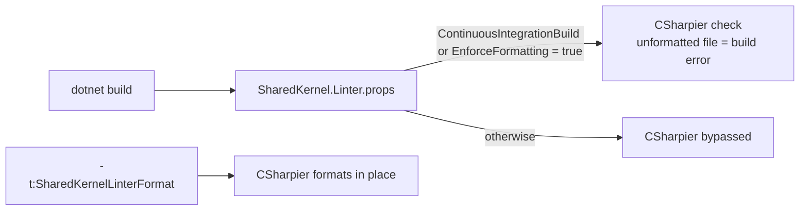

# SharedKernel.Linter

[](https://dotnet.microsoft.com/)
[](https://github.com/Gresta-Vertex-Labs/platform-shared-kernel/blob/main/LICENSE)


> **A CSharpier format check that fails CI on unformatted code and stays silent locally, a one-command local format,
> and the platform's shared `.editorconfig`. Ships no DLL and no analyzers: it governs layout and style, while
> [`SharedKernel.Analyzers`](https://github.com/Gresta-Vertex-Labs/platform-shared-kernel/blob/main/tools/Governance/SharedKernel.Analyzers/README.md)
> checks how the kernel APIs are used.**

| You get | So that |
| --- | --- |
| A format check driven by `ContinuousIntegrationBuild` | Pull requests stay formatted without interrupting local builds |
| `dotnet build -t:SharedKernelLinterFormat` | Everyone formats with the exact CSharpier version CI checks against — no global tool |
| `InstallSharedKernelLinterConfig` | One command copies the shared `.editorconfig` into your repository |
| One config file for IDE, code-style analyzers and CSharpier | Changing `max_line_length` or `indent_size` changes all three |
| Report-only mode pinned | A build never rewrites your files behind your back |

## Install

```xml
<PackageReference Include="SharedKernel.Linter" PrivateAssets="all" />
```

The version comes from your central `SharedKernelVersion` property — every SharedKernel package ships at the same
version. See [Using the packages](https://github.com/Gresta-Vertex-Labs/platform-shared-kernel#using-the-packages).

| Requirement | Value |
| --- | --- |
| Target framework | Any; the package ships MSBuild files only (.NET SDK 8 or later) |
| Tier | Tooling — build only; reference it from every project, usually through `Directory.Build.props` |
| Depends on | `CSharpier.MsBuild` 1.3.0 (MIT) |
| Package content | `build/SharedKernel.Linter.props`, `build/SharedKernel.Linter.targets`, `build/config/.editorconfig` |

## Quick start

```xml
<!-- Directory.Build.props -->
<Project>
  <ItemGroup>
    <PackageReference Include="SharedKernel.Linter" PrivateAssets="all" />
  </ItemGroup>
</Project>
```

Install the shared style once, from the repository root, and commit it:

```bash
dotnet build -t:InstallSharedKernelLinterConfig -p:SharedKernelLinterConfigDestination=.
git add .editorconfig
```

Format before you commit:

```bash
dotnet build -t:SharedKernelLinterFormat
```

CI builds with `ContinuousIntegrationBuild=true` now fail on unformatted files.

## How it works



| Situation | Behaviour |
| --- | --- |
| Local build, any configuration | Nothing — no check, no reformatting |
| `-t:SharedKernelLinterFormat` | Formats this project's files in place |
| CI build (`ContinuousIntegrationBuild=true`) | Check only; unformatted files fail the build |
| Any build | Your files are never rewritten implicitly (`CSharpier_Check` is pinned `true`) |

- The switches are set in `.props`, because `CSharpier.MsBuild` derives its command line in its own `.targets`.
- `build/` at the package root is auto-imported; `buildTransitive/` is deliberately not used, so the gate never appears
  in someone's build because they referenced a library that referenced this.
- CSharpier 1.x also formats `.csproj`, `.props` and `.targets` files.

## Recipes

### 1. Reproduce a CI formatting failure locally

```bash
dotnet build -p:SharedKernelLinterEnforceFormatting=true
```

### 2. Opt a project (or the repository) out

```xml
<SharedKernelLinterEnforceFormatting>false</SharedKernelLinterEnforceFormatting>
```

### 3. Take an updated platform config

```bash
dotnet build -t:InstallSharedKernelLinterConfig -p:SharedKernelLinterOverwriteConfig=true
```

An existing `.editorconfig` is never overwritten without this switch.

### 4. Adopt on an existing codebase

Install the config, run `-t:SharedKernelLinterFormat` once as a single reviewable commit, then let CI keep it that way.

## Configuration

MSBuild properties, set on the command line or in a project / `Directory.Build.props`.

| Key | Type | Default | Meaning |
| --- | --- | --- | --- |
| `SharedKernelLinterEnforceFormatting` | `bool` | `$(ContinuousIntegrationBuild)`, else `false` | Run the CSharpier check in this build |
| `SharedKernelLinterConfigDestination` | path | `$(MSBuildProjectDirectory)` | Where `InstallSharedKernelLinterConfig` writes `.editorconfig` |
| `SharedKernelLinterOverwriteConfig` | `bool` | `false` | Replace an existing `.editorconfig` on install |

## Reference

### Targets

| Target | Does |
| --- | --- |
| `SharedKernelLinterFormat` | Re-enters CSharpier's `CSharpierFormatInner` with check and bypass off: formats in place |
| `InstallSharedKernelLinterConfig` | Copies `build/config/.editorconfig` to the destination unless one exists (or overwrite is set) |

### What the `.editorconfig` covers

| Area | Content |
| --- | --- |
| Layout | Owned by CSharpier; `csharp_new_line_*`/`csharp_space_*` keys match its output so IDE typing agrees |
| Whitespace | 4-space indent (2 for XML/JSON/YAML), `max_line_length = 120`, `end_of_line = crlf`, UTF-8 without BOM, `root = true` |
| Naming | `I`-prefixed interfaces, `T`-prefixed type parameters, `_camelCase` private fields, PascalCase members and constants, camelCase parameters and locals (member naming relaxed for test projects) |
| Language style | File-scoped namespaces, required braces, pattern matching, null propagation, no `this.`, `var` where apparent |
| Nullable | Null-state diagnostics raised so they stand out |

Every style severity is a warning, not an error; escalate in your own copy.

## Testing

There is nothing to fake. To check the gate works in your pipeline, commit a mis-formatted file on a branch and confirm
the CI build fails; locally, build with `-p:SharedKernelLinterEnforceFormatting=true`.

## Pitfalls

| Don't | Do | Why |
| --- | --- | --- |
| Install a global `csharpier` tool | Use `-t:SharedKernelLinterFormat` | A different formatter version formats one way while CI demands another |
| Add a `.csharpierrc.json` next to `.editorconfig` | Keep one config file | CSharpier then uses it *instead of* `.editorconfig`, not merged |
| Expect the package to apply the config from the NuGet cache | Install and commit the copy | EditorConfig matches sections relative to the file's own directory |
| Turn the check on over an unformatted codebase | Format once as its own commit first | The first pass also rewrites project files |
| Rely on local builds to catch formatting | Let CI (`ContinuousIntegrationBuild`) enforce it | Local builds are silent by design |

## Design decisions

**Why silent locally?** A formatter that fails a build mid-thought trains people to bypass it; failing the PR does the
same job without the interruption.

**Why copy the config instead of applying it?** No `PackageReference` mechanism writes into a consumer's source tree,
and an `.editorconfig` outside that tree matches nothing. Your committed copy can drift; the CI check holds the line.

---

Part of [Platform.SharedKernel](https://github.com/Gresta-Vertex-Labs/platform-shared-kernel) ·
[Governance packages](https://github.com/Gresta-Vertex-Labs/platform-shared-kernel/blob/main/tools/Governance/README.md) ·
[MIT license](https://github.com/Gresta-Vertex-Labs/platform-shared-kernel/blob/main/LICENSE)
